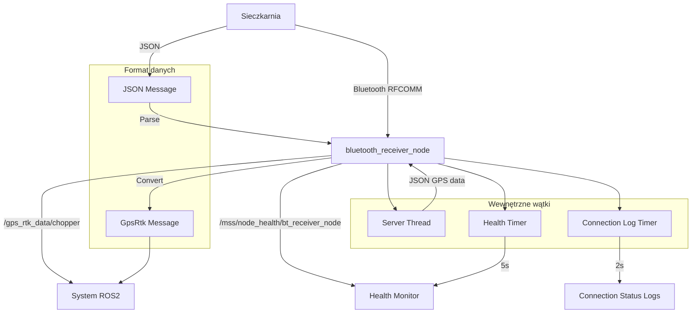

# BT Comm - Dokumentacja Pakietu

## Przegląd
Pakiet `bt_comm` odpowiada za komunikację Bluetooth z sieczkarnią polową. Węzeł działa jako serwer Bluetooth, nasłuchuje połączeń od sieczkarni i odbiera dane GPS RTK, które następnie publikuje w systemie ROS2.

## Funkcjonalności
- **Serwer Bluetooth**: Nasłuchuje połączeń na określonym porcie RFCOMM
- **Odbieranie danych GPS**: Parsowanie wiadomości JSON z sieczkarni
- **Publikacja danych**: Konwersja na wiadomości ROS2 GpsRtk
- **Health monitoring**: Raportowanie statusu połączenia i węzła
- **Automatyczne rekonfiguracja**: Ponowne łączenie przy rozłączeniu
- **Non-blocking I/O**: Optymalizacja wydajności z timeoutami

## Węzeł: `bluetooth_receiver_node`

### Parametry
| Parametr | Typ | Domyślna wartość | Opis |
|----------|-----|------------------|------|
| `bt_port` | int | `1` | Port Bluetooth RFCOMM |
| `publish_topic` | string | `/gps_rtk_data/chopper` | Topik publikacji danych sieczkarni |
| `connection_timeout` | double | `0.5` | Timeout połączenia [s] |
| `health_report_interval` | double | `5.0` | Interwał raportów health [s] |
| `reconnect_delay` | double | `2.0` | Opóźnienie ponownego łączenia [s] |

### Topiki

#### Publikowane
- **`/gps_rtk_data/chopper`** (`my_robot_interfaces/GpsRtk`)
  - Dane GPS sieczkarni odbierane przez Bluetooth
  - Zawiera: pozycję, prędkość, kurs, status RTK, czas GPS
  - Częstotliwość: zależna od sieczkarni (zwykle 1-10 Hz)

- **`/mss/node_health/bt_receiver_node`** (`std_msgs/String`)
  - Status zdrowia węzła w formacie JSON
  - Zawiera: status serwera, połączenia BT, metryki systemu
  - Częstotliwość: 0.2 Hz (co 5s)

### Wiadomości

#### Format JSON od sieczkarni
```json
{
  "lat": 52.2297,
  "lon": 21.0122,
  "speed": 1.9,
  "heading": 45.5,
  "rtk_status": 4,
  "altitude": 120.5,
  "gps_time": "123456.789"
}
```

#### Konwersja na GpsRtk
- `lat` → `latitude_deg`
- `lon` → `longitude_deg`
- `speed` → `speed_mps`
- `heading` → `heading_deg`
- `rtk_status` → `rtk_status`
- `altitude` → `altitude_m`
- `gps_time` → `gps_time` (konwersja na ROS Time)

## Architektura

### Wątki
1. **Wątek serwera Bluetooth**: Nasłuchuje połączeń i obsługuje klientów
2. **Timer health**: Raportuje status węzła
3. **Timer logowania**: Kontroluje częstotliwość logów połączenia

### Algorytm działania
1. **Inicjalizacja**: Utworzenie gniazda Bluetooth RFCOMM
2. **Nasłuchiwanie**: Oczekiwanie na połączenia od sieczkarni
3. **Akceptacja**: Przyjęcie połączenia i ustawienie timeout
4. **Odbieranie danych**: Parsowanie wiadomości JSON
5. **Publikacja**: Konwersja i wysyłanie danych ROS2
6. **Obsługa rozłączenia**: Zamknięcie połączenia i powrót do nasłuchiwania

### Obsługa błędów
- **Timeout połączenia**: Automatyczne rozłączenie przy braku danych
- **Błąd parsowania JSON**: Pomijanie niepoprawnych wiadomości
- **Rozłączenie klienta**: Powrót do trybu nasłuchiwania
- **Błąd gniazda**: Ponowne inicjalizowanie serwera

## Zależności

### ROS2
- `rclpy` - Python API dla ROS2
- `my_robot_interfaces` - Niestandardowe wiadomości
- `diagnostic_msgs` - Wiadomości diagnostyczne

### Python
- `socket` - Komunikacja Bluetooth
- `json` - Parsowanie danych JSON
- `threading` - Wielowątkowość
- `time` - Obsługa czasu i timeoutów
- `psutil` - Metryki systemu

## Instalacja i uruchomienie

### Budowanie
```bash
cd /home/pi/mss_ros
colcon build --packages-select bt_comm
source install/setup.bash
```

### Uruchomienie
```bash
ros2 run bt_comm bt_receiver_node
```

### Uruchomienie z parametrami
```bash
ros2 run bt_comm bt_receiver_node --ros-args \
  -p bt_port:=2 \
  -p connection_timeout:=1.0 \
  -p health_report_interval:=10.0
```

## Konfiguracja sprzętowa

### Wymagania
- Moduł Bluetooth w Raspberry Pi
- Sieczkarnia z modułem Bluetooth
- Skonfigurowane pary Bluetooth (opcjonalnie)

### Konfiguracja Bluetooth
```bash
# Sprawdź status Bluetooth
sudo systemctl status bluetooth

# Włącz Bluetooth
sudo systemctl enable bluetooth
sudo systemctl start bluetooth

# Sprawdź dostępne urządzenia
bluetoothctl
scan on
devices

# Sprawdź porty RFCOMM
sudo rfcomm -a
```

### Konfiguracja uprawnień
```bash
# Dodaj użytkownika do grupy bluetooth
sudo usermod -a -G bluetooth $USER

# Sprawdź uprawnienia
groups $USER
```

## Diagnostyka

### Sprawdzanie statusu
```bash
# Sprawdź czy węzeł działa
ros2 node list | grep bt_receiver_node

# Sprawdź topiki
ros2 topic list | grep chopper

# Sprawdź dane sieczkarni
ros2 topic echo /gps_rtk_data/chopper

# Sprawdź health status
ros2 topic echo /mss/node_health/bt_receiver_node
```

### Logi
```bash
# Sprawdź logi węzła
ros2 node info /bt_receiver_node

# Sprawdź parametry
ros2 param list /bt_receiver_node
ros2 param get /bt_receiver_node bt_port
```

### Testowanie połączenia
```bash
# Test połączenia Bluetooth
sudo rfcomm bind 1 00:11:22:33:44:55 1
sudo rfcomm -a

# Test komunikacji
echo '{"lat":52.2297,"lon":21.0122,"speed":1.9}' | nc -l 1
```

### Typowe problemy
1. **Brak połączenia**: Sprawdź status Bluetooth i urządzenia
2. **Timeout połączenia**: Zwiększ `connection_timeout`
3. **Błąd parsowania**: Sprawdź format JSON z sieczkarni
4. **Błąd uprawnień**: Dodaj użytkownika do grupy bluetooth

## Bezpieczeństwo

### Połączenia Bluetooth
- Używaj dedykowanych portów RFCOMM
- Monitoruj aktywne połączenia
- Implementuj autoryzację urządzeń (opcjonalnie)

### Dane sieczkarni
- Waliduj format wiadomości JSON
- Sprawdź zakresy wartości GPS
- Implementuj timeout dla starych danych

## Wydajność

### Optymalizacja
- Dostosuj timeout połączenia do charakterystyki sieczkarni
- Użyj odpowiedniego QoS dla topików
- Monitoruj wykorzystanie CPU i pamięci

### Metryki
- Częstotliwość publikacji: 1-10 Hz (zależna od sieczkarni)
- Opóźnienie: < 500ms
- Wykorzystanie CPU: < 3%
- Wykorzystanie pamięci: < 30MB

## Protokół komunikacji

### Format wiadomości
- **Protokół**: JSON over Bluetooth RFCOMM
- **Kodowanie**: UTF-8
- **Separator**: Nowa linia (`\n`)
- **Timeout**: Konfigurowalny (domyślnie 0.5s)

### Przykład komunikacji
```
Klient (sieczkarnia) → Serwer (Raspberry Pi)
{"lat":52.2297,"lon":21.0122,"speed":1.9,"heading":45.5,"rtk_status":4,"altitude":120.5,"gps_time":"123456.789"}
```

## Graf przepływu informacji



## Testowanie

### Testy jednostkowe
```bash
# Uruchom testy
cd /home/pi/mss_ros
colcon test --packages-select bt_comm
colcon test-result --all
```

### Testy integracyjne
```bash
# Test z mockup sieczkarni
ros2 run system_mockup gear_mockup_node

# Test połączenia
ros2 topic echo /gps_rtk_data/chopper
```

## Autorzy
- **Główny deweloper**: Adam Wróblewski
- **Email**: adam01wroblewski@gmail.com
