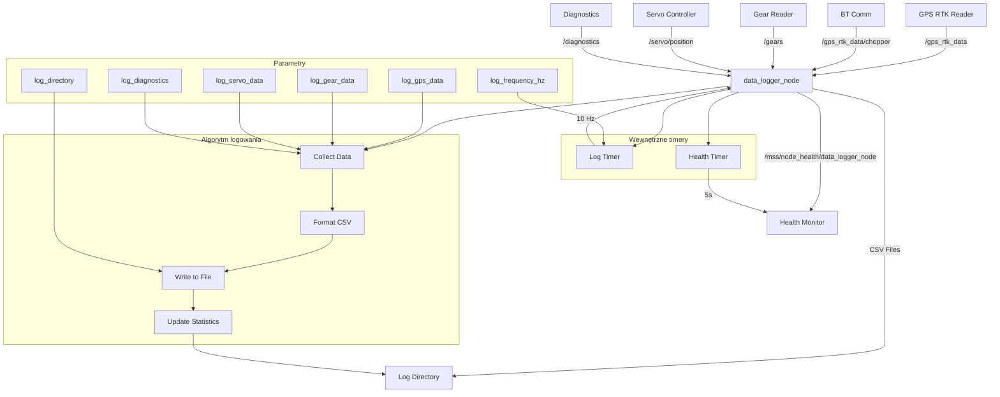

# Data Logger - Dokumentacja Pakietu

## Przegląd
Pakiet `data_logger` odpowiada za logowanie zsynchronizowanych danych z sensorów do pliku CSV. Węzeł zbiera dane z różnych komponentów systemu MSS i zapisuje je w formacie CSV dla późniejszej analizy.

## Funkcjonalności
- **Logowanie danych**: Zapis danych z sensorów do pliku CSV
- **Synchronizacja czasowa**: Synchronizacja danych z różnych źródeł
- **Format CSV**: Strukturyzowane dane w formacie CSV
- **Konfigurowalne źródła**: Wybór danych do logowania
- **Health monitoring**: Raportowanie statusu węzła
- **Automatyczne nazewnictwo**: Pliki z timestampem

## Węzeł: `data_logger_node`

### Parametry
| Parametr | Typ | Domyślna wartość | Opis |
|----------|-----|------------------|------|
| `log_directory` | string | `/home/pi/logs` | Katalog do zapisu logów |
| `log_frequency_hz` | double | `10.0` | Częstotliwość logowania [Hz] |
| `log_gps_data` | bool | `true` | Logowanie danych GPS |
| `log_gear_data` | bool | `true` | Logowanie danych biegów |
| `log_servo_data` | bool | `true` | Logowanie danych serwa |
| `log_diagnostics` | bool | `true` | Logowanie danych diagnostycznych |

### Topiki

#### Subskrypcje
- **`/gps_rtk_data`** (`my_robot_interfaces/GpsRtk`)
  - Dane GPS ciągnika z gps_rtk_reader
  - Zawiera: pozycję, prędkość, kurs, status RTK

- **`/gps_rtk_data/chopper`** (`my_robot_interfaces/GpsRtk`)
  - Dane GPS sieczkarni z bt_comm
  - Zawiera: pozycję, prędkość, kurs, status RTK

- **`/gears`** (`my_robot_interfaces/Gear`)
  - Stan biegów i sprzęgła z gear_reader
  - Zawiera: aktualny bieg (0-4), stan sprzęgła (0-1)

- **`/servo/position`** (`my_robot_interfaces/StampedInt32`)
  - Aktualna pozycja serwa z servo_controller
  - Zawiera: kąt serwa w stopniach

- **`/diagnostics`** (`my_robot_interfaces/DiagnosticData`)
  - Skonsolidowane dane diagnostyczne
  - Zawiera: wszystkie dane systemu

#### Publikowane
- **`/mss/node_health/data_logger_node`** (`std_msgs/String`)
  - Status zdrowia węzła w formacie JSON
  - Zawiera: status logowania, liczba zapisanych rekordów, metryki systemu
  - Częstotliwość: 0.2 Hz (co 5s)

## Architektura

### Algorytm logowania
```python
def log_data_callback(self):
    current_time = time.time()
    
    # Przygotuj dane do logowania
    log_data = {
        'timestamp': current_time,
        'gps_tractor': self.last_gps_tractor,
        'gps_chopper': self.last_gps_chopper,
        'gears': self.last_gears,
        'servo': self.last_servo,
        'diagnostics': self.last_diagnostics
    }
    
    # Zapisz do pliku CSV
    self.write_to_csv(log_data)
    
    # Aktualizuj statystyki
    self.records_written += 1
```

### Format pliku CSV
```csv
timestamp,gps_tractor_lat,gps_tractor_lon,gps_tractor_speed,gps_tractor_heading,gps_tractor_rtk_status,
gps_chopper_lat,gps_chopper_lon,gps_chopper_speed,gps_chopper_heading,gps_chopper_rtk_status,
gear_current,gear_clutch,servo_angle,diagnostics_bt_status,diagnostics_system_status
```

### Synchronizacja danych
```python
def gps_tractor_callback(self, msg):
    self.last_gps_tractor = {
        'lat': msg.latitude_deg,
        'lon': msg.longitude_deg,
        'speed': msg.speed_mps,
        'heading': msg.heading_deg,
        'rtk_status': msg.rtk_status
    }

def gps_chopper_callback(self, msg):
    self.last_gps_chopper = {
        'lat': msg.latitude_deg,
        'lon': msg.longitude_deg,
        'speed': msg.speed_mps,
        'heading': msg.heading_deg,
        'rtk_status': msg.rtk_status
    }
```

### Zarządzanie plikami
```python
def create_log_file(self):
    timestamp = datetime.now().strftime("%Y%m%d_%H%M%S")
    filename = f"mss_data_{timestamp}.csv"
    filepath = os.path.join(self.log_directory, filename)
    
    # Utwórz nagłówek CSV
    header = "timestamp,gps_tractor_lat,gps_tractor_lon,gps_tractor_speed,gps_tractor_heading,gps_tractor_rtk_status,"
    header += "gps_chopper_lat,gps_chopper_lon,gps_chopper_speed,gps_chopper_heading,gps_chopper_rtk_status,"
    header += "gear_current,gear_clutch,servo_angle,diagnostics_bt_status,diagnostics_system_status\n"
    
    with open(filepath, 'w') as f:
        f.write(header)
    
    return filepath
```

## Zależności

### ROS2
- `rclpy` - Python API dla ROS2
- `sensor_msgs` - Wiadomości sensorów
- `my_robot_interfaces` - Niestandardowe wiadomości
- `message_filters` - Synchronizacja czasowa

### Python
- `csv` - Obsługa plików CSV
- `json` - Formatowanie danych health
- `time` - Obsługa czasu
- `datetime` - Formatowanie timestampów
- `os` - Obsługa plików i katalogów

## Instalacja i uruchomienie

### Budowanie
```bash
cd /home/pi/mss_ros
colcon build --packages-select data_logger
source install/setup.bash
```

### Uruchomienie
```bash
ros2 run data_logger data_logger_node
```

### Uruchomienie z parametrami
```bash
ros2 run data_logger data_logger_node --ros-args \
  -p log_directory:=/home/pi/data_logs \
  -p log_frequency_hz:=20.0 \
  -p log_gps_data:=true \
  -p log_gear_data:=true \
  -p log_servo_data:=true \
  -p log_diagnostics:=true
```

## Konfiguracja

### Parametry
```bash
# Ustawienie katalogu logów
ros2 param set /data_logger_node log_directory /home/pi/data_logs

# Ustawienie częstotliwości logowania
ros2 param set /data_logger_node log_frequency_hz 20.0

# Włączanie/wyłączanie logowania danych
ros2 param set /data_logger_node log_gps_data true
ros2 param set /data_logger_node log_gear_data true
ros2 param set /data_logger_node log_servo_data true
ros2 param set /data_logger_node log_diagnostics true
```

### Struktura katalogów
```
/home/pi/logs/
├── mss_data_20241201_120000.csv
├── mss_data_20241201_130000.csv
└── mss_data_20241201_140000.csv
```

## Diagnostyka

### Sprawdzanie statusu
```bash
# Sprawdź węzły
ros2 node list | grep data_logger

# Sprawdź topiki
ros2 topic list | grep data

# Sprawdź health status
ros2 topic echo /mss/node_health/data_logger_node
```

### Monitoring
```bash
# Sprawdź parametry
ros2 param list /data_logger_node
ros2 param get /data_logger_node log_directory
ros2 param get /data_logger_node log_frequency_hz

# Sprawdź logi
ros2 node info /data_logger_node
```

### Testowanie
```bash
# Test z pełnym systemem
ros2 run gps_rtk_reader gps_rtk_node
ros2 run bt_comm bt_receiver_node
ros2 run gear_reader gear_reader_node
ros2 run servo_controller servo_controller
ros2 run data_logger data_logger_node

# Sprawdź pliki logów
ls -la /home/pi/logs/
```

### Typowe problemy
1. **Brak plików**: Sprawdź uprawnienia do katalogu logów
2. **Brak danych**: Sprawdź czy węzły źródłowe publikują dane
3. **Błąd zapisu**: Sprawdź miejsce na dysku
4. **Błąd formatu**: Sprawdź strukturę danych

## Bezpieczeństwo

### Uprawnienia
- **Katalog logów**: Uprawnienia do zapisu w katalogu logów
- **Pliki CSV**: Uprawnienia do tworzenia i zapisywania plików
- **Dane**: Ochrona danych logowanych

### Ograniczenia
- Częstotliwość logowania: 10 Hz (konfigurowalna)
- Rozmiar pliku: Bez ograniczeń
- Liczba plików: Bez ograniczeń

## Wydajność

### Metryki
- Częstotliwość logowania: 10 Hz
- Opóźnienie: < 50ms
- Wykorzystanie CPU: < 3%
- Wykorzystanie pamięci: < 40MB

### Optymalizacja
- Dostosuj częstotliwość logowania
- Użyj odpowiedniego QoS
- Monitoruj wykorzystanie zasobów

## Testowanie

### Testy jednostkowe
```bash
# Uruchom testy
cd /home/pi/mss_ros
colcon test --packages-select data_logger
colcon test-result --all
```

### Testy integracyjne
```bash
# Test z pełnym systemem
ros2 run system_mockup gps_mockup_node
ros2 run data_logger data_logger_node

# Sprawdź pliki
ls -la /home/pi/logs/
```

### Testy wydajności
```bash
# Test częstotliwości
ros2 topic hz /mss/node_health/data_logger_node

# Test opóźnienia
ros2 topic delay /mss/node_health/data_logger_node
```

## Graf przepływu informacji



## Autorzy
- **Główny deweloper**: Adam Wróblewski
- **Email**: adam01wroblewski@gmail.com
