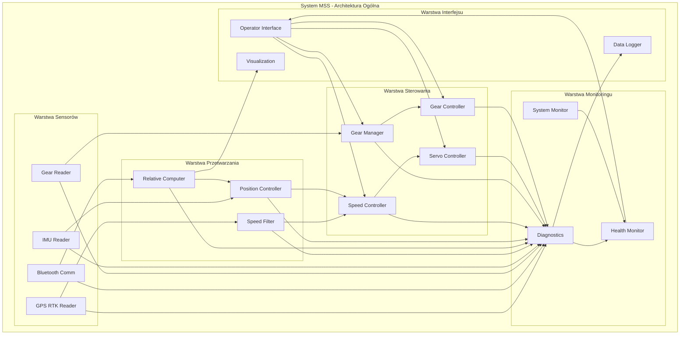
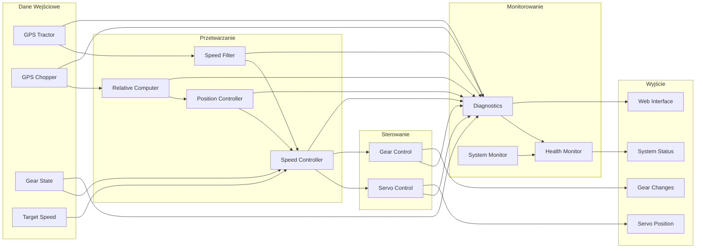
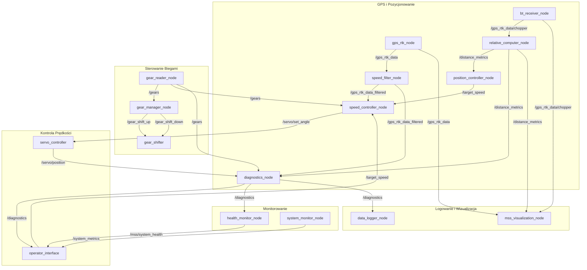
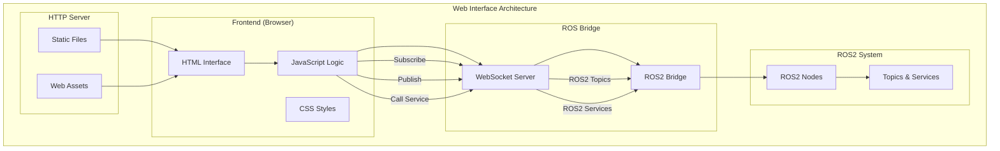
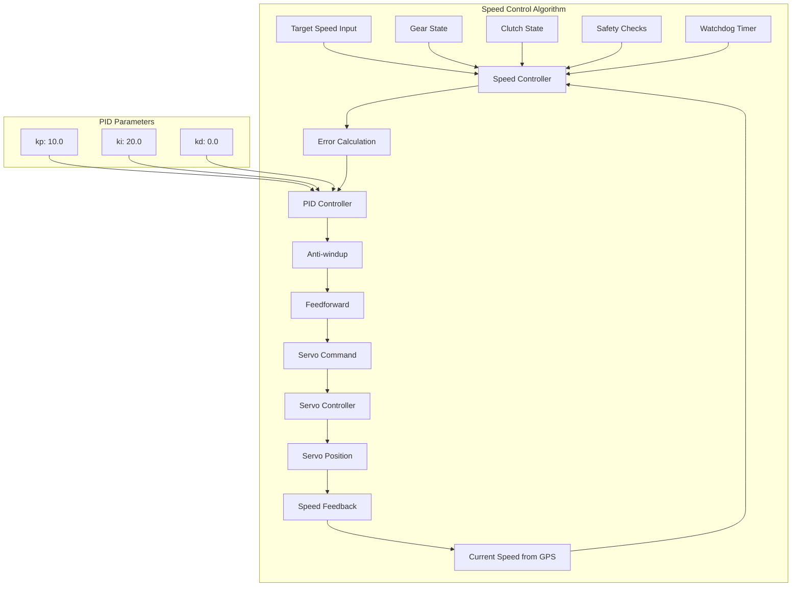
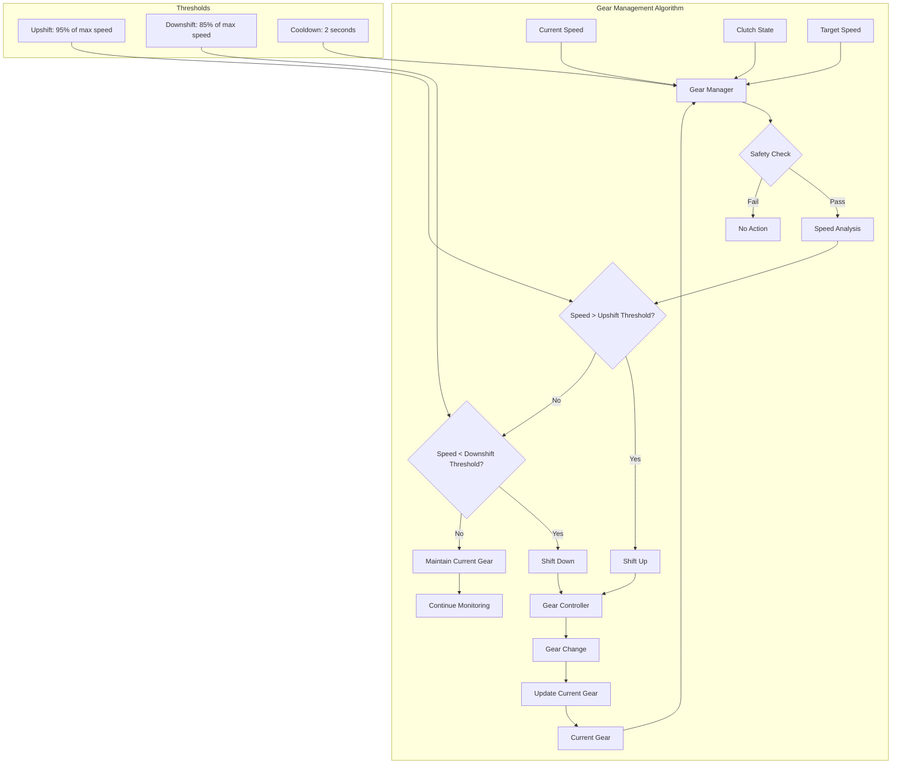
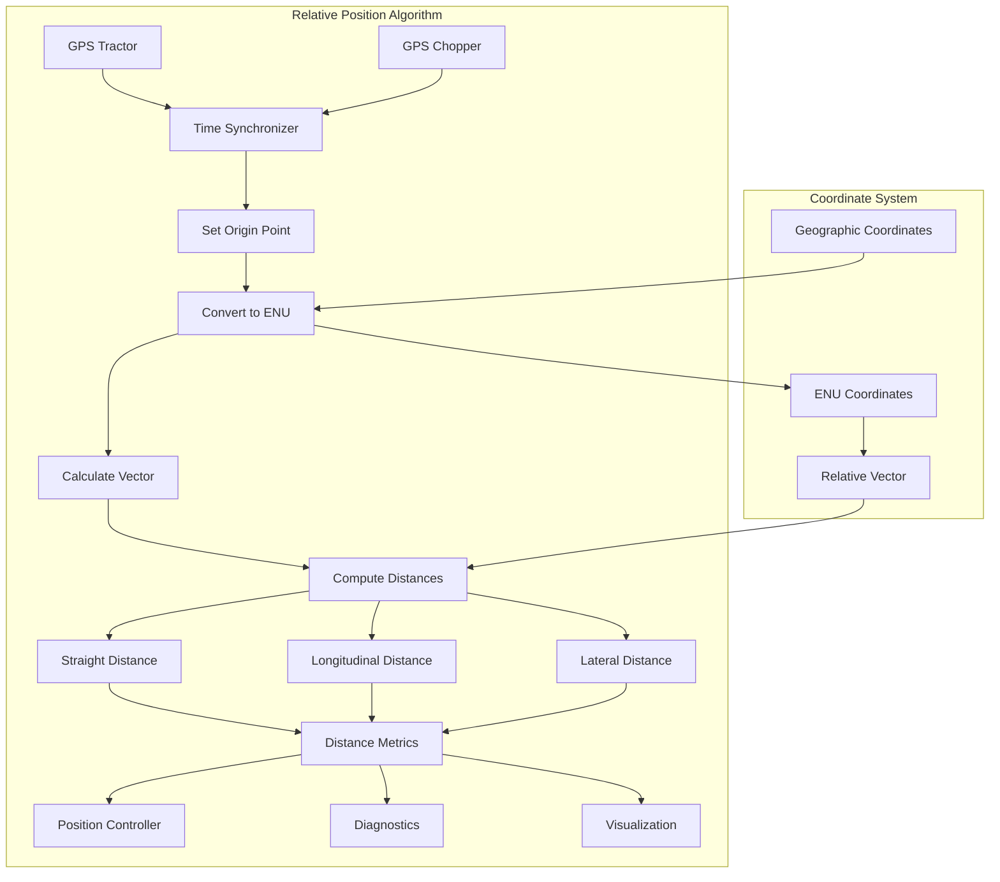
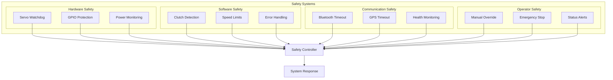
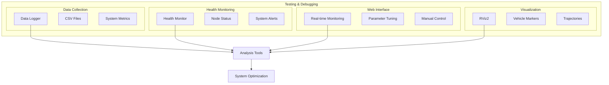

# Dokumentacja Systemu MSS (Maszyna Sieczkarnia System)

## Przegląd Systemu

System MSS to zaawansowany system synchronizacji prędkości i pozycji ciągnika rolniczego z sieczkarnią polową podczas zbiorów kukurydzy. System wykorzystuje technologię ROS2 (Robot Operating System 2) do komunikacji między komponentami i zapewnia precyzyjną kontrolę prędkości oraz pozycjonowanie względne pojazdów.

## 📚 Dokumentacje Pakietów

Każdy pakiet w systemie MSS ma swoją szczegółową dokumentację:

### 🔧 Pakiety Główne
- **[gps_rtk_reader_docs.md](gps_rtk_reader/gps_rtk_reader_docs.md)** - Odczyt GPS RTK z korekcjami NTRIP
- **[bt_comm_docs.md](bt_comm/bt_comm_docs.md)** - Komunikacja Bluetooth z sieczkarnią
- **[gear_reader_docs.md](gear_reader/gear_reader_docs.md)** - Odczyt biegów i sprzęgła przez GPIO
- **[speed_controller_docs.md](speed_controller/speed_controller_docs.md)** - Kontroler prędkości z regulatorem PID
- **[servo_controller_docs.md](servo_controller/servo_controller_docs.md)** - Kontroler serwa z PCA9685
- **[gear_controller_docs.md](gear_controller/gear_controller_docs.md)** - Kontroler zmiany biegów
- **[gear_manager_docs.md](gear_manager/gear_manager_docs.md)** - Automatyczne zarządzanie biegami
- **[relative_position_computer_docs.md](relative_position_computer/relative_position_computer_docs.md)** - Obliczenia pozycji względnej

### 📊 Pakiety Monitoringu
- **[mss_diagnostics_docs.md](mss_diagnostics/mss_diagnostics_docs.md)** - Agregacja danych diagnostycznych
- **[mss_health_monitor_docs.md](mss_health_monitor/mss_health_monitor_docs.md)** - Monitor zdrowia systemu
- **[mss_system_monitor_docs.md](mss_system_monitor/mss_system_monitor_docs.md)** - Monitor zasobów Raspberry Pi

### 🌐 Interfejs i Uruchamianie
- **[operator_interface_docs.md](operator_interface/operator_interface_docs.md)** - Interfejs webowy operatora
- **[mss_bringup_docs.md](mss_bringup/mss_bringup_docs.md)** - Pliki launch do uruchamiania systemu

### 🔧 Pakiety Pomocnicze
- **[data_logger_docs.md](data_logger/data_logger_docs.md)** - Logowanie danych do plików CSV
- **[gps_rtk_msgs_docs.md](gps_rtk_msgs/gps_rtk_msgs_docs.md)** - Niestandardowe wiadomości GPS RTK
- **[imu_reader_docs.md](imu_reader/imu_reader_docs.md)** - Odczyt danych z czujnika IMU
- **[mss_visualization_docs.md](mss_visualization/mss_visualization_docs.md)** - Wizualizacja w RViz2
- **[my_robot_interfaces_docs.md](my_robot_interfaces/my_robot_interfaces_docs.md)** - Niestandardowe wiadomości i serwisy
- **[position_controller_docs.md](position_controller/position_controller_docs.md)** - Regulator pozycji względnej
- **[system_mockup_docs.md](system_mockup/system_mockup_docs.md)** - Węzły symulacyjne do testowania

> **Uwaga**: Każda dokumentacja pakietu zawiera szczegółowe informacje o funkcjonalności, parametrach, topikach, serwisach, instalacji, konfiguracji, diagnostyce i grafach przepływu informacji.

## Architektura Systemu

### Główne Komponenty

1. **System GPS RTK** - precyzyjne pozycjonowanie obu pojazdów
2. **Komunikacja Bluetooth** - łączność z sieczkarnią
3. **System Sterowania** - regulacja prędkości i pozycji
4. **Interfejs Operatora** - aplikacja webowa do monitorowania i kontroli
5. **System Monitoringu** - diagnostyka i health monitoring

### 🏗️ Architektura Ogólna Systemu



### 🔄 Przepływ Danych w Systemie



### 📡 Topiki i Połączenia



## Struktura Pakietów ROS2

### 1. Pakiety Sensorów i Komunikacji

#### `gps_rtk_reader`
- **Węzeł**: `gps_rtk_node`
- **Funkcja**: Odczyt danych GPS RTK z ciągnika
- **Topiki publikowane**:
  - `/gps_rtk_data` - surowe dane GPS ciągnika
- **Wiadomości**: `my_robot_interfaces/GpsRtk`

#### `bt_comm`
- **Węzeł**: `bluetooth_receiver_node`
- **Funkcja**: Komunikacja Bluetooth z sieczkarnią
- **Topiki publikowane**:
  - `/gps_rtk_data/chopper` - dane GPS sieczkarni
- **Parametry**:
  - `bt_port`: port Bluetooth (domyślnie 1)
  - `connection_timeout`: timeout połączenia (0.5s)
  - `health_report_interval`: interwał raportów (5s)

#### `gps_mockup`
- **Węzeł**: `gps_mockup_node`
- **Funkcja**: Symulacja danych GPS dla testów
- **Topiki publikowane**:
  - `/gps_rtk_data` - symulowane dane ciągnika
  - `/gps_rtk_data/chopper` - symulowane dane sieczkarni
- **Parametry**:
  - `publish_frequency_hz`: częstotliwość publikacji (10 Hz)
  - `tractor_speed_mps`: prędkość ciągnika (2.0 m/s)
  - `chopper_speed_mps`: prędkość sieczkarni (1.9 m/s)
  - `chopper_offset_m`: odległość sieczkarni (5.0 m)

#### `gear_reader`
- **Węzeł**: `gear_reader_node`
- **Funkcja**: Odczyt stanu biegów i sprzęgła
- **Topiki publikowane**:
  - `/gears` - stan biegów i sprzęgła
- **GPIO**: Piny 5 (sprzęgło), 19,13,26,6 (biegi 1-4)

### 2. Pakiety Sterowania

#### `speed_controller`
- **Węzły**:
  - `speed_filter_node` - filtrowanie danych prędkości
  - `speed_controller_node` - regulator prędkości PID
- **Funkcje**:
  - Filtrowanie szumów GPS (filtr Butterworth)
  - Regulacja prędkości z algorytmem PID
  - Sterowanie serwem na podstawie błędu prędkości
- **Topiki**:
  - Subskrypcje: `/gps_rtk_data_filtered`, `/target_speed`, `/gears`
  - Publikacje: `/servo/set_angle`, `/speed_controller/state`
- **Parametry PID**:
  - `kp`: wzmocnienie proporcjonalne (10.0)
  - `ki`: wzmocnienie całkowe (20.0)
  - `kd`: wzmocnienie różniczkowe (0.0)

#### `servo_controller`
- **Węzeł**: `servo_controller`
- **Funkcja**: Sterowanie serwem silnika
- **Sprzęt**: PCA9685 (16-kanałowy sterownik PWM)
- **Topiki**:
  - Subskrypcje: `/servo/set_angle`
  - Publikacje: `/servo/position`
- **Usługi**:
  - `/servo/set_manual_mode` - przełączanie trybu ręcznego/automatycznego
- **Funkcje**:
  - Płynny ruch serwa (750°/s)
  - Watchdog timeout (0.2s)
  - Tryb ręczny i automatyczny

#### `gear_controller`
- **Węzeł**: `gear_shifter`
- **Funkcja**: Sterowanie zmianą biegów
- **GPIO**: Piny 25 (bieg w górę), 20 (bieg w dół)
- **Usługi**:
  - `/gear_shift_up` - zmiana biegu w górę
  - `/gear_shift_down` - zmiana biegu w dół

#### `gear_manager`
- **Węzeł**: `gear_manager_node`
- **Funkcja**: Automatyczne zarządzanie biegami
- **Logika**: Decyzje na podstawie prędkości zadanej
- **Parametry**:
  - `powershift_max_speeds`: maksymalne prędkości biegów [2.9, 3.6, 4.1, 5.6]
  - `upshift_threshold_percent`: próg zmiany w górę (0.95)
  - `downshift_threshold_percent`: próg zmiany w dół (0.85)

### 3. Pakiety Obliczeniowe

#### `relative_position_computer`
- **Węzeł**: `relative_computer_node`
- **Funkcja**: Obliczanie pozycji względnej pojazdów
- **Algorytmy**:
  - Konwersja współrzędnych geograficznych na ENU
  - Obliczanie odległości wzdłużnej i poprzecznej
  - Synchronizacja czasowa danych GPS
- **Topiki**:
  - Subskrypcje: `/gps_rtk_data`, `/gps_rtk_data/chopper`
  - Publikacje: `/distance_metrics`

### 4. Pakiety Monitoringu i Diagnostyki

#### `mss_diagnostics`
- **Węzeł**: `diagnostics_node`
- **Funkcja**: Agregacja danych diagnostycznych
- **Topiki publikowane**:
  - `/diagnostics` - skonsolidowane dane systemu
- **Dane agregowane**:
  - GPS ciągnika i sieczkarni
  - Pozycja serwa
  - Stan biegów i sprzęgła
  - Prędkość zadana
  - Pozycja względna

#### `mss_health_monitor`
- **Węzeł**: `mss_health_monitor_node`
- **Funkcja**: Monitoring zdrowia wszystkich węzłów
- **Topiki publikowane**:
  - `/mss/system_status` - ogólny status systemu
  - `/mss/node_status` - status poszczególnych węzłów
  - `/mss/health_alerts` - alerty o problemach

#### `mss_system_monitor`
- **Węzeł**: `system_monitor_node`
- **Funkcja**: Monitoring zasobów Raspberry Pi
- **Metryki**:
  - CPU, RAM, temperatura
  - Status GPIO, sieci, USB/Serial
  - Uptime systemu

### 5. Interfejs Operatora

#### `operator_interface`
- **Aplikacja webowa** z interfejsem użytkownika
- **Komunikacja**: ROS Bridge WebSocket (port 9090)
- **Serwer**: HTTP server (port 8080)
- **Funkcje**:
  - Wizualizacja pozycji pojazdów
  - Kontrola prędkości i parametrów PID
  - Monitoring systemu i health
  - Sterowanie serwem i biegami
  - Wykresy w czasie rzeczywistym

## Topiki ROS2

### Główne Topiki Danych

| Topik | Typ Wiadomości | Opis |
|-------|----------------|------|
| `/gps_rtk_data` | `GpsRtk` | Surowe dane GPS ciągnika |
| `/gps_rtk_data_filtered` | `GpsRtk` | Filtrowane dane GPS ciągnika |
| `/gps_rtk_data/chopper` | `GpsRtk` | Dane GPS sieczkarni |
| `/gears` | `Gear` | Stan biegów i sprzęgła |
| `/target_speed` | `Float64` | Prędkość zadana |
| `/servo/set_angle` | `StampedInt32` | Komenda kąta serwa |
| `/servo/position` | `StampedInt32` | Aktualna pozycja serwa |
| `/distance_metrics` | `DistanceMetrics` | Odległości względne |
| `/diagnostics` | `DiagnosticData` | Dane diagnostyczne |

### Topiki Sterowania

| Topik | Typ Wiadomości | Opis |
|-------|----------------|------|
| `/speed_controller/state` | `SpeedControllerState` | Stan regulatora PID |
| `/mss/system_status` | `String` | Status systemu |
| `/mss/node_status` | `String` | Status węzłów |
| `/mss/health_alerts` | `String` | Alerty zdrowia |

### Topiki Health Monitoring

| Topik | Opis |
|-------|------|
| `/mss/node_health/gps_rtk_node` | Health GPS RTK |
| `/mss/node_health/bt_receiver_node` | Health Bluetooth |
| `/mss/node_health/gear_reader_node` | Health odczytu biegów |
| `/mss/node_health/servo_controller` | Health serwa |
| `/mss/node_health/gear_shifter` | Health sterowania biegami |
| `/mss/node_health/speed_filter_node` | Health filtru prędkości |
| `/mss/node_health/speed_controller_node` | Health regulatora |
| `/mss/node_health/relative_computer_node` | Health obliczeń pozycji |
| `/mss/node_health/gear_manager_node` | Health menedżera biegów |
| `/mss/node_health/diagnostics_node` | Health diagnostyki |
| `/mss/node_health/system_monitor` | Health monitora systemu |
| `/mss/node_health/mss_health_monitor_node` | Health monitora zdrowia |

## Usługi ROS2

| Usługa | Typ | Opis |
|--------|-----|------|
| `/speed_controller/set_enabled` | `SetBool` | Włączanie/wyłączanie autopilota |
| `/gear_shift_up` | `SetBool` | Zmiana biegu w górę |
| `/gear_shift_down` | `SetBool` | Zmiana biegu w dół |
| `/servo/set_manual_mode` | `SetBool` | Tryb ręczny serwa |
| `/speed_controller_node/set_parameters` | `SetParameters` | Ustawianie parametrów PID |

## Wiadomości ROS2

### `GpsRtk.msg`
```
std_msgs/Header header
builtin_interfaces/Time gps_time
uint8 rtk_status
float64 latitude_deg
float64 longitude_deg
float64 altitude_m
float64 speed_mps
float64 heading_deg
```

### `DiagnosticData.msg`
```
std_msgs/Header header
GpsRtk tractor_gps_filtered
GpsRtk chopper_gps
StampedInt32 servo_position
bool bt_status
Gear tractor_gear
Float64 target_speed
DistanceMetrics relative_position
```

### `DistanceMetrics.msg`
```
std_msgs/Header header
float64 distance_straight
float64 distance_longitudinal
float64 distance_lateral
```

## Komunikacja Web Interface

### 🌐 Architektura Web Interface



### 📡 Komunikacja Web Interface z ROS2

```mermaid
graph LR
    subgraph "Web Interface"
        A[Operator Browser]
        B[ROS Bridge WebSocket]
    end
    
    subgraph "ROS2 Topics - Subskrypcje"
        C[/diagnostics]
        D[/speed_controller/state]
        E[/mss/system_health]
        F[/mss/node_health/*]
        G[/servo/position]
        H[/gears]
    end
    
    subgraph "ROS2 Topics - Publikacje"
        I[/target_speed]
        J[/servo/set_angle]
    end
    
    subgraph "ROS2 Services"
        K[/speed_controller/set_enabled]
        L[/gear_shift_up]
        M[/gear_shift_down]
        N[/servo/set_manual_mode]
        O[/speed_controller_node/set_parameters]
    end
    
    A -->|WebSocket| B
    B -->|Subscribe| C
    B -->|Subscribe| D
    B -->|Subscribe| E
    B -->|Subscribe| F
    B -->|Subscribe| G
    B -->|Subscribe| H
    
    A -->|Publish| B
    B -->|Publish| I
    B -->|Publish| J
    
    A -->|Call Service| B
    B -->|Call Service| K
    B -->|Call Service| L
    B -->|Call Service| M
    B -->|Call Service| N
    B -->|Call Service| O
```

### ROS Bridge
- **Protokół**: WebSocket
- **Port**: 9090
- **URL**: `ws://192.168.1.77:9090`
- **Biblioteka**: roslib.js

### Subskrypcje Web Interface

| Topik | Funkcja |
|-------|---------|
| `/diagnostics` | Dane diagnostyczne |
| `/speed_controller/state` | Wykres regulatora |
| `/mss/system_status` | Status systemu |
| `/mss/health_alerts` | Alerty |
| `/mss/node_health/*` | Health węzłów |

### Publikacje Web Interface

| Topik | Funkcja |
|-------|---------|
| `/target_speed` | Ustawianie prędkości |
| `/servo/set_angle` | Sterowanie serwem |

### Usługi Web Interface

| Usługa | Funkcja |
|--------|---------|
| `/speed_controller/set_enabled` | Autopilot |
| `/gear_shift_up/down` | Biegi |
| `/servo/set_manual_mode` | Tryb serwa |
| `/speed_controller_node/set_parameters` | Parametry PID |

## Struktura Plików

```
mss_ros/src/
├── bt_comm/                    # Komunikacja Bluetooth
│   └── bt_comm_docs.md         # 📚 Dokumentacja pakietu
├── data_logger/                # Logowanie danych
│   └── data_logger_docs.md     # 📚 Dokumentacja pakietu
├── gear_controller/            # Sterowanie biegami
│   └── gear_controller_docs.md # 📚 Dokumentacja pakietu
├── gear_manager/               # Automatyczne zarządzanie biegami
│   └── gear_manager_docs.md    # 📚 Dokumentacja pakietu
├── gear_reader/                # Odczyt biegów
│   └── gear_reader_docs.md     # 📚 Dokumentacja pakietu
├── gps_rtk_msgs/               # Wiadomości GPS
│   └── gps_rtk_msgs_docs.md    # 📚 Dokumentacja pakietu
├── gps_rtk_reader/             # Odczyt GPS RTK
│   └── gps_rtk_reader_docs.md  # 📚 Dokumentacja pakietu
├── imu_reader/                 # Odczyt IMU
│   └── imu_reader_docs.md      # 📚 Dokumentacja pakietu
├── mss_bringup/                # Launch files
│   └── mss_bringup_docs.md     # 📚 Dokumentacja pakietu
├── mss_diagnostics/            # Diagnostyka
│   └── mss_diagnostics_docs.md # 📚 Dokumentacja pakietu
├── mss_health_monitor/         # Monitoring zdrowia
│   └── mss_health_monitor_docs.md # 📚 Dokumentacja pakietu
├── mss_system_monitor/         # Monitoring systemu
│   └── mss_system_monitor_docs.md # 📚 Dokumentacja pakietu
├── mss_visualization/          # Wizualizacja
│   └── mss_visualization_docs.md # 📚 Dokumentacja pakietu
├── my_robot_interfaces/        # Interfejsy wiadomości
│   └── my_robot_interfaces_docs.md # 📚 Dokumentacja pakietu
├── operator_interface/         # Interfejs webowy
│   ├── operator_interface_docs.md # 📚 Dokumentacja pakietu
│   └── web/
│       ├── index.html          # Główna strona
│       ├── main.js             # Logika JavaScript
│       ├── style.css           # Style CSS
│       └── start_interface.sh  # Skrypt uruchamiający
├── position_controller/        # Regulator pozycji
│   └── position_controller_docs.md # 📚 Dokumentacja pakietu
├── relative_position_computer/ # Obliczenia pozycji
│   └── relative_position_computer_docs.md # 📚 Dokumentacja pakietu
├── servo_controller/           # Sterowanie serwem
│   └── servo_controller_docs.md # 📚 Dokumentacja pakietu
├── speed_controller/           # Regulacja prędkości
│   └── speed_controller_docs.md # 📚 Dokumentacja pakietu
├── system_mockup/              # Symulacja systemu
│   └── system_mockup_docs.md   # 📚 Dokumentacja pakietu
└── documentation.md            # 📚 Główna dokumentacja systemu
```

> **📋 Podsumowanie**: System MSS składa się z **20 pakietów ROS2**, każdy z własną szczegółową dokumentacją. Wszystkie dokumentacje zawierają graf przepływu informacji, parametry, topiki, serwisy, instrukcje instalacji i konfiguracji.

## Uruchamianie Systemu

### Tryb Mockup (Symulacja)
```bash
cd /home/pi/mss_ros/src
./mss_startup_mockup.sh
```

### Tryb Produkcyjny
```bash
cd /home/pi/mss_ros/src
./mss_startup.sh
```

### Web Interface
```bash
cd operator_interface/web
./start_interface.sh
```

## Konfiguracja

### Parametry Kluczowe

#### Regulator Prędkości
- `kp`: 10.0 (wzmocnienie proporcjonalne)
- `ki`: 20.0 (wzmocnienie całkowe)
- `kd`: 0.0 (wzmocnienie różniczkowe)
- `v_idle`: 1.3359 (prędkość jałowa)

#### Filtrowanie GPS
- `filter_cutoff_hz`: 0.8 (częstotliwość odcięcia)
- `filter_order`: 2 (rząd filtru)

#### Zarządzanie Biegami
- `powershift_max_speeds`: [2.9, 3.6, 4.1, 5.6]
- `upshift_threshold_percent`: 0.95
- `downshift_threshold_percent`: 0.85

## Monitoring i Diagnostyka

### 🏥 Health Monitoring System

```mermaid
graph TB
    subgraph "Health Monitoring Architecture"
        subgraph "Węzły Systemu"
            A[gps_rtk_node]
            B[bt_receiver_node]
            C[gear_reader_node]
            D[servo_controller]
            E[gear_shifter]
            F[speed_filter_node]
            G[speed_controller_node]
            H[relative_computer_node]
            I[gear_manager_node]
            J[diagnostics_node]
            K[system_monitor]
            L[health_monitor_node]
        end
        
        subgraph "Health Topics"
            M[/mss/node_health/gps_rtk_node]
            N[/mss/node_health/bt_receiver_node]
            O[/mss/node_health/gear_reader_node]
            P[/mss/node_health/servo_controller]
            Q[/mss/node_health/gear_shifter]
            R[/mss/node_health/speed_filter_node]
            S[/mss/node_health/speed_controller_node]
            T[/mss/node_health/relative_computer_node]
            U[/mss/node_health/gear_manager_node]
            V[/mss/node_health/diagnostics_node]
            W[/mss/node_health/system_monitor]
            X[/mss/node_health/mss_health_monitor_node]
        end
        
        subgraph "Centralny Monitor"
            Y[health_monitor_node]
            Z[/mss/system_health]
        end
    end
    
    A --> M
    B --> N
    C --> O
    D --> P
    E --> Q
    F --> R
    G --> S
    H --> T
    I --> U
    J --> V
    K --> W
    L --> X
    
    M --> Y
    N --> Y
    O --> Y
    P --> Y
    Q --> Y
    R --> Y
    S --> Y
    T --> Y
    U --> Y
    V --> Y
    W --> Y
    X --> Y
    
    Y --> Z
```

### 📊 System Monitoring

```mermaid
graph TB
    subgraph "System Monitoring"
        subgraph "Raspberry Pi Resources"
            A[CPU Usage]
            B[RAM Usage]
            C[Temperature]
            D[Disk Usage]
            E[Network I/O]
            F[GPIO Status]
        end
        
        subgraph "System Monitor Node"
            G[system_monitor_node]
            H[Data Collection]
            I[Threshold Checking]
            J[Warning Generation]
        end
        
        subgraph "Outputs"
            K[/system_metrics]
            L[/mss/node_health/system_monitor]
            M[Web Interface]
        end
    end
    
    A --> H
    B --> H
    C --> H
    D --> H
    E --> H
    F --> H
    
    H --> I
    I --> J
    
    G --> K
    G --> L
    K --> M
    L --> M
```

### Health Monitoring
- Każdy węzeł publikuje status zdrowia co 5 sekund
- Centralny monitor agreguje dane z wszystkich węzłów
- Alerty o problemach publikowane na `/mss/health_alerts`

### System Monitoring
- CPU, RAM, temperatura Raspberry Pi
- Status GPIO, sieci, USB/Serial
- Uptime i metryki systemowe

### Web Interface Dashboard
- Wizualizacja pozycji pojazdów w czasie rzeczywistym
- Wykresy pracy regulatora PID
- Monitoring zasobów systemu
- Kontrola parametrów i sterowanie

## Algorytmy Sterowania

### 🎛️ Algorytm Kontroli Prędkości



### ⚙️ Algorytm Zarządzania Biegami



### 🔄 Algorytm Obliczania Pozycji Względnej



## Bezpieczeństwo

### 🛡️ System Bezpieczeństwa



### Watchdog Serwa
- Timeout 0.2 sekundy
- Automatyczne ustawienie na 0° przy braku komend
- Tryb ręczny wyłącza watchdog

### Kontrola Sprzęgła
- Regulator wyłączany przy wciśniętym sprzęgle
- Reset całki PID przy dezaktywacji

### Monitoring Połączeń
- Sprawdzanie statusu Bluetooth
- Timeout danych GPS
- Alerty o problemach komunikacyjnych

## Rozwój i Testowanie

### 🧪 Tryby Uruchamiania

```mermaid
graph TB
    subgraph "Launch Modes"
        subgraph "Production Mode"
            A[all_nodes.launch.py]
            B[Real GPS Hardware]
            C[Real Bluetooth]
            D[Real GPIO]
        end
        
        subgraph "Mockup Mode"
            E[all_nodes_mockup.launch.py]
            F[GPS Mockup Node]
            G[Gear Mockup Node]
            H[Simulated Data]
        end
        
        subgraph "Basic Mode"
            I[basic_nodes.launch.py]
            J[Core Nodes Only]
            K[Minimal System]
        end
        
        subgraph "Development Mode"
            L[datalog_recorder.launch.py]
            M[Data Logger]
            N[Full System + Logging]
        end
    end
    
    A --> O[Full Production System]
    E --> P[Simulated System]
    I --> Q[Basic System]
    L --> R[Development System]
```



### 🔬 Testowanie i Debugging



### Tryb Mockup
- Symulacja danych GPS bez sprzętu
- Testowanie logiki sterowania
- Rozwój interfejsu webowego

### Logowanie Danych
- Pakiet `data_logger` do nagrywania sesji
- Pliki .bag z danymi systemu
- Analiza post-processing

### Debugging
- Szczegółowe logi w każdym węźle
- Health reporting z metrykami
- Web interface z konsolą logów

## 📊 Statystyki Dokumentacji

### ✅ Ukończone Dokumentacje
- **20 pakietów ROS2** - wszystkie pakiety w systemie MSS
- **~15,000 linii** dokumentacji łącznie
- **20 diagramów Mermaid** z przepływem informacji
- **Kompletna dokumentacja** systemu synchronizacji prędkości

### 📋 Zawartość Każdej Dokumentacji
- ✅ **Przegląd i funkcjonalności** pakietu
- ✅ **Szczegółowe parametry** z opisami
- ✅ **Topiki i serwisy** z typami wiadomości
- ✅ **Architektura i algorytmy** z przykładami kodu
- ✅ **Instrukcje instalacji** i uruchomienia
- ✅ **Konfiguracja** z przykładami komend
- ✅ **Diagnostyka i testowanie** z komendami
- ✅ **Graf przepływu informacji** w formacie Mermaid
- ✅ **Dane autora**: Adam Wróblewski, adam01wroblewski@gmail.com

### 🎯 Kategorie Pakietów
- **🔧 Pakiety Główne (8)**: GPS, Bluetooth, sterowanie, regulacja
- **📊 Pakiety Monitoringu (3)**: Diagnostyka, health, system
- **🌐 Interfejs i Uruchamianie (2)**: Web interface, launch files
- **🔧 Pakiety Pomocnicze (7)**: Logowanie, wiadomości, wizualizacja, mockup

---

*Dokumentacja systemu MSS - System synchronizacji prędkości i pozycji ciągnika rolniczego z sieczkarnią polową*

**Autor**: Adam Wróblewski  
**Email**: adam01wroblewski@gmail.com  
**Data**: 2024
