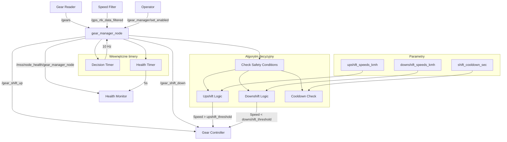

# Gear Manager - Dokumentacja Pakietu

## Przegląd
Pakiet `gear_manager` odpowiada za automatyczne zarządzanie biegami ciągnika rolniczego. Węzeł analizuje aktualną prędkość i automatycznie decyduje o zmianie biegów w górę lub w dół, zapewniając optymalną pracę silnika.

## Funkcjonalności
- **Automatyczne biegi**: Inteligentne zarządzanie biegami na podstawie prędkości
- **Progi upshift/downshift**: Konfigurowalne progi zmiany biegów
- **Cooldown**: Zabezpieczenie przed zbyt częstymi zmianami
- **Warunki bezpieczeństwa**: Sprawdzanie sprzęgła i prędkości
- **Health monitoring**: Raportowanie statusu i statystyk
- **Włączanie/wyłączanie**: Kontrola aktywności gear managera

## Węzeł: `gear_manager_node`

### Parametry
| Parametr | Typ | Domyślna wartość | Opis |
|----------|-----|------------------|------|
| `powershift_max_speeds_kmh` | double[] | `[8.4, 13.0, 16.8, 25.2]` | Maksymalne prędkości biegów [km/h] |
| `upshift_speeds_kmh` | double[] | `[7.5, 12.0, 15.5, 24.0]` | Progi upshift [km/h] |
| `downshift_speeds_kmh` | double[] | `[-6.0, 10.0, 13.5, 20.0]` | Progi downshift [km/h] |
| `shift_cooldown_sec` | double | `2.0` | Cooldown między zmianami [s] |
| `max_powershift` | int | `4` | Maksymalny bieg |

### Topiki

#### Subskrypcje
- **`/gears`** (`my_robot_interfaces/Gear`)
  - Stan biegów i sprzęgła z gear_reader
  - Zawiera: aktualny bieg (0-4), stan sprzęgła (0-1)

- **`/gps_rtk_data_filtered`** (`my_robot_interfaces/GpsRtk`)
  - Filtrowana prędkość z speed_filter_node
  - Zawiera: aktualną prędkość w m/s

#### Publikowane
- **`/mss/node_health/gear_manager_node`** (`std_msgs/String`)
  - Status zdrowia węzła w formacie JSON
  - Zawiera: statystyki zmian, status serwisów, metryki systemu
  - Częstotliwość: 0.2 Hz (co 5s)

### Serwisy

#### `/gear_manager/set_enabled` (SetBool)
- **Funkcja**: Włączanie/wyłączanie gear managera
- **Parametr**: `data` (bool) - true=włączony, false=wyłączony
- **Odpowiedź**: `success` (bool), `message` (string)

### Klienci serwisów
- **`/gear_shift_up`** (SetBool) - zmiana biegu w górę
- **`/gear_shift_down`** (SetBool) - zmiana biegu w dół

## Architektura

### Algorytm decyzyjny
```python
def decision_loop(self):
    # Warunki bezpieczeństwa
    if not self.is_enabled or not self.powershift_initialized:
        return
    if self.clutch_pressed or self.current_powershift == 0 or self.current_speed == 0.0:
        return
    if time_since_last_shift < self.shift_cooldown:
        return
    
    # Logika upshift
    if self.current_powershift < self.max_powershift:
        upshift_trigger = self.upshift_speeds[current_gear_index]
        if self.current_speed > upshift_trigger:
            self.call_shift_service(self.shift_up_client, "GÓRA")
            return
    
    # Logika downshift
    if self.current_powershift > 1:
        downshift_trigger = self.downshift_speeds[current_gear_index]
        if self.current_speed < downshift_trigger:
            self.call_shift_service(self.shift_down_client, "DÓŁ")
            return
```

### Logika upshift
- **Warunek**: `current_speed > upshift_speeds[current_gear_index]`
- **Akcja**: Wywołanie serwisu `/gear_shift_up`
- **Przykład**: Bieg 1 → 2 gdy prędkość > 7.5 km/h

### Logika downshift
- **Warunek**: `current_speed < downshift_speeds[current_gear_index]`
- **Akcja**: Wywołanie serwisu `/gear_shift_down`
- **Przykład**: Bieg 2 → 1 gdy prędkość < 10.0 km/h

### Warunki bezpieczeństwa
1. **Gear manager włączony**: `is_enabled = true`
2. **Bieg zainicjalizowany**: `powershift_initialized = true`
3. **Sprzęgło zwolnione**: `clutch_pressed = false`
4. **Bieg aktywny**: `current_powershift > 0`
5. **Prędkość > 0**: `current_speed > 0.0`
6. **Cooldown**: `time_since_last_shift >= shift_cooldown`

## Zależności

### ROS2
- `rclpy` - Python API dla ROS2
- `std_msgs` - Standardowe wiadomości
- `std_srvs` - Standardowe serwisy
- `my_robot_interfaces` - Niestandardowe wiadomości

### Python
- `json` - Formatowanie danych health
- `time` - Obsługa czasu i cooldown

## Instalacja i uruchomienie

### Budowanie
```bash
cd /home/pi/mss_ros
colcon build --packages-select gear_manager
source install/setup.bash
```

### Uruchomienie
```bash
ros2 run gear_manager gear_manager_node
```

### Uruchomienie z parametrami
```bash
ros2 run gear_manager gear_manager_node --ros-args \
  -p upshift_speeds_kmh:="[8.0, 13.5, 16.0, 25.0]" \
  -p downshift_speeds_kmh:="[-5.0, 11.0, 14.0, 21.0]" \
  -p shift_cooldown_sec:=3.0
```

## Konfiguracja

### Tuning parametrów
```bash
# Ustawienie progów upshift
ros2 param set /gear_manager_node upshift_speeds_kmh "[8.0, 13.5, 16.0, 25.0]"

# Ustawienie progów downshift
ros2 param set /gear_manager_node downshift_speeds_kmh "[-5.0, 11.0, 14.0, 21.0]"

# Ustawienie cooldown
ros2 param set /gear_manager_node shift_cooldown_sec 3.0
```

### Włączanie/wyłączanie
```bash
# Włącz gear manager
ros2 service call /gear_manager/set_enabled std_srvs/srv/SetBool "{data: true}"

# Wyłącz gear manager
ros2 service call /gear_manager/set_enabled std_srvs/srv/SetBool "{data: false}"
```

## Diagnostyka

### Sprawdzanie statusu
```bash
# Sprawdź węzły
ros2 node list | grep gear_manager

# Sprawdź serwisy
ros2 service list | grep gear_manager

# Sprawdź health status
ros2 topic echo /mss/node_health/gear_manager_node
```

### Monitoring
```bash
# Sprawdź parametry
ros2 param list /gear_manager_node
ros2 param get /gear_manager_node upshift_speeds_kmh
ros2 param get /gear_manager_node downshift_speeds_kmh

# Sprawdź logi
ros2 node info /gear_manager_node
```

### Testowanie
```bash
# Test włączania
ros2 service call /gear_manager/set_enabled std_srvs/srv/SetBool "{data: true}"

# Test z mockup GPS
ros2 run system_mockup gps_mockup_node

# Test z mockup biegów
ros2 run system_mockup gear_mockup_node
```

### Typowe problemy
1. **Brak zmian biegów**: Sprawdź czy gear manager jest włączony
2. **Zbyt częste zmiany**: Zwiększ `shift_cooldown_sec`
3. **Brak reakcji**: Sprawdź połączenia z gear_controller
4. **Nieprawidłowe progi**: Dostosuj `upshift_speeds_kmh` i `downshift_speeds_kmh`

## Bezpieczeństwo

### Warunki bezpieczeństwa
- **Sprzęgło wciśnięte**: Brak zmian biegów
- **Bieg 0**: Brak zmian biegów
- **Prędkość 0**: Brak zmian biegów
- **Cooldown**: Zabezpieczenie przed zbyt częstymi zmianami
- **Gear manager wyłączony**: Brak automatycznych zmian

### Ograniczenia
- Maksymalny bieg: 4
- Minimalny bieg: 1
- Cooldown: 2s (konfigurowalny)
- Częstotliwość decyzji: 10 Hz

## Wydajność

### Metryki
- Częstotliwość decyzji: 10 Hz
- Opóźnienie reakcji: < 100ms
- Wykorzystanie CPU: < 2%
- Wykorzystanie pamięci: < 30MB

### Optymalizacja
- Dostosuj progi do charakterystyki ciągnika
- Użyj odpowiedniego cooldown
- Monitoruj statystyki zmian biegów

## Testowanie

### Testy jednostkowe
```bash
# Uruchom testy
cd /home/pi/mss_ros
colcon test --packages-select gear_manager
colcon test-result --all
```

### Testy integracyjne
```bash
# Test z pełnym systemem
ros2 run gear_reader gear_reader_node
ros2 run gear_controller gear_shifter
ros2 run gear_manager gear_manager_node

# Włącz gear manager
ros2 service call /gear_manager/set_enabled std_srvs/srv/SetBool "{data: true}"
```

### Testy wydajności
```bash
# Test częstotliwości
ros2 topic hz /mss/node_health/gear_manager_node

# Test opóźnienia
ros2 topic delay /mss/node_health/gear_manager_node
```

## Graf przepływu informacji



## Autorzy
- **Główny deweloper**: Adam Wróblewski
- **Email**: adam01wroblewski@gmail.com
