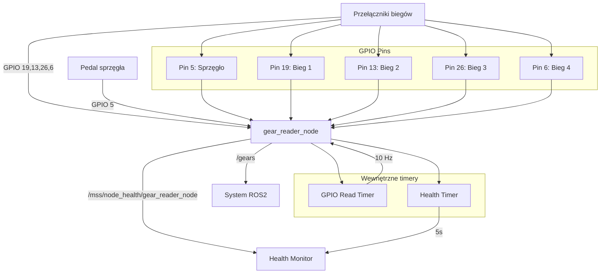

# Gear Reader - Dokumentacja Pakietu

## Przegląd
Pakiet `gear_reader` odpowiada za odczyt stanu biegów i sprzęgła ciągnika rolniczego. Węzeł odczytuje sygnały z pinu GPIO Raspberry Pi, które są podłączone do przełączników biegów i pedału sprzęgła, a następnie publikuje te informacje w systemie ROS2.

## Funkcjonalności
- **Odczyt biegów**: Monitorowanie 4 biegów (1-4) przez piny GPIO
- **Odczyt sprzęgła**: Monitorowanie stanu pedału sprzęgła
- **Health monitoring**: Raportowanie statusu węzła i GPIO
- **Częstotliwość odczytu**: 10 Hz dla responsywności
- **Obsługa błędów**: Graceful handling błędów GPIO

## Węzeł: `gear_reader_node`

### Parametry
Pakiet nie definiuje własnych parametrów - używa stałych konfiguracji w kodzie.

### Konfiguracja GPIO
| Pin | Funkcja | Opis |
|-----|---------|------|
| 5 | Sprzęgło | Stan pedału sprzęgła (0=zwolnione, 1=wciśnięte) |
| 19 | Bieg 1 | Sygnał biegu 1 (0=nieaktywny, 1=aktywny) |
| 13 | Bieg 2 | Sygnał biegu 2 (0=nieaktywny, 1=aktywny) |
| 26 | Bieg 3 | Sygnał biegu 3 (0=nieaktywny, 1=aktywny) |
| 6 | Bieg 4 | Sygnał biegu 4 (0=nieaktywny, 1=aktywny) |

### Topiki

#### Publikowane
- **`/gears`** (`my_robot_interfaces/Gear`)
  - Stan biegów i sprzęgła ciągnika
  - Zawiera: aktualny bieg (0-4), stan sprzęgła (0-1)
  - Częstotliwość: 10 Hz

- **`/mss/node_health/gear_reader_node`** (`std_msgs/String`)
  - Status zdrowia węzła w formacie JSON
  - Zawiera: status GPIO, konfigurację pinów, metryki systemu
  - Częstotliwość: 0.2 Hz (co 5s)

### Wiadomości

#### `Gear.msg`
```yaml
std_msgs/Header header
uint8 gear          # Aktualny bieg (0=Neutralny, 1-4=Biegi)
uint8 clutch_state  # Stan sprzęgła (0=Zwolnione, 1=Wciśnięte)
```

## Architektura

### Algorytm działania
1. **Inicjalizacja GPIO**: Konfiguracja pinów jako wejścia z pull-down
2. **Odczyt stanu**: Cykliczne odczytywanie wszystkich pinów
3. **Detekcja biegu**: Sprawdzanie który pin biegów jest aktywny
4. **Publikacja**: Wysyłanie stanu biegów i sprzęgła
5. **Health monitoring**: Raportowanie statusu węzła

### Logika detekcji biegów
```python
def read_gear_state(self):
    for gear, pin in self.gear_pins.items():
        if lgpio.gpio_read(self.chip_handle, pin) == 1:
            return gear
    return 0  # Neutralny jeśli żaden bieg nie jest aktywny
```

### Obsługa błędów
- **Błąd GPIO**: Logowanie ostrzeżeń i kontynuacja pracy
- **Błąd odczytu**: Zwracanie bezpiecznych wartości (0)
- **Graceful shutdown**: Prawidłowe zwalnianie zasobów GPIO

## Zależności

### ROS2
- `rclpy` - Python API dla ROS2
- `std_msgs` - Standardowe wiadomości ROS2
- `my_robot_interfaces` - Niestandardowe wiadomości

### Python
- `lgpio` - Biblioteka GPIO dla Raspberry Pi 5
- `json` - Formatowanie danych health
- `psutil` - Metryki systemu
- `time` - Obsługa czasu

## Instalacja i uruchomienie

### Budowanie
```bash
cd /home/pi/mss_ros
colcon build --packages-select gear_reader
source install/setup.bash
```

### Uruchomienie
```bash
ros2 run gear_reader gear_reader_node
```

### Uruchomienie z logami
```bash
ros2 run gear_reader gear_reader_node --ros-args --log-level debug
```

## Konfiguracja sprzętowa

### Wymagania
- Raspberry Pi 5 (wymaga biblioteki lgpio)
- Przełączniki biegów podłączone do GPIO
- Pedał sprzęgła z przełącznikiem
- Rezystory pull-down (10kΩ)

### Schemat połączeń
```
Raspberry Pi 5 GPIO:
Pin 5  → Sprzęgło (przełącznik + pull-down)
Pin 19 → Bieg 1 (przełącznik + pull-down)
Pin 13 → Bieg 2 (przełącznik + pull-down)
Pin 26 → Bieg 3 (przełącznik + pull-down)
Pin 6  → Bieg 4 (przełącznik + pull-down)
GND    → Wspólna masa
```

### Konfiguracja uprawnień
```bash
# Sprawdź uprawnienia GPIO
ls -l /dev/gpiochip*

# Dodaj użytkownika do grupy gpio (jeśli potrzebne)
sudo usermod -a -G gpio $USER
```

## Diagnostyka

### Sprawdzanie statusu
```bash
# Sprawdź czy węzeł działa
ros2 node list | grep gear_reader_node

# Sprawdź topiki
ros2 topic list | grep gears

# Sprawdź dane biegów
ros2 topic echo /gears

# Sprawdź health status
ros2 topic echo /mss/node_health/gear_reader_node
```

### Testowanie GPIO
```bash
# Sprawdź status pinów GPIO
sudo lgpio-test 4 5  # Pin 5 (sprzęgło)
sudo lgpio-test 4 19 # Pin 19 (bieg 1)
sudo lgpio-test 4 13 # Pin 13 (bieg 2)
sudo lgpio-test 4 26 # Pin 26 (bieg 3)
sudo lgpio-test 4 6  # Pin 6 (bieg 4)
```

### Logi
```bash
# Sprawdź logi węzła
ros2 node info /gear_reader_node

# Sprawdź parametry
ros2 param list /gear_reader_node
```

### Typowe problemy
1. **Brak danych**: Sprawdź połączenia GPIO i rezystory pull-down
2. **Błąd GPIO**: Sprawdź uprawnienia i dostępność chipsetu
3. **Nieprawidłowe odczyty**: Sprawdź jakość połączeń i zasilanie
4. **Błąd biblioteki**: Upewnij się, że używasz Raspberry Pi 5 z lgpio

## Bezpieczeństwo

### GPIO
- Używaj rezystorów pull-down dla stabilności sygnałów
- Sprawdź napięcia sygnałów (3.3V dla Raspberry Pi)
- Zabezpiecz przed zwarciami i przepięciami

### Dane
- Waliduj odczyty GPIO przed publikacją
- Implementuj debouncing dla przełączników (opcjonalnie)
- Monitoruj częstotliwość zmian stanów

## Wydajność

### Optymalizacja
- Częstotliwość odczytu: 10 Hz (optymalna dla responsywności)
- Użyj odpowiedniego QoS dla topików
- Monitoruj wykorzystanie CPU i pamięci

### Metryki
- Częstotliwość publikacji: 10 Hz
- Opóźnienie: < 100ms
- Wykorzystanie CPU: < 1%
- Wykorzystanie pamięci: < 20MB

## Testowanie

### Testy jednostkowe
```bash
# Uruchom testy
cd /home/pi/mss_ros
colcon test --packages-select gear_reader
colcon test-result --all
```

### Testy integracyjne
```bash
# Test z mockup biegów
ros2 run system_mockup gear_mockup_node

# Test odczytu
ros2 topic echo /gears
```

### Testy sprzętowe
```bash
# Test przełączników
# 1. Włącz bieg 1 - sprawdź czy gear=1
# 2. Włącz bieg 2 - sprawdź czy gear=2
# 3. Wciśnij sprzęgło - sprawdź czy clutch_state=1
# 4. Zwolnij sprzęgło - sprawdź czy clutch_state=0
```

## Graf przepływu informacji



## Kompatybilność

### Raspberry Pi
- **Raspberry Pi 5**: Pełna obsługa (lgpio)
- **Raspberry Pi 4**: Wymaga migracji na RPi.GPIO
- **Starsze wersje**: Wymaga migracji na RPi.GPIO

### Migracja z RPi.GPIO
```python
# Stary kod (RPi.GPIO)
import RPi.GPIO as GPIO
GPIO.setmode(GPIO.BCM)
GPIO.setup(pin, GPIO.IN, pull_up_down=GPIO.PUD_DOWN)
state = GPIO.input(pin)

# Nowy kod (lgpio)
import lgpio
chip_handle = lgpio.gpiochip_open(4)
lgpio.gpio_claim_input(chip_handle, pin, lgpio.SET_PULL_DOWN)
state = lgpio.gpio_read(chip_handle, pin)
```

## Autorzy
- **Główny deweloper**: Adam Wróblewski
- **Email**: adam01wroblewski@gmail.com
