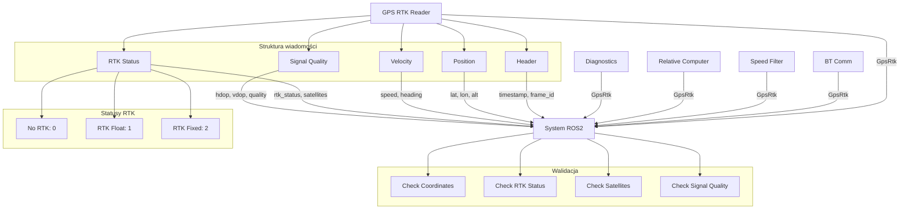

# GPS RTK Messages - Dokumentacja Pakietu

## Przegląd
Pakiet `gps_rtk_msgs` zawiera niestandardowe wiadomości ROS2 używane w systemie MSS do komunikacji danych GPS RTK. Definiuje struktury danych dla pozycji, prędkości, kursu i statusu RTK.

## Funkcjonalności
- **Niestandardowe wiadomości**: Definicje wiadomości GPS RTK
- **Struktury danych**: Pozycja, prędkość, kurs, status RTK
- **Kompatybilność**: Zgodność z systemem ROS2
- **Typy danych**: Standardowe typy ROS2
- **Dokumentacja**: Opisane pola wiadomości

## Wiadomości

### `GpsRtk.msg`
Główna wiadomość zawierająca dane GPS RTK z pozycją, prędkością, kursem i statusem.

```yaml
# Nagłówek z timestampem
std_msgs/Header header

# Pozycja geograficzna
float64 latitude_deg          # Szerokość geograficzna [°]
float64 longitude_deg         # Długość geograficzna [°]
float64 altitude_m            # Wysokość [m]

# Prędkość i kurs
float64 speed_mps             # Prędkość [m/s]
float64 heading_deg           # Kurs [°]

# Status RTK
uint8 rtk_status              # Status RTK (0=No RTK, 1=RTK Float, 2=RTK Fixed)
uint8 satellites_used         # Liczba satelitów
float64 hdop                  # Horizontal Dilution of Precision
float64 vdop                  # Vertical Dilution of Precision

# Jakość sygnału
float64 signal_quality        # Jakość sygnału (0-100%)
```

### Statusy RTK
- **0**: No RTK - Brak korekcji RTK
- **1**: RTK Float - Korekcja RTK float (dokładność ~1m)
- **2**: RTK Fixed - Korekcja RTK fixed (dokładność ~1cm)

### Pola wiadomości

#### Pozycja geograficzna
- **`latitude_deg`**: Szerokość geograficzna w stopniach
- **`longitude_deg`**: Długość geograficzna w stopniach
- **`altitude_m`**: Wysokość w metrach

#### Prędkość i kurs
- **`speed_mps`**: Prędkość w metrach na sekundę
- **`heading_deg`**: Kurs w stopniach (0° = północ, 90° = wschód)

#### Status RTK
- **`rtk_status`**: Status korekcji RTK (0-2)
- **`satellites_used`**: Liczba używanych satelitów
- **`hdop`**: Horizontal Dilution of Precision
- **`vdop`**: Vertical Dilution of Precision

#### Jakość sygnału
- **`signal_quality`**: Jakość sygnału w procentach (0-100%)

## Architektura

### Struktura wiadomości
```yaml
# Przykład wiadomości GpsRtk
header:
  stamp:
    sec: 1701234567
    nanosec: 890123456
  frame_id: "gps_frame"
latitude_deg: 52.2297
longitude_deg: 21.0122
altitude_m: 100.5
speed_mps: 5.2
heading_deg: 45.0
rtk_status: 2
satellites_used: 12
hdop: 1.2
vdop: 1.8
signal_quality: 95.0
```

### Użycie w systemie
```python
# Publikacja wiadomości
from gps_rtk_msgs.msg import GpsRtk

msg = GpsRtk()
msg.header.stamp = self.get_clock().now().to_msg()
msg.header.frame_id = "gps_frame"
msg.latitude_deg = 52.2297
msg.longitude_deg = 21.0122
msg.altitude_m = 100.5
msg.speed_mps = 5.2
msg.heading_deg = 45.0
msg.rtk_status = 2
msg.satellites_used = 12
msg.hdop = 1.2
msg.vdop = 1.8
msg.signal_quality = 95.0

self.publisher.publish(msg)
```

### Subskrypcja wiadomości
```python
# Subskrypcja wiadomości
from gps_rtk_msgs.msg import GpsRtk

def gps_callback(self, msg):
    lat = msg.latitude_deg
    lon = msg.longitude_deg
    speed = msg.speed_mps
    heading = msg.heading_deg
    rtk_status = msg.rtk_status
    
    if rtk_status == 2:
        print("RTK Fixed - wysoka dokładność")
    elif rtk_status == 1:
        print("RTK Float - średnia dokładność")
    else:
        print("No RTK - niska dokładność")

self.subscription = self.create_subscription(
    GpsRtk,
    '/gps_rtk_data',
    self.gps_callback,
    10
)
```

## Zależności

### ROS2
- `ament_cmake` - System budowania
- `std_msgs` - Standardowe wiadomości
- `builtin_interfaces` - Interfejsy wbudowane
- `rosidl_default_generators` - Generatory wiadomości
- `rosidl_default_runtime` - Runtime wiadomości

### Pakiety
- `geometry_msgs` - Wiadomości geometryczne
- `sensor_msgs` - Wiadomości sensorów

## Instalacja i uruchomienie

### Budowanie
```bash
cd /home/pi/mss_ros
colcon build --packages-select gps_rtk_msgs
source install/setup.bash
```

### Użycie w pakietach
```python
# W package.xml
<depend>gps_rtk_msgs</depend>

# W setup.py
install_requires=['gps_rtk_msgs']

# W kodzie Python
from gps_rtk_msgs.msg import GpsRtk
```

### Testowanie wiadomości
```bash
# Sprawdź dostępne wiadomości
ros2 interface list | grep gps_rtk

# Sprawdź definicję wiadomości
ros2 interface show gps_rtk_msgs/msg/GpsRtk

# Test publikacji
ros2 topic pub /test_gps gps_rtk_msgs/msg/GpsRtk "
header:
  stamp:
    sec: 0
    nanosec: 0
  frame_id: 'test'
latitude_deg: 52.2297
longitude_deg: 21.0122
altitude_m: 100.5
speed_mps: 5.2
heading_deg: 45.0
rtk_status: 2
satellites_used: 12
hdop: 1.2
vdop: 1.8
signal_quality: 95.0"
```

## Konfiguracja

### Parametry wiadomości
```python
# Konfiguracja w węzłach
self.declare_parameter('gps_frame_id', 'gps_frame')
self.declare_parameter('rtk_timeout_sec', 5.0)
self.declare_parameter('min_satellites', 4)
```

### Walidacja danych
```python
def validate_gps_data(self, msg):
    # Sprawdź zakres współrzędnych
    if not (-90 <= msg.latitude_deg <= 90):
        return False
    if not (-180 <= msg.longitude_deg <= 180):
        return False
    
    # Sprawdź status RTK
    if msg.rtk_status not in [0, 1, 2]:
        return False
    
    # Sprawdź liczbę satelitów
    if msg.satellites_used < 4:
        return False
    
    return True
```

## Diagnostyka

### Sprawdzanie statusu
```bash
# Sprawdź dostępne wiadomości
ros2 interface list | grep gps_rtk

# Sprawdź definicję wiadomości
ros2 interface show gps_rtk_msgs/msg/GpsRtk

# Sprawdź topiki używające wiadomości
ros2 topic list | grep gps
```

### Monitoring
```bash
# Sprawdź dane GPS
ros2 topic echo /gps_rtk_data

# Sprawdź częstotliwość
ros2 topic hz /gps_rtk_data

# Sprawdź opóźnienie
ros2 topic delay /gps_rtk_data
```

### Testowanie
```bash
# Test publikacji
ros2 topic pub /test_gps gps_rtk_msgs/msg/GpsRtk "{header: {stamp: {sec: 0, nanosec: 0}, frame_id: 'test'}, latitude_deg: 52.2297, longitude_deg: 21.0122, altitude_m: 100.5, speed_mps: 5.2, heading_deg: 45.0, rtk_status: 2, satellites_used: 12, hdop: 1.2, vdop: 1.8, signal_quality: 95.0}"

# Test subskrypcji
ros2 topic echo /test_gps
```

### Typowe problemy
1. **Brak wiadomości**: Sprawdź czy pakiet jest zbudowany
2. **Błąd importu**: Sprawdź zależności w package.xml
3. **Błąd walidacji**: Sprawdź zakresy wartości
4. **Błąd kompilacji**: Sprawdź składnię wiadomości

## Bezpieczeństwo

### Walidacja danych
- **Zakres współrzędnych**: Szerokość -90° do 90°, długość -180° do 180°
- **Status RTK**: Tylko wartości 0, 1, 2
- **Liczba satelitów**: Minimum 4
- **Jakość sygnału**: 0-100%

### Ograniczenia
- Rozmiar wiadomości: ~100 bytes
- Częstotliwość: Do 20 Hz
- Dokładność: Zależna od statusu RTK

## Wydajność

### Metryki
- Rozmiar wiadomości: ~100 bytes
- Czas serializacji: < 1ms
- Czas deserializacji: < 1ms
- Wykorzystanie pamięci: Minimalne

### Optymalizacja
- Użyj odpowiedniego QoS
- Dostosuj częstotliwość publikacji
- Monitoruj wykorzystanie zasobów

## Testowanie

### Testy jednostkowe
```bash
# Uruchom testy
cd /home/pi/mss_ros
colcon test --packages-select gps_rtk_msgs
colcon test-result --all
```

### Testy integracyjne
```bash
# Test z węzłami GPS
ros2 run gps_rtk_reader gps_rtk_node
ros2 topic echo /gps_rtk_data
```

### Testy wydajności
```bash
# Test częstotliwości
ros2 topic hz /gps_rtk_data

# Test opóźnienia
ros2 topic delay /gps_rtk_data
```

## Graf przepływu informacji



## Autorzy
- **Główny deweloper**: Adam Wróblewski
- **Email**: adam01wroblewski@gmail.com
