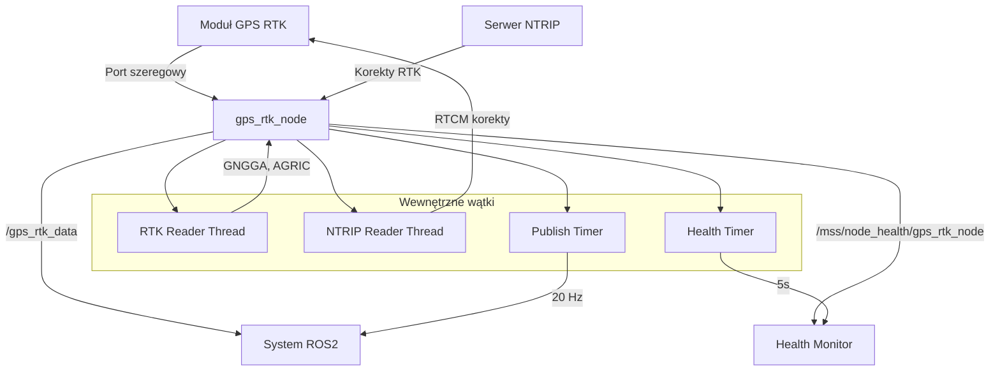

# GPS RTK Reader - Dokumentacja Pakietu

## Przegląd
Pakiet `gps_rtk_reader` odpowiada za odczyt danych GPS RTK z ciągnika rolniczego. Węzeł łączy się z modułem GPS RTK przez port szeregowy, odbiera korekty NTRIP i publikuje precyzyjne dane pozycji, prędkości i kursu.

## Funkcjonalności
- **Odczyt GPS RTK**: Parsowanie wiadomości NMEA GNGGA i AGRIC
- **Połączenie NTRIP**: Automatyczne łączenie z serwerem korekcyjnym
- **Synchronizacja czasowa**: Konwersja czasu GPS na czas ROS
- **Health monitoring**: Raportowanie statusu węzła
- **Automatyczne rekonfiguracja**: Ponowne łączenie przy błędach

## Węzeł: `gps_rtk_node`

### Parametry
| Parametr | Typ | Domyślna wartość | Opis |
|----------|-----|------------------|------|
| `serial_port` | string | `/dev/ttyUSB0` | Port szeregowy modułu GPS |
| `baud_rate` | int | `460800` | Prędkość transmisji szeregowej |
| `ntrip_ip` | string | `system.asgeupos.pl` | Adres IP serwera NTRIP |
| `ntrip_port` | int | `8080` | Port serwera NTRIP |
| `ntrip_mountpoint` | string | `RTN4G_VRS_RTCM32` | Punkt montażowy NTRIP |
| `ntrip_user` | string | `pwmgr/adamwrb` | Użytkownik NTRIP |
| `gngga_ntrip_interval` | double | `10.0` | Interwał wysyłania GNGGA do NTRIP [s] |
| `publish_frequency` | double | `20.0` | Częstotliwość publikacji [Hz] |

### Topiki

#### Publikowane
- **`/gps_rtk_data`** (`my_robot_interfaces/GpsRtk`)
  - Surowe dane GPS ciągnika
  - Zawiera: pozycję, prędkość, kurs, status RTK, czas GPS
  - Częstotliwość: 20 Hz

- **`/mss/node_health/gps_rtk_node`** (`std_msgs/String`)
  - Status zdrowia węzła w formacie JSON
  - Zawiera: status portu, NTRIP, wątków, metryki systemu
  - Częstotliwość: 0.2 Hz (co 5s)

### Wiadomości

#### `GpsRtk.msg`
```yaml
std_msgs/Header header           # Nagłówek ROS z czasem i frame_id
builtin_interfaces/Time gps_time # Czas UTC odczytany z GPS
uint8 rtk_status                 # Status RTK (0: brak, 1: SPS, 2: DGPS, 4: RTK Fixed, 5: RTK Float)
float64 latitude_deg             # Szerokość geograficzna [°]
float64 longitude_deg            # Długość geograficzna [°]
float64 altitude_m               # Wysokość n.p.m. [m]
float64 speed_mps                # Prędkość [m/s]
float64 heading_deg              # Kurs (orientacja) [°] (0-360)
```

## Architektura

### Wątki
1. **Wątek RTK Reader**: Odczytuje dane z portu szeregowego
2. **Wątek NTRIP Reader**: Odbiera korekty z serwera NTRIP
3. **Timer publikacji**: Publikuje dane GPS z określoną częstotliwością
4. **Timer health**: Raportuje status węzła

### Algorytm działania
1. **Inicjalizacja**: Otwarcie portu szeregowego i połączenia NTRIP
2. **Parsowanie GNGGA**: Odczyt pozycji i statusu RTK
3. **Parsowanie AGRIC**: Odczyt kursu i prędkości
4. **Synchronizacja**: Czekanie na świeże dane z obu źródeł
5. **Publikacja**: Wysyłanie zsynchronizowanych danych

### Obsługa błędów
- **Port szeregowy**: Automatyczne ponowne otwieranie przy błędach
- **NTRIP**: Ponowne łączenie przy rozłączeniu
- **Timeout**: Sprawdzanie świeżości danych (2s)
- **Graceful shutdown**: Prawidłowe zamykanie połączeń

## Zależności

### ROS2
- `rclpy` - Python API dla ROS2
- `gps_rtk_msgs` - Niestandardowe wiadomości GPS

### Python
- `serial` - Komunikacja szeregowa
- `socket` - Połączenia sieciowe
- `threading` - Wielowątkowość
- `base64` - Kodowanie autoryzacji NTRIP
- `datetime` - Obsługa czasu
- `psutil` - Metryki systemu

## Instalacja i uruchomienie

### Budowanie
```bash
cd /home/pi/mss_ros
colcon build --packages-select gps_rtk_reader
source install/setup.bash
```

### Uruchomienie
```bash
ros2 run gps_rtk_reader gps_rtk_node
```

### Uruchomienie z parametrami
```bash
ros2 run gps_rtk_reader gps_rtk_node --ros-args \
  -p serial_port:=/dev/ttyUSB1 \
  -p baud_rate:=115200 \
  -p publish_frequency:=10.0
```

## Konfiguracja sprzętowa

### Wymagania
- Moduł GPS RTK z interfejsem szeregowym
- Połączenie internetowe dla NTRIP
- Port szeregowy dostępny dla użytkownika

### Konfiguracja portu szeregowego
```bash
# Dodaj użytkownika do grupy dialout
sudo usermod -a -G dialout $USER

# Sprawdź dostępne porty
ls /dev/ttyUSB* /dev/ttyACM*

# Sprawdź uprawnienia
ls -l /dev/ttyUSB0
```

## Diagnostyka

### Sprawdzanie statusu
```bash
# Sprawdź czy węzeł działa
ros2 node list | grep gps_rtk_node

# Sprawdź topiki
ros2 topic list | grep gps_rtk

# Sprawdź dane GPS
ros2 topic echo /gps_rtk_data

# Sprawdź health status
ros2 topic echo /mss/node_health/gps_rtk_node
```

### Logi
```bash
# Sprawdź logi węzła
ros2 node info /gps_rtk_node

# Sprawdź parametry
ros2 param list /gps_rtk_node
ros2 param get /gps_rtk_node serial_port
```

### Typowe problemy
1. **Brak danych GPS**: Sprawdź połączenie szeregowe i antenę
2. **Błąd NTRIP**: Sprawdź połączenie internetowe i dane logowania
3. **Timeout danych**: Sprawdź częstotliwość wiadomości GPS
4. **Błąd uprawnień**: Dodaj użytkownika do grupy dialout

## Bezpieczeństwo

### Dane logowania NTRIP
- Dane logowania są przechowywane w parametrach ROS2
- Używaj zmiennych środowiskowych dla danych produkcyjnych
- Regularnie zmieniaj hasła dostępu

### Port szeregowy
- Sprawdź uprawnienia dostępu do portu
- Używaj dedykowanego użytkownika dla aplikacji
- Monitoruj dostęp do urządzeń

## Wydajność

### Optymalizacja
- Dostosuj częstotliwość publikacji do potrzeb
- Użyj odpowiedniego QoS dla topików
- Monitoruj wykorzystanie CPU i pamięci

### Metryki
- Częstotliwość publikacji: 20 Hz
- Opóźnienie: < 100ms
- Wykorzystanie CPU: < 5%
- Wykorzystanie pamięci: < 50MB

## Graf przepływu informacji



## Autorzy
- **Główny deweloper**: Adam Wróblewski
- **Email**: adam01wroblewski@gmail.com
