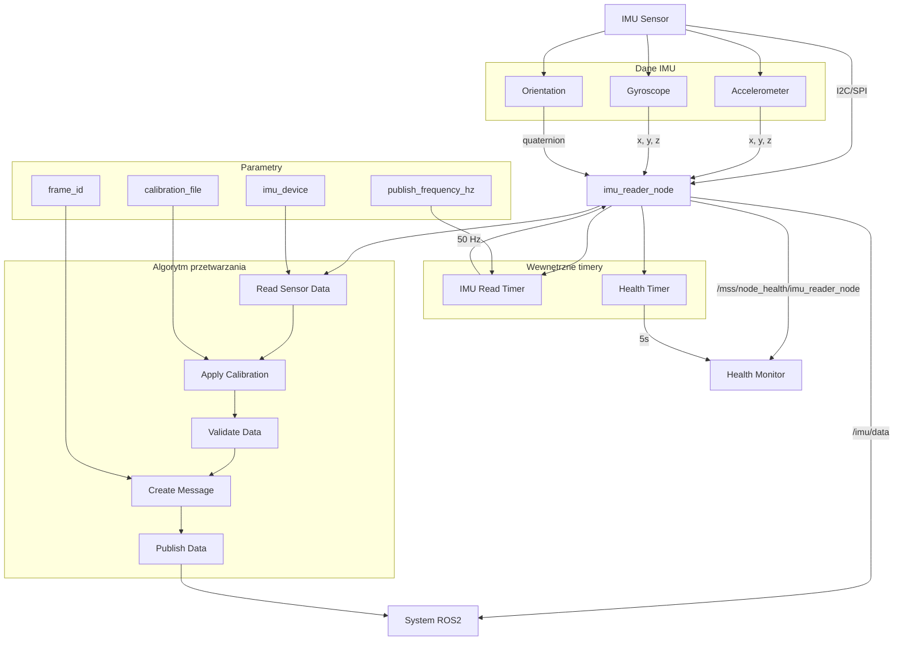

# IMU Reader - Dokumentacja Pakietu

## Przegląd
Pakiet `imu_reader` odpowiada za odczyt danych z czujnika IMU (Inertial Measurement Unit). Węzeł zbiera dane dotyczące przyspieszenia, prędkości kątowej i orientacji, publikując je w standardowym formacie ROS2.

## Funkcjonalności
- **Odczyt IMU**: Zbieranie danych z czujnika IMU
- **Przyspieszenie**: Dane przyspieszenia liniowego (x, y, z)
- **Prędkość kątowa**: Dane prędkości kątowej (x, y, z)
- **Orientacja**: Dane orientacji (quaternion)
- **Health monitoring**: Raportowanie statusu węzła
- **Konfiguracja**: Parametry czujnika i częstotliwości

## Węzeł: `imu_reader_node`

### Parametry
| Parametr | Typ | Domyślna wartość | Opis |
|----------|-----|------------------|------|
| `imu_device` | string | `/dev/ttyUSB0` | Urządzenie IMU |
| `publish_frequency_hz` | double | `50.0` | Częstotliwość publikacji [Hz] |
| `frame_id` | string | `imu_link` | Frame ID dla transformacji |
| `calibration_file` | string | `""` | Plik kalibracji IMU |

### Topiki

#### Publikowane
- **`/imu/data`** (`sensor_msgs/Imu`)
  - Dane IMU w standardowym formacie ROS2
  - Zawiera: przyspieszenie, prędkość kątową, orientację
  - Częstotliwość: 50 Hz (konfigurowalna)

- **`/mss/node_health/imu_reader_node`** (`std_msgs/String`)
  - Status zdrowia węzła w formacie JSON
  - Zawiera: status połączenia, błędy, metryki systemu
  - Częstotliwość: 0.2 Hz (co 5s)

## Architektura

### Struktura danych IMU
```python
def create_imu_message(self, accel_data, gyro_data, orientation_data):
    imu_msg = Imu()
    imu_msg.header.stamp = self.get_clock().now().to_msg()
    imu_msg.header.frame_id = self.frame_id
    
    # Przyspieszenie liniowe
    imu_msg.linear_acceleration.x = accel_data[0]
    imu_msg.linear_acceleration.y = accel_data[1]
    imu_msg.linear_acceleration.z = accel_data[2]
    
    # Prędkość kątowa
    imu_msg.angular_velocity.x = gyro_data[0]
    imu_msg.angular_velocity.y = gyro_data[1]
    imu_msg.angular_velocity.z = gyro_data[2]
    
    # Orientacja (quaternion)
    imu_msg.orientation.x = orientation_data[0]
    imu_msg.orientation.y = orientation_data[1]
    imu_msg.orientation.z = orientation_data[2]
    imu_msg.orientation.w = orientation_data[3]
    
    return imu_msg
```

### Odczyt danych z czujnika
```python
def read_imu_data(self):
    try:
        # Odczyt danych z czujnika IMU
        accel_data = self.imu_sensor.read_accelerometer()
        gyro_data = self.imu_sensor.read_gyroscope()
        orientation_data = self.imu_sensor.read_orientation()
        
        # Walidacja danych
        if self.validate_imu_data(accel_data, gyro_data, orientation_data):
            return accel_data, gyro_data, orientation_data
        else:
            self.get_logger().warn("Invalid IMU data received")
            return None, None, None
            
    except Exception as e:
        self.get_logger().error(f"Error reading IMU data: {e}")
        return None, None, None
```

### Walidacja danych
```python
def validate_imu_data(self, accel_data, gyro_data, orientation_data):
    # Sprawdź zakres przyspieszenia
    for accel in accel_data:
        if not (-50 <= accel <= 50):  # m/s²
            return False
    
    # Sprawdź zakres prędkości kątowej
    for gyro in gyro_data:
        if not (-1000 <= gyro <= 1000):  # rad/s
            return False
    
    # Sprawdź normalizację quaternion
    if orientation_data is not None:
        norm = math.sqrt(sum(x**2 for x in orientation_data))
        if not (0.9 <= norm <= 1.1):
            return False
    
    return True
```

### Kalibracja IMU
```python
def load_calibration(self, calibration_file):
    if not calibration_file:
        return None
    
    try:
        with open(calibration_file, 'r') as f:
            calibration_data = json.load(f)
        
        # Zastosuj kalibrację
        self.accel_bias = calibration_data.get('accel_bias', [0, 0, 0])
        self.gyro_bias = calibration_data.get('gyro_bias', [0, 0, 0])
        self.accel_scale = calibration_data.get('accel_scale', [1, 1, 1])
        self.gyro_scale = calibration_data.get('gyro_scale', [1, 1, 1])
        
        self.get_logger().info("IMU calibration loaded successfully")
        return True
        
    except Exception as e:
        self.get_logger().error(f"Error loading calibration: {e}")
        return False
```

## Zależności

### ROS2
- `rclpy` - Python API dla ROS2
- `sensor_msgs` - Wiadomości sensorów
- `geometry_msgs` - Wiadomości geometryczne

### Python
- `json` - Obsługa plików kalibracji
- `math` - Obliczenia matematyczne
- `time` - Obsługa czasu

### Sprzęt
- **IMU Sensor** - Czujnik IMU (np. MPU6050, LSM9DS1)
- **I2C/SPI** - Interfejs komunikacji z czujnikiem

## Instalacja i uruchomienie

### Budowanie
```bash
cd /home/pi/mss_ros
colcon build --packages-select imu_reader
source install/setup.bash
```

### Uruchomienie
```bash
ros2 run imu_reader imu_reader_node
```

### Uruchomienie z parametrami
```bash
ros2 run imu_reader imu_reader_node --ros-args \
  -p imu_device:=/dev/ttyUSB1 \
  -p publish_frequency_hz:=100.0 \
  -p frame_id:=base_link \
  -p calibration_file:=/home/pi/imu_calibration.json
```

## Konfiguracja

### Parametry
```bash
# Ustawienie urządzenia IMU
ros2 param set /imu_reader_node imu_device /dev/ttyUSB1

# Ustawienie częstotliwości publikacji
ros2 param set /imu_reader_node publish_frequency_hz 100.0

# Ustawienie frame ID
ros2 param set /imu_reader_node frame_id base_link

# Ustawienie pliku kalibracji
ros2 param set /imu_reader_node calibration_file /home/pi/imu_calibration.json
```

### Plik kalibracji
```json
{
    "accel_bias": [0.1, -0.05, 0.02],
    "gyro_bias": [0.01, -0.01, 0.005],
    "accel_scale": [1.02, 0.98, 1.01],
    "gyro_scale": [1.01, 0.99, 1.00]
}
```

## Diagnostyka

### Sprawdzanie statusu
```bash
# Sprawdź węzły
ros2 node list | grep imu_reader

# Sprawdź topiki
ros2 topic list | grep imu

# Sprawdź dane IMU
ros2 topic echo /imu/data

# Sprawdź health status
ros2 topic echo /mss/node_health/imu_reader_node
```

### Monitoring
```bash
# Sprawdź parametry
ros2 param list /imu_reader_node
ros2 param get /imu_reader_node publish_frequency_hz
ros2 param get /imu_reader_node frame_id

# Sprawdź logi
ros2 node info /imu_reader_node
```

### Testowanie
```bash
# Test z czujnikiem IMU
ros2 run imu_reader imu_reader_node

# Sprawdź dane
ros2 topic echo /imu/data
```

### Typowe problemy
1. **Brak danych**: Sprawdź połączenie z czujnikiem IMU
2. **Błąd urządzenia**: Sprawdź uprawnienia do urządzenia
3. **Błąd kalibracji**: Sprawdź plik kalibracji
4. **Błąd walidacji**: Sprawdź zakresy danych

## Bezpieczeństwo

### Uprawnienia
- **Urządzenie IMU**: Dostęp do urządzenia IMU
- **Pliki kalibracji**: Uprawnienia do odczytu plików
- **Dane**: Ochrona danych IMU

### Ograniczenia
- Częstotliwość publikacji: 50 Hz (konfigurowalna)
- Rozmiar wiadomości: ~200 bytes
- Zakres przyspieszenia: ±50 m/s²
- Zakres prędkości kątowej: ±1000 rad/s

## Wydajność

### Metryki
- Częstotliwość publikacji: 50 Hz
- Opóźnienie: < 20ms
- Wykorzystanie CPU: < 5%
- Wykorzystanie pamięci: < 30MB

### Optymalizacja
- Dostosuj częstotliwość publikacji
- Użyj odpowiedniego QoS
- Monitoruj wykorzystanie zasobów

## Testowanie

### Testy jednostkowe
```bash
# Uruchom testy
cd /home/pi/mss_ros
colcon test --packages-select imu_reader
colcon test-result --all
```

### Testy integracyjne
```bash
# Test z czujnikiem IMU
ros2 run imu_reader imu_reader_node

# Sprawdź dane
ros2 topic echo /imu/data
```

### Testy wydajności
```bash
# Test częstotliwości
ros2 topic hz /imu/data

# Test opóźnienia
ros2 topic delay /imu/data
```

## Graf przepływu informacji



## Autorzy
- **Główny deweloper**: Adam Wróblewski
- **Email**: adam01wroblewski@gmail.com
