# MSS Bringup - Dokumentacja Pakietu

## Przegląd
Pakiet `mss_bringup` zawiera pliki launch do uruchamiania systemu MSS. Zapewnia różne konfiguracje uruchomieniowe dla różnych scenariuszy użycia, od podstawowych węzłów po pełny system z mockupami.

## Funkcjonalności
- **Pliki launch**: Różne konfiguracje uruchomieniowe
- **Uruchamianie systemu**: Automatyczne uruchamianie wszystkich węzłów
- **Konfiguracje**: Podstawowe, pełne, mockup, datalog
- **Parametry**: Konfigurowalne parametry systemu
- **Zależności**: Zarządzanie zależnościami między węzłami

## Pliki launch

### `all_nodes.launch.py`
**Pełny system MSS** - Uruchamia wszystkie węzły systemu MSS w trybie produkcyjnym.

#### Uruchamiane węzły:
- `gps_rtk_reader.gps_rtk_node` - Odczyt GPS RTK
- `bt_comm.bt_receiver_node` - Komunikacja Bluetooth
- `gear_reader.gear_reader_node` - Odczyt biegów
- `speed_controller.speed_filter_node` - Filtr prędkości
- `speed_controller.speed_controller_node` - Kontroler prędkości
- `servo_controller.servo_controller` - Kontroler serwa
- `gear_controller.gear_shifter` - Kontroler biegów
- `gear_manager.gear_manager_node` - Zarządzanie biegami
- `relative_position_computer.relative_computer_node` - Obliczenia pozycji
- `mss_diagnostics.diagnostics_node` - Diagnostyka
- `mss_health_monitor.health_monitor_node` - Monitor zdrowia
- `mss_system_monitor.system_monitor_node` - Monitor systemu

### `all_nodes_mockup.launch.py`
**System z mockupami** - Uruchamia system MSS z węzłami mockup zamiast rzeczywistych.

#### Uruchamiane węzły:
- `system_mockup.gps_mockup_node` - Mockup GPS
- `system_mockup.gear_mockup_node` - Mockup biegów
- `speed_controller.speed_filter_node` - Filtr prędkości
- `speed_controller.speed_controller_node` - Kontroler prędkości
- `servo_controller.servo_controller` - Kontroler serwa
- `gear_controller.gear_shifter` - Kontroler biegów
- `gear_manager.gear_manager_node` - Zarządzanie biegami
- `relative_position_computer.relative_computer_node` - Obliczenia pozycji
- `mss_diagnostics.diagnostics_node` - Diagnostyka
- `mss_health_monitor.health_monitor_node` - Monitor zdrowia
- `mss_system_monitor.system_monitor_node` - Monitor systemu

### `basic_nodes.launch.py`
**Podstawowe węzły** - Uruchamia tylko podstawowe węzły systemu.

#### Uruchamiane węzły:
- `gps_rtk_reader.gps_rtk_node` - Odczyt GPS RTK
- `bt_comm.bt_receiver_node` - Komunikacja Bluetooth
- `gear_reader.gear_reader_node` - Odczyt biegów
- `speed_controller.speed_filter_node` - Filtr prędkości
- `speed_controller.speed_controller_node` - Kontroler prędkości

### `datalog_recorder.launch.py`
**Rejestrator danych** - Uruchamia system z rejestratorem danych.

#### Uruchamiane węzły:
- Wszystkie węzły z `all_nodes.launch.py`
- `data_logger.data_logger_node` - Rejestrator danych

## Architektura

### Struktura plików launch
```python
# Przykład struktury pliku launch
from launch import LaunchDescription
from launch_ros.actions import Node
from launch.actions import DeclareLaunchArgument
from launch.substitutions import LaunchConfiguration

def generate_launch_description():
    return LaunchDescription([
        # Deklaracja argumentów
        DeclareLaunchArgument('param_name', default_value='default_value'),
        
        # Uruchomienie węzłów
        Node(
            package='package_name',
            executable='node_name',
            name='node_name',
            parameters=[{'param_name': LaunchConfiguration('param_name')}]
        ),
        
        # Więcej węzłów...
    ])
```

### Zarządzanie zależnościami
```python
# Przykład zależności między węzłami
Node(
    package='speed_controller',
    executable='speed_controller_node',
    name='speed_controller_node',
    # Węzeł zależy od speed_filter_node
    condition=launch.conditions.IfCondition('true')
)
```

### Parametry systemu
```python
# Przykład parametrów
DeclareLaunchArgument('gps_port', default_value='/dev/ttyUSB0'),
DeclareLaunchArgument('bt_mac', default_value='00:11:22:33:44:55'),
DeclareLaunchArgument('servo_channel', default_value='0'),
```

## Zależności

### ROS2
- `launch` - System uruchamiania
- `launch_ros` - Uruchamianie węzłów ROS2
- `ament_cmake` - System budowania

### Pakiety MSS
- `gps_rtk_reader` - Odczyt GPS RTK
- `bt_comm` - Komunikacja Bluetooth
- `gear_reader` - Odczyt biegów
- `speed_controller` - Kontroler prędkości
- `servo_controller` - Kontroler serwa
- `gear_controller` - Kontroler biegów
- `gear_manager` - Zarządzanie biegami
- `relative_position_computer` - Obliczenia pozycji
- `mss_diagnostics` - Diagnostyka
- `mss_health_monitor` - Monitor zdrowia
- `mss_system_monitor` - Monitor systemu
- `system_mockup` - Węzły mockup
- `data_logger` - Rejestrator danych

## Instalacja i uruchomienie

### Budowanie
```bash
cd /home/pi/mss_ros
colcon build --packages-select mss_bringup
source install/setup.bash
```

### Uruchomienie pełnego systemu
```bash
# Uruchom wszystkie węzły
ros2 launch mss_bringup all_nodes.launch.py

# Uruchom z parametrami
ros2 launch mss_bringup all_nodes.launch.py \
  gps_port:=/dev/ttyUSB1 \
  bt_mac:=00:11:22:33:44:66 \
  servo_channel:=1
```

### Uruchomienie z mockupami
```bash
# Uruchom system z mockupami
ros2 launch mss_bringup all_nodes_mockup.launch.py

# Uruchom z parametrami
ros2 launch mss_bringup all_nodes_mockup.launch.py \
  mockup_speed:=5.0 \
  mockup_gear:=2
```

### Uruchomienie podstawowych węzłów
```bash
# Uruchom tylko podstawowe węzły
ros2 launch mss_bringup basic_nodes.launch.py

# Uruchom z parametrami
ros2 launch mss_bringup basic_nodes.launch.py \
  gps_port:=/dev/ttyUSB0 \
  bt_mac:=00:11:22:33:44:55
```

### Uruchomienie z rejestratorem
```bash
# Uruchom system z rejestratorem danych
ros2 launch mss_bringup datalog_recorder.launch.py

# Uruchom z parametrami
ros2 launch mss_bringup datalog_recorder.launch.py \
  log_directory:=/home/pi/logs \
  log_frequency:=10.0
```

## Konfiguracja

### Parametry launch
```bash
# Sprawdź dostępne parametry
ros2 launch mss_bringup all_nodes.launch.py --show-args

# Ustaw parametry
ros2 launch mss_bringup all_nodes.launch.py \
  gps_port:=/dev/ttyUSB1 \
  bt_mac:=00:11:22:33:44:66 \
  servo_channel:=1 \
  mockup_speed:=5.0
```

### Konfiguracja węzłów
```bash
# Sprawdź parametry węzła
ros2 param list /gps_rtk_node
ros2 param get /gps_rtk_node port

# Ustaw parametry węzła
ros2 param set /gps_rtk_node port /dev/ttyUSB1
```

## Diagnostyka

### Sprawdzanie statusu
```bash
# Sprawdź uruchomione węzły
ros2 node list

# Sprawdź topiki
ros2 topic list

# Sprawdź serwisy
ros2 service list
```

### Monitoring
```bash
# Sprawdź logi
ros2 node info /gps_rtk_node
ros2 node info /bt_receiver_node

# Sprawdź health status
ros2 topic echo /mss/system_health
```

### Testowanie
```bash
# Test podstawowych węzłów
ros2 launch mss_bringup basic_nodes.launch.py

# Test z mockupami
ros2 launch mss_bringup all_nodes_mockup.launch.py

# Test pełnego systemu
ros2 launch mss_bringup all_nodes.launch.py
```

### Typowe problemy
1. **Brak węzłów**: Sprawdź czy pakiety są zbudowane
2. **Błąd parametrów**: Sprawdź wartości parametrów
3. **Błąd zależności**: Sprawdź czy wszystkie pakiety są dostępne
4. **Błąd uruchomienia**: Sprawdź logi węzłów

## Bezpieczeństwo

### Uwagi bezpieczeństwa
- **Parametry**: Sprawdź wartości parametrów przed uruchomieniem
- **Zależności**: Upewnij się, że wszystkie pakiety są dostępne
- **Uprawnienia**: Sprawdź uprawnienia do urządzeń (GPS, GPIO)

### Rekomendacje
- Użyj mockupów do testowania
- Sprawdź logi przed uruchomieniem produkcyjnym
- Regularnie aktualizuj pakiety

## Wydajność

### Metryki
- Czas uruchomienia: < 30s
- Wykorzystanie CPU: < 10%
- Wykorzystanie pamięci: < 100MB

### Optymalizacja
- Użyj odpowiednich konfiguracji launch
- Dostosuj parametry do potrzeb
- Monitoruj wykorzystanie zasobów

## Testowanie

### Testy funkcjonalne
```bash
# Test podstawowych węzłów
ros2 launch mss_bringup basic_nodes.launch.py

# Test z mockupami
ros2 launch mss_bringup all_nodes_mockup.launch.py

# Test pełnego systemu
ros2 launch mss_bringup all_nodes.launch.py
```

### Testy integracyjne
```bash
# Test z rejestratorem
ros2 launch mss_bringup datalog_recorder.launch.py

# Sprawdź dane
ros2 topic echo /diagnostics
ros2 topic echo /mss/system_health
```

### Testy wydajności
```bash
# Test częstotliwości
ros2 topic hz /diagnostics

# Test opóźnienia
ros2 topic delay /mss/system_health
```

## Graf przepływu informacji

```mermaid
graph TD
    A[mss_bringup] -->|Launch Files| B[System ROS2]
    
    subgraph "Pliki launch"
        C[all_nodes.launch.py]
        D[all_nodes_mockup.launch.py]
        E[basic_nodes.launch.py]
        F[datalog_recorder.launch.py]
    end
    
    A --> C
    A --> D
    A --> E
    A --> F
    
    subgraph "Węzły systemu"
        G[GPS RTK Reader]
        H[BT Comm]
        I[Gear Reader]
        J[Speed Controller]
        K[Servo Controller]
        L[Gear Controller]
        M[Gear Manager]
        N[Relative Computer]
        O[Diagnostics]
        P[Health Monitor]
        Q[System Monitor]
        R[Mockup Nodes]
        S[Data Logger]
    end
    
    C --> G
    C --> H
    C --> I
    C --> J
    C --> K
    C --> L
    C --> M
    C --> N
    C --> O
    C --> P
    C --> Q
    
    D --> R
    D --> J
    D --> K
    D --> L
    D --> M
    D --> N
    D --> O
    D --> P
    D --> Q
    
    E --> G
    E --> H
    E --> I
    E --> J
    
    F --> G
    F --> H
    F --> I
    F --> J
    F --> K
    F --> L
    F --> M
    F --> N
    F --> O
    F --> P
    F --> Q
    F --> S
    
    subgraph "Parametry"
        T[gps_port]
        U[bt_mac]
        V[servo_channel]
        W[mockup_speed]
        X[log_directory]
    end
    
    T --> G
    U --> H
    V --> K
    W --> R
    X --> S
```



## Autorzy
- **Główny deweloper**: Adam Wróblewski
- **Email**: adam01wroblewski@gmail.com
