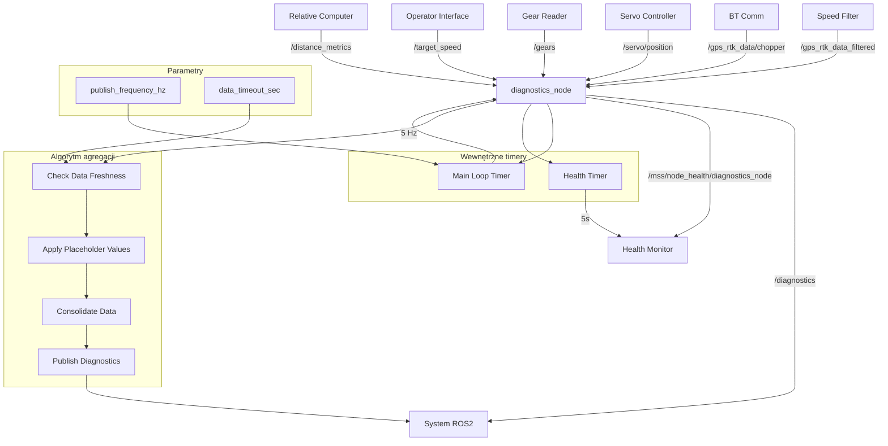

# MSS Diagnostics - Dokumentacja Pakietu

## Przegląd
Pakiet `mss_diagnostics` odpowiada za agregację i publikację skonsolidowanych danych diagnostycznych z całego systemu MSS. Węzeł zbiera dane z różnych komponentów i publikuje je w jednym miejscu dla łatwego monitorowania i analizy.

## Funkcjonalności
- **Agregacja danych**: Zbieranie danych z wszystkich komponentów systemu
- **Konsolidacja**: Łączenie danych w jedną wiadomość diagnostyczną
- **Sprawdzanie świeżości**: Walidacja aktualności danych
- **Placeholder values**: Zastępowanie brakujących danych wartościami domyślnymi
- **Health monitoring**: Raportowanie statusu węzła
- **Częstotliwość publikacji**: Konfigurowalna częstotliwość (domyślnie 5 Hz)

## Węzeł: `diagnostics_node`

### Parametry
| Parametr | Typ | Domyślna wartość | Opis |
|----------|-----|------------------|------|
| `publish_frequency_hz` | double | `5.0` | Częstotliwość publikacji [Hz] |
| `data_timeout_sec` | double | `2.0` | Timeout dla danych [s] |

### Topiki

#### Subskrypcje
- **`/gps_rtk_data_filtered`** (`my_robot_interfaces/GpsRtk`)
  - Filtrowane dane GPS ciągnika z speed_filter_node
  - Zawiera: pozycję, prędkość, kurs, status RTK

- **`/gps_rtk_data/chopper`** (`my_robot_interfaces/GpsRtk`)
  - Dane GPS sieczkarni z bt_comm
  - Zawiera: pozycję, prędkość, kurs, status RTK

- **`/servo/position`** (`my_robot_interfaces/StampedInt32`)
  - Aktualna pozycja serwa z servo_controller
  - Zawiera: kąt serwa w stopniach

- **`/gears`** (`my_robot_interfaces/Gear`)
  - Stan biegów i sprzęgła z gear_reader
  - Zawiera: aktualny bieg (0-4), stan sprzęgła (0-1)

- **`/target_speed`** (`std_msgs/Float64`)
  - Prędkość zadana z operator_interface
  - Zawiera: prędkość w m/s

- **`/distance_metrics`** (`my_robot_interfaces/DistanceMetrics`)
  - Metryki odległości z relative_position_computer
  - Zawiera: odległości wzdłużną, poprzeczną, w linii prostej

#### Publikowane
- **`/diagnostics`** (`my_robot_interfaces/DiagnosticData`)
  - Skonsolidowane dane diagnostyczne
  - Zawiera: wszystkie dane systemu w jednej wiadomości
  - Częstotliwość: 5 Hz (konfigurowalna)

- **`/mss/node_health/diagnostics_node`** (`std_msgs/String`)
  - Status zdrowia węzła w formacie JSON
  - Zawiera: status timerów, publisherów, subskrypcji, metryki systemu
  - Częstotliwość: 0.2 Hz (co 5s)

### Wiadomości

#### `DiagnosticData.msg`
```yaml
std_msgs/Header header
GpsRtk tractor_gps_filtered    # Dane GPS ciągnika (filtrowane)
GpsRtk chopper_gps            # Dane GPS sieczkarni
StampedInt32 servo_position   # Pozycja serwa
bool bt_status                # Status połączenia Bluetooth
Gear tractor_gear             # Stan biegów i sprzęgła
Float64 target_speed          # Prędkość zadana
DistanceMetrics relative_position  # Pozycja względna
```

## Architektura

### Algorytm agregacji
```python
def main_loop_callback(self):
    diag_msg = DiagnosticData()
    diag_msg.header.stamp = self.get_clock().now().to_msg()
    
    # 1. Dane z ciągnika (filtrowane)
    if self.is_data_fresh(self.last_tractor_gps):
        diag_msg.tractor_gps_filtered = self.last_tractor_gps
    else:
        diag_msg.tractor_gps_filtered.rtk_status = PLACEHOLDER_UINT8
        diag_msg.tractor_gps_filtered.latitude_deg = PLACEHOLDER_FLOAT
        # ... inne placeholder values
    
    # 2. Dane z sieczkarni i status BT
    if self.is_data_fresh(self.last_chopper_gps):
        diag_msg.chopper_gps = self.last_chopper_gps
        diag_msg.bt_status = True
    else:
        diag_msg.chopper_gps.rtk_status = PLACEHOLDER_UINT8
        diag_msg.bt_status = False
    
    # 3-6. Podobnie dla pozostałych danych...
    
    self.diag_publisher.publish(diag_msg)
```

### Sprawdzanie świeżości danych
```python
def is_data_fresh(self, msg):
    if msg is None: 
        return False
    if not hasattr(msg, 'header'):
        return True  # Float64 nie ma nagłówka
    
    current_time_sec = self.get_clock().now().nanoseconds / 1e9
    msg_time_sec = msg.header.stamp.sec + msg.header.stamp.nanosec / 1e9
    return (current_time_sec - msg_time_sec) < self.data_timeout
```

### Wartości zastępcze
```python
PLACEHOLDER_UINT8 = 255
PLACEHOLDER_INT = 99999
PLACEHOLDER_FLOAT = 99999.0
```

## Zależności

### ROS2
- `rclpy` - Python API dla ROS2
- `std_msgs` - Standardowe wiadomości
- `my_robot_interfaces` - Niestandardowe wiadomości

### Python
- `json` - Formatowanie danych health
- `psutil` - Metryki systemu
- `time` - Obsługa czasu

## Instalacja i uruchomienie

### Budowanie
```bash
cd /home/pi/mss_ros
colcon build --packages-select mss_diagnostics
source install/setup.bash
```

### Uruchomienie
```bash
ros2 run mss_diagnostics diagnostics_node
```

### Uruchomienie z parametrami
```bash
ros2 run mss_diagnostics diagnostics_node --ros-args \
  -p publish_frequency_hz:=10.0 \
  -p data_timeout_sec:=1.0
```

## Konfiguracja

### Parametry
```bash
# Ustawienie częstotliwości publikacji
ros2 param set /diagnostics_node publish_frequency_hz 10.0

# Ustawienie timeout danych
ros2 param set /diagnostics_node data_timeout_sec 1.0
```

### Wartości zastępcze
- **PLACEHOLDER_UINT8**: 255 (dla statusów RTK, biegów)
- **PLACEHOLDER_INT**: 99999 (dla pozycji serwa)
- **PLACEHOLDER_FLOAT**: 99999.0 (dla współrzędnych, prędkości, odległości)

## Diagnostyka

### Sprawdzanie statusu
```bash
# Sprawdź węzły
ros2 node list | grep diagnostics

# Sprawdź topiki
ros2 topic list | grep diagnostics

# Sprawdź dane diagnostyczne
ros2 topic echo /diagnostics

# Sprawdź health status
ros2 topic echo /mss/node_health/diagnostics_node
```

### Monitoring
```bash
# Sprawdź parametry
ros2 param list /diagnostics_node
ros2 param get /diagnostics_node publish_frequency_hz
ros2 param get /diagnostics_node data_timeout_sec

# Sprawdź logi
ros2 node info /diagnostics_node
```

### Testowanie
```bash
# Test z pełnym systemem
ros2 run gps_rtk_reader gps_rtk_node
ros2 run bt_comm bt_receiver_node
ros2 run speed_controller speed_filter_node
ros2 run servo_controller servo_node
ros2 run gear_reader gear_reader_node
ros2 run relative_position_computer relative_computer_node
ros2 run mss_diagnostics diagnostics_node

# Test z mockup
ros2 run system_mockup gps_mockup_node
ros2 run mss_diagnostics diagnostics_node
```

### Typowe problemy
1. **Brak danych**: Sprawdź czy wszystkie węzły źródłowe działają
2. **Placeholder values**: Sprawdź timeout danych i częstotliwość publikacji
3. **Brak synchronizacji**: Sprawdź czy dane są aktualne
4. **Błąd agregacji**: Sprawdź logi węzła

## Bezpieczeństwo

### Walidacja danych
- **Sprawdzanie świeżości**: Timeout 2s dla danych
- **Placeholder values**: Zastępowanie brakujących danych
- **Walidacja nagłówków**: Sprawdzanie znaczników czasu

### Ograniczenia
- Częstotliwość publikacji: 5 Hz (konfigurowalna)
- Timeout danych: 2s (konfigurowalny)
- Rozmiar wiadomości: ~1KB

## Wydajność

### Metryki
- Częstotliwość publikacji: 5 Hz
- Opóźnienie: < 100ms
- Wykorzystanie CPU: < 2%
- Wykorzystanie pamięci: < 30MB

### Optymalizacja
- Dostosuj częstotliwość publikacji do potrzeb
- Użyj odpowiedniego QoS dla topików
- Monitoruj wykorzystanie zasobów

## Testowanie

### Testy jednostkowe
```bash
# Uruchom testy
cd /home/pi/mss_ros
colcon test --packages-select mss_diagnostics
colcon test-result --all
```

### Testy integracyjne
```bash
# Test z pełnym systemem
ros2 run system_mockup gps_mockup_node
ros2 run mss_diagnostics diagnostics_node

# Sprawdź dane
ros2 topic echo /diagnostics
```

### Testy wydajności
```bash
# Test częstotliwości
ros2 topic hz /diagnostics

# Test opóźnienia
ros2 topic delay /diagnostics
```

## Graf przepływu informacji



## Autorzy
- **Główny deweloper**: Adam Wróblewski
- **Email**: adam01wroblewski@gmail.com
