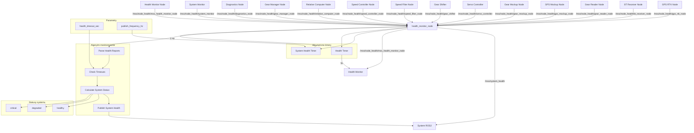

# MSS Health Monitor - Dokumentacja Pakietu

## Przegląd
Pakiet `mss_health_monitor` odpowiada za centralne monitorowanie zdrowia wszystkich węzłów w systemie MSS. Węzeł zbiera raporty zdrowia z wszystkich komponentów, analizuje je i publikuje skonsolidowany status systemu.

## Funkcjonalności
- **Centralne monitorowanie**: Zbieranie raportów zdrowia z wszystkich węzłów
- **Analiza statusu**: Określanie ogólnego stanu systemu
- **Lista monitorowanych węzłów**: 14 węzłów systemu MSS
- **Health reporting**: Publikacja skonsolidowanego statusu
- **Timeout detection**: Wykrywanie nieaktywnych węzłów
- **JSON format**: Strukturyzowane dane zdrowia

## Węzeł: `health_monitor_node`

### Parametry
| Parametr | Typ | Domyślna wartość | Opis |
|----------|-----|------------------|------|
| `health_timeout_sec` | double | `10.0` | Timeout dla raportów zdrowia [s] |
| `publish_frequency_hz` | double | `1.0` | Częstotliwość publikacji [Hz] |

### Topiki

#### Subskrypcje
- **`/mss/node_health/gps_rtk_node`** (`std_msgs/String`)
  - Raport zdrowia węzła GPS RTK
  - Zawiera: status połączenia, jakość sygnału, metryki

- **`/mss/node_health/bt_receiver_node`** (`std_msgs/String`)
  - Raport zdrowia węzła Bluetooth
  - Zawiera: status połączenia, liczba wiadomości, błędy

- **`/mss/node_health/gear_reader_node`** (`std_msgs/String`)
  - Raport zdrowia węzła odczytu biegów
  - Zawiera: status GPIO, częstotliwość odczytu, błędy

- **`/mss/node_health/gps_mockup_node`** (`std_msgs/String`)
  - Raport zdrowia węzła mockup GPS
  - Zawiera: status symulacji, liczba wiadomości

- **`/mss/node_health/gear_mockup_node`** (`std_msgs/String`)
  - Raport zdrowia węzła mockup biegów
  - Zawiera: status symulacji, liczba wiadomości

- **`/mss/node_health/servo_controller`** (`std_msgs/String`)
  - Raport zdrowia węzła serwa
  - Zawiera: status PCA9685, pozycja, błędy

- **`/mss/node_health/gear_shifter`** (`std_msgs/String`)
  - Raport zdrowia węzła zmiany biegów
  - Zawiera: status GPIO, liczba zmian, błędy

- **`/mss/node_health/speed_filter_node`** (`std_msgs/String`)
  - Raport zdrowia węzła filtru prędkości
  - Zawiera: status filtra, częstotliwość, błędy

- **`/mss/node_health/speed_controller_node`** (`std_msgs/String`)
  - Raport zdrowia węzła kontrolera prędkości
  - Zawiera: status PID, błędy, metryki

- **`/mss/node_health/relative_computer_node`** (`std_msgs/String`)
  - Raport zdrowia węzła obliczeń pozycji
  - Zawiera: status synchronizacji, błędy

- **`/mss/node_health/gear_manager_node`** (`std_msgs/String`)
  - Raport zdrowia węzła zarządzania biegami
  - Zawiera: status decyzji, liczba zmian, błędy

- **`/mss/node_health/diagnostics_node`** (`std_msgs/String`)
  - Raport zdrowia węzła diagnostyki
  - Zawiera: status agregacji, błędy

- **`/mss/node_health/system_monitor`** (`std_msgs/String`)
  - Raport zdrowia węzła monitora systemu
  - Zawiera: status zasobów, błędy

- **`/mss/node_health/mss_health_monitor_node`** (`std_msgs/String`)
  - Raport zdrowia własnego węzła
  - Zawiera: status monitorowania, błędy

#### Publikowane
- **`/mss/system_health`** (`std_msgs/String`)
  - Skonsolidowany status zdrowia systemu
  - Zawiera: status wszystkich węzłów, ogólny stan systemu
  - Częstotliwość: 1 Hz

- **`/mss/node_health/mss_health_monitor_node`** (`std_msgs/String`)
  - Status zdrowia własnego węzła
  - Zawiera: status monitorowania, liczba aktywnych węzłów
  - Częstotliwość: 0.2 Hz (co 5s)

## Architektura

### Lista monitorowanych węzłów
```python
self.monitored_nodes = [
    'gps_rtk_node',
    'bt_receiver_node', 
    'gear_reader_node',
    'gps_mockup_node',
    'gear_mockup_node',
    'servo_controller',
    'gear_shifter',
    'speed_filter_node',
    'speed_controller_node',
    'relative_computer_node',
    'gear_manager_node',
    'diagnostics_node',
    'system_monitor',
    'mss_health_monitor_node'
]
```

### Algorytm monitorowania
```python
def health_callback(self, msg, node_name):
    try:
        health_data = json.loads(msg.data)
        self.node_health[node_name] = {
            'status': health_data.get('status', 'unknown'),
            'timestamp': time.time(),
            'data': health_data
        }
    except json.JSONDecodeError:
        self.node_health[node_name] = {
            'status': 'error',
            'timestamp': time.time(),
            'data': {'error': 'Invalid JSON'}
        }

def publish_system_health(self):
    current_time = time.time()
    active_nodes = 0
    healthy_nodes = 0
    
    for node_name in self.monitored_nodes:
        if node_name in self.node_health:
            node_data = self.node_health[node_name]
            if (current_time - node_data['timestamp']) < self.health_timeout:
                active_nodes += 1
                if node_data['status'] == 'healthy':
                    healthy_nodes += 1
    
    system_status = 'healthy' if healthy_nodes == active_nodes else 'degraded'
    if active_nodes == 0:
        system_status = 'critical'
    
    health_msg = {
        'system_status': system_status,
        'active_nodes': active_nodes,
        'healthy_nodes': healthy_nodes,
        'total_nodes': len(self.monitored_nodes),
        'nodes': self.node_health
    }
```

### Statusy systemu
- **`healthy`**: Wszystkie aktywne węzły są zdrowe
- **`degraded`**: Niektóre węzły mają problemy
- **`critical`**: Brak aktywnych węzłów

## Zależności

### ROS2
- `rclpy` - Python API dla ROS2
- `std_msgs` - Standardowe wiadomości
- `my_robot_interfaces` - Niestandardowe wiadomości

### Python
- `json` - Parsowanie i formatowanie danych
- `time` - Obsługa czasu i timeout
- `psutil` - Metryki systemu

## Instalacja i uruchomienie

### Budowanie
```bash
cd /home/pi/mss_ros
colcon build --packages-select mss_health_monitor
source install/setup.bash
```

### Uruchomienie
```bash
ros2 run mss_health_monitor health_monitor_node
```

### Uruchomienie z parametrami
```bash
ros2 run mss_health_monitor health_monitor_node --ros-args \
  -p health_timeout_sec:=15.0 \
  -p publish_frequency_hz:=2.0
```

## Konfiguracja

### Parametry
```bash
# Ustawienie timeout dla raportów zdrowia
ros2 param set /health_monitor_node health_timeout_sec 15.0

# Ustawienie częstotliwości publikacji
ros2 param set /health_monitor_node publish_frequency_hz 2.0
```

### Timeout i częstotliwość
- **Health timeout**: 10s (konfigurowalny)
- **Publish frequency**: 1 Hz (konfigurowalna)
- **Health reporting**: 0.2 Hz (co 5s)

## Diagnostyka

### Sprawdzanie statusu
```bash
# Sprawdź węzły
ros2 node list | grep health_monitor

# Sprawdź topiki
ros2 topic list | grep health

# Sprawdź status systemu
ros2 topic echo /mss/system_health

# Sprawdź health status
ros2 topic echo /mss/node_health/mss_health_monitor_node
```

### Monitoring
```bash
# Sprawdź parametry
ros2 param list /health_monitor_node
ros2 param get /health_monitor_node health_timeout_sec
ros2 param get /health_monitor_node publish_frequency_hz

# Sprawdź logi
ros2 node info /health_monitor_node
```

### Testowanie
```bash
# Test z pełnym systemem
ros2 run gps_rtk_reader gps_rtk_node
ros2 run bt_comm bt_receiver_node
ros2 run gear_reader gear_reader_node
ros2 run mss_health_monitor health_monitor_node

# Sprawdź status
ros2 topic echo /mss/system_health
```

### Typowe problemy
1. **Brak raportów**: Sprawdź czy węzły publikują health
2. **Timeout**: Zwiększ `health_timeout_sec`
3. **Błąd JSON**: Sprawdź format raportów zdrowia
4. **Brak węzłów**: Sprawdź czy węzły są uruchomione

## Bezpieczeństwo

### Walidacja danych
- **JSON parsing**: Sprawdzanie poprawności formatu
- **Timeout detection**: Wykrywanie nieaktywnych węzłów
- **Error handling**: Obsługa błędów parsowania

### Ograniczenia
- Częstotliwość publikacji: 1 Hz
- Timeout: 10s (konfigurowalny)
- Liczba węzłów: 14 (stała)

## Wydajność

### Metryki
- Częstotliwość publikacji: 1 Hz
- Opóźnienie: < 50ms
- Wykorzystanie CPU: < 1%
- Wykorzystanie pamięci: < 20MB

### Optymalizacja
- Dostosuj częstotliwość publikacji
- Użyj odpowiedniego QoS
- Monitoruj wykorzystanie zasobów

## Testowanie

### Testy jednostkowe
```bash
# Uruchom testy
cd /home/pi/mss_ros
colcon test --packages-select mss_health_monitor
colcon test-result --all
```

### Testy integracyjne
```bash
# Test z pełnym systemem
ros2 run system_mockup gps_mockup_node
ros2 run mss_health_monitor health_monitor_node

# Sprawdź status
ros2 topic echo /mss/system_health
```

### Testy wydajności
```bash
# Test częstotliwości
ros2 topic hz /mss/system_health

# Test opóźnienia
ros2 topic delay /mss/system_health
```

## Graf przepływu informacji



## Autorzy
- **Główny deweloper**: Adam Wróblewski
- **Email**: adam01wroblewski@gmail.com
