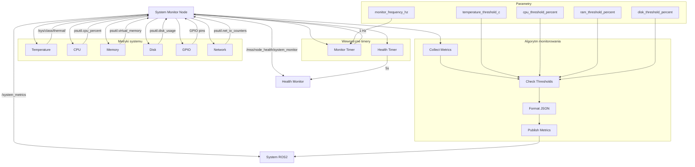

# MSS System Monitor - Dokumentacja Pakietu

## Przegląd
Pakiet `mss_system_monitor` odpowiada za monitorowanie zasobów systemu Raspberry Pi. Węzeł zbiera metryki dotyczące temperatury, CPU, RAM, dysku, GPIO i sieci, publikując je w formacie JSON dla łatwego monitorowania i analizy.

## Funkcjonalności
- **Monitorowanie temperatury**: Temperatura CPU i GPU Raspberry Pi
- **Monitorowanie CPU**: Wykorzystanie procesora, częstotliwość, obciążenie
- **Monitorowanie pamięci**: RAM, swap, wykorzystanie pamięci
- **Monitorowanie dysku**: Wolne miejsce, wykorzystanie, I/O
- **Monitorowanie GPIO**: Status pinów GPIO
- **Monitorowanie sieci**: Interfejsy sieciowe, transfer danych
- **Health reporting**: Raportowanie statusu węzła
- **JSON format**: Strukturyzowane dane systemowe

## Węzeł: `system_monitor_node`

### Parametry
| Parametr | Typ | Domyślna wartość | Opis |
|----------|-----|------------------|------|
| `monitor_frequency_hz` | double | `1.0` | Częstotliwość monitorowania [Hz] |
| `temperature_threshold_c` | double | `80.0` | Próg temperatury ostrzeżenia [°C] |
| `cpu_threshold_percent` | double | `90.0` | Próg wykorzystania CPU [%] |
| `ram_threshold_percent` | double | `90.0` | Próg wykorzystania RAM [%] |
| `disk_threshold_percent` | double | `90.0` | Próg wykorzystania dysku [%] |

### Topiki

#### Publikowane
- **`/system_metrics`** (`std_msgs/String`)
  - Metryki systemu w formacie JSON
  - Zawiera: temperatura, CPU, RAM, dysk, GPIO, sieć
  - Częstotliwość: 1 Hz (konfigurowalna)

- **`/mss/node_health/system_monitor`** (`std_msgs/String`)
  - Status zdrowia węzła w formacie JSON
  - Zawiera: status monitorowania, błędy, metryki systemu
  - Częstotliwość: 0.2 Hz (co 5s)

## Architektura

### Metryki systemu
```python
def collect_system_metrics(self):
    metrics = {
        'timestamp': time.time(),
        'temperature': self.get_temperature(),
        'cpu': self.get_cpu_metrics(),
        'memory': self.get_memory_metrics(),
        'disk': self.get_disk_metrics(),
        'gpio': self.get_gpio_metrics(),
        'network': self.get_network_metrics(),
        'warnings': self.check_thresholds(metrics)
    }
    return metrics
```

### Temperatura
```python
def get_temperature(self):
    try:
        with open('/sys/class/thermal/thermal_zone0/temp', 'r') as f:
            temp_millicelsius = int(f.read().strip())
            return temp_millicelsius / 1000.0  # Konwersja na °C
    except:
        return None
```

### CPU
```python
def get_cpu_metrics(self):
    return {
        'usage_percent': psutil.cpu_percent(interval=1),
        'frequency_mhz': psutil.cpu_freq().current if psutil.cpu_freq() else None,
        'load_average': psutil.getloadavg(),
        'count': psutil.cpu_count()
    }
```

### Pamięć
```python
def get_memory_metrics(self):
    memory = psutil.virtual_memory()
    swap = psutil.swap_memory()
    return {
        'ram': {
            'total_gb': memory.total / (1024**3),
            'available_gb': memory.available / (1024**3),
            'used_gb': memory.used / (1024**3),
            'usage_percent': memory.percent
        },
        'swap': {
            'total_gb': swap.total / (1024**3),
            'used_gb': swap.used / (1024**3),
            'usage_percent': swap.percent
        }
    }
```

### Dysk
```python
def get_disk_metrics(self):
    disk = psutil.disk_usage('/')
    disk_io = psutil.disk_io_counters()
    return {
        'usage': {
            'total_gb': disk.total / (1024**3),
            'used_gb': disk.used / (1024**3),
            'free_gb': disk.free / (1024**3),
            'usage_percent': (disk.used / disk.total) * 100
        },
        'io': {
            'read_bytes': disk_io.read_bytes if disk_io else 0,
            'write_bytes': disk_io.write_bytes if disk_io else 0,
            'read_count': disk_io.read_count if disk_io else 0,
            'write_count': disk_io.write_count if disk_io else 0
        }
    }
```

### GPIO
```python
def get_gpio_metrics(self):
    # Sprawdzenie statusu pinów GPIO używanych w systemie
    gpio_pins = [5, 6, 13, 19, 20, 25, 26]  # Piny używane w MSS
    gpio_status = {}
    
    for pin in gpio_pins:
        try:
            # Sprawdzenie czy pin jest używany
            gpio_status[f'pin_{pin}'] = 'active'
        except:
            gpio_status[f'pin_{pin}'] = 'inactive'
    
    return gpio_status
```

### Sieć
```python
def get_network_metrics(self):
    network_io = psutil.net_io_counters()
    interfaces = psutil.net_if_addrs()
    
    return {
        'interfaces': list(interfaces.keys()),
        'bytes_sent': network_io.bytes_sent,
        'bytes_recv': network_io.bytes_recv,
        'packets_sent': network_io.packets_sent,
        'packets_recv': network_io.packets_recv
    }
```

### Sprawdzanie progów
```python
def check_thresholds(self, metrics):
    warnings = []
    
    if metrics['temperature'] and metrics['temperature'] > self.temperature_threshold:
        warnings.append(f"High temperature: {metrics['temperature']:.1f}°C")
    
    if metrics['cpu']['usage_percent'] > self.cpu_threshold:
        warnings.append(f"High CPU usage: {metrics['cpu']['usage_percent']:.1f}%")
    
    if metrics['memory']['ram']['usage_percent'] > self.ram_threshold:
        warnings.append(f"High RAM usage: {metrics['memory']['ram']['usage_percent']:.1f}%")
    
    if metrics['disk']['usage']['usage_percent'] > self.disk_threshold:
        warnings.append(f"High disk usage: {metrics['disk']['usage']['usage_percent']:.1f}%")
    
    return warnings
```

## Zależności

### ROS2
- `rclpy` - Python API dla ROS2
- `std_msgs` - Standardowe wiadomości

### Python
- `psutil` - Metryki systemu
- `json` - Formatowanie danych
- `time` - Obsługa czasu

## Instalacja i uruchomienie

### Budowanie
```bash
cd /home/pi/mss_ros
colcon build --packages-select mss_system_monitor
source install/setup.bash
```

### Uruchomienie
```bash
ros2 run mss_system_monitor system_monitor_node
```

### Uruchomienie z parametrami
```bash
ros2 run mss_system_monitor system_monitor_node --ros-args \
  -p monitor_frequency_hz:=2.0 \
  -p temperature_threshold_c:=85.0 \
  -p cpu_threshold_percent:=95.0
```

## Konfiguracja

### Parametry
```bash
# Ustawienie częstotliwości monitorowania
ros2 param set /system_monitor_node monitor_frequency_hz 2.0

# Ustawienie progów ostrzeżeń
ros2 param set /system_monitor_node temperature_threshold_c 85.0
ros2 param set /system_monitor_node cpu_threshold_percent 95.0
ros2 param set /system_monitor_node ram_threshold_percent 95.0
ros2 param set /system_monitor_node disk_threshold_percent 95.0
```

### Progi ostrzeżeń
- **Temperatura**: 80°C (konfigurowalna)
- **CPU**: 90% (konfigurowalny)
- **RAM**: 90% (konfigurowalny)
- **Dysk**: 90% (konfigurowalny)

## Diagnostyka

### Sprawdzanie statusu
```bash
# Sprawdź węzły
ros2 node list | grep system_monitor

# Sprawdź topiki
ros2 topic list | grep system

# Sprawdź metryki systemu
ros2 topic echo /system_metrics

# Sprawdź health status
ros2 topic echo /mss/node_health/system_monitor
```

### Monitoring
```bash
# Sprawdź parametry
ros2 param list /system_monitor_node
ros2 param get /system_monitor_node monitor_frequency_hz
ros2 param get /system_monitor_node temperature_threshold_c

# Sprawdź logi
ros2 node info /system_monitor_node
```

### Testowanie
```bash
# Test z pełnym systemem
ros2 run mss_system_monitor system_monitor_node

# Sprawdź metryki
ros2 topic echo /system_metrics
```

### Typowe problemy
1. **Brak metryk**: Sprawdź uprawnienia do plików systemowych
2. **Błąd temperatury**: Sprawdź dostęp do `/sys/class/thermal/`
3. **Błąd GPIO**: Sprawdź uprawnienia do GPIO
4. **Błąd psutil**: Sprawdź instalację biblioteki

## Bezpieczeństwo

### Uprawnienia
- **Temperatura**: Dostęp do `/sys/class/thermal/thermal_zone0/temp`
- **GPIO**: Dostęp do pinów GPIO
- **System**: Uprawnienia do odczytu metryk systemowych

### Ograniczenia
- Częstotliwość monitorowania: 1 Hz (konfigurowalna)
- Rozmiar wiadomości: ~2KB
- Wykorzystanie CPU: < 5%

## Wydajność

### Metryki
- Częstotliwość publikacji: 1 Hz
- Opóźnienie: < 100ms
- Wykorzystanie CPU: < 5%
- Wykorzystanie pamięci: < 50MB

### Optymalizacja
- Dostosuj częstotliwość monitorowania
- Użyj odpowiedniego QoS
- Monitoruj wykorzystanie zasobów

## Testowanie

### Testy jednostkowe
```bash
# Uruchom testy
cd /home/pi/mss_ros
colcon test --packages-select mss_system_monitor
colcon test-result --all
```

### Testy integracyjne
```bash
# Test z pełnym systemem
ros2 run mss_system_monitor system_monitor_node

# Sprawdź metryki
ros2 topic echo /system_metrics
```

### Testy wydajności
```bash
# Test częstotliwości
ros2 topic hz /system_metrics

# Test opóźnienia
ros2 topic delay /system_metrics
```

## Graf przepływu informacji



## Autorzy
- **Główny deweloper**: Adam Wróblewski
- **Email**: adam01wroblewski@gmail.com
