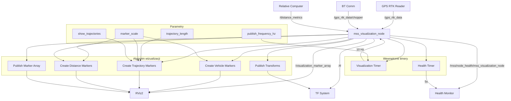

# MSS Visualization - Dokumentacja Pakietu

## Przegląd
Pakiet `mss_visualization` odpowiada za wizualizację danych systemu MSS w RViz2. Węzeł publikuje dane wizualizacyjne w formacie markerów i transformacji, umożliwiając wizualizację pozycji pojazdów, trajektorii i metryk systemu.

## Funkcjonalności
- **Wizualizacja pojazdów**: Markery pozycji ciągnika i sieczkarni
- **Trajektorie**: Ślady ruchu pojazdów
- **Metryki odległości**: Wizualizacja odległości między pojazdami
- **Transformacje**: Publikacja transformacji między ramkami
- **Markery**: Różne typy markerów wizualizacyjnych
- **Health monitoring**: Raportowanie statusu węzła

## Węzeł: `mss_visualization_node`

### Parametry
| Parametr | Typ | Domyślna wartość | Opis |
|----------|-----|------------------|------|
| `publish_frequency_hz` | double | `10.0` | Częstotliwość publikacji [Hz] |
| `trajectory_length` | int | `100` | Długość trajektorii |
| `marker_scale` | double | `1.0` | Skala markerów |
| `show_trajectories` | bool | `true` | Wyświetlanie trajektorii |

### Topiki

#### Subskrypcje
- **`/gps_rtk_data`** (`my_robot_interfaces/GpsRtk`)
  - Dane GPS ciągnika z gps_rtk_reader
  - Zawiera: pozycję, prędkość, kurs, status RTK

- **`/gps_rtk_data/chopper`** (`my_robot_interfaces/GpsRtk`)
  - Dane GPS sieczkarni z bt_comm
  - Zawiera: pozycję, prędkość, kurs, status RTK

- **`/distance_metrics`** (`my_robot_interfaces/DistanceMetrics`)
  - Metryki odległości z relative_position_computer
  - Zawiera: odległości wzdłużną, poprzeczną, w linii prostej

#### Publikowane
- **`/visualization_marker_array`** (`visualization_msgs/MarkerArray`)
  - Markery wizualizacyjne dla RViz2
  - Zawiera: markery pojazdów, trajektorie, metryki
  - Częstotliwość: 10 Hz (konfigurowalna)

- **`/tf`** (`tf2_msgs/TFMessage`)
  - Transformacje między ramkami
  - Zawiera: transformacje pojazdów

- **`/mss/node_health/mss_visualization_node`** (`std_msgs/String`)
  - Status zdrowia węzła w formacie JSON
  - Zawiera: status wizualizacji, liczba markerów, metryki systemu
  - Częstotliwość: 0.2 Hz (co 5s)

## Architektura

### Tworzenie markerów
```python
def create_vehicle_marker(self, position, orientation, vehicle_type, vehicle_id):
    marker = Marker()
    marker.header.frame_id = "map"
    marker.header.stamp = self.get_clock().now().to_msg()
    marker.id = vehicle_id
    marker.type = Marker.CUBE
    marker.action = Marker.ADD
    
    # Pozycja
    marker.pose.position.x = position[0]
    marker.pose.position.y = position[1]
    marker.pose.position.z = position[2]
    
    # Orientacja
    marker.pose.orientation.x = orientation[0]
    marker.pose.orientation.y = orientation[1]
    marker.pose.orientation.z = orientation[2]
    marker.pose.orientation.w = orientation[3]
    
    # Skala
    if vehicle_type == "tractor":
        marker.scale.x = 2.0 * self.marker_scale
        marker.scale.y = 1.0 * self.marker_scale
        marker.scale.z = 0.5 * self.marker_scale
        marker.color.r = 0.0
        marker.color.g = 1.0
        marker.color.b = 0.0
    else:  # chopper
        marker.scale.x = 3.0 * self.marker_scale
        marker.scale.y = 1.5 * self.marker_scale
        marker.scale.z = 0.5 * self.marker_scale
        marker.color.r = 1.0
        marker.color.g = 0.0
        marker.color.b = 0.0
    
    marker.color.a = 1.0
    return marker
```

### Tworzenie trajektorii
```python
def create_trajectory_marker(self, trajectory_points, vehicle_type, vehicle_id):
    marker = Marker()
    marker.header.frame_id = "map"
    marker.header.stamp = self.get_clock().now().to_msg()
    marker.id = vehicle_id + 1000  # Unikalne ID dla trajektorii
    marker.type = Marker.LINE_STRIP
    marker.action = Marker.ADD
    
    # Punkty trajektorii
    for point in trajectory_points:
        p = Point()
        p.x = point[0]
        p.y = point[1]
        p.z = point[2]
        marker.points.append(p)
    
    # Właściwości linii
    marker.scale.x = 0.1 * self.marker_scale
    if vehicle_type == "tractor":
        marker.color.r = 0.0
        marker.color.g = 0.8
        marker.color.b = 0.0
    else:  # chopper
        marker.color.r = 0.8
        marker.color.g = 0.0
        marker.color.b = 0.0
    
    marker.color.a = 0.7
    return marker
```

### Tworzenie markerów odległości
```python
def create_distance_marker(self, distance_metrics, tractor_pos, chopper_pos):
    marker = Marker()
    marker.header.frame_id = "map"
    marker.header.stamp = self.get_clock().now().to_msg()
    marker.id = 2000
    marker.type = Marker.TEXT_VIEW_FACING
    marker.action = Marker.ADD
    
    # Pozycja tekstu (środek między pojazdami)
    marker.pose.position.x = (tractor_pos[0] + chopper_pos[0]) / 2
    marker.pose.position.y = (tractor_pos[1] + chopper_pos[1]) / 2
    marker.pose.position.z = 2.0
    
    # Tekst z metrykami
    marker.text = f"Distance: {distance_metrics.distance_straight:.2f}m\n"
    marker.text += f"Longitudinal: {distance_metrics.distance_longitudinal:.2f}m\n"
    marker.text += f"Lateral: {distance_metrics.distance_lateral:.2f}m"
    
    # Właściwości tekstu
    marker.scale.z = 0.5 * self.marker_scale
    marker.color.r = 1.0
    marker.color.g = 1.0
    marker.color.b = 1.0
    marker.color.a = 1.0
    
    return marker
```

### Publikacja transformacji
```python
def publish_transforms(self, tractor_pos, chopper_pos, tractor_orientation, chopper_orientation):
    # Transformacja ciągnika
    tractor_transform = TransformStamped()
    tractor_transform.header.stamp = self.get_clock().now().to_msg()
    tractor_transform.header.frame_id = "map"
    tractor_transform.child_frame_id = "tractor"
    
    tractor_transform.transform.translation.x = tractor_pos[0]
    tractor_transform.transform.translation.y = tractor_pos[1]
    tractor_transform.transform.translation.z = tractor_pos[2]
    
    tractor_transform.transform.rotation.x = tractor_orientation[0]
    tractor_transform.transform.rotation.y = tractor_orientation[1]
    tractor_transform.transform.rotation.z = tractor_orientation[2]
    tractor_transform.transform.rotation.w = tractor_orientation[3]
    
    # Transformacja sieczkarni
    chopper_transform = TransformStamped()
    chopper_transform.header.stamp = self.get_clock().now().to_msg()
    chopper_transform.header.frame_id = "map"
    chopper_transform.child_frame_id = "chopper"
    
    chopper_transform.transform.translation.x = chopper_pos[0]
    chopper_transform.transform.translation.y = chopper_pos[1]
    chopper_transform.transform.translation.z = chopper_pos[2]
    
    chopper_transform.transform.rotation.x = chopper_orientation[0]
    chopper_transform.transform.rotation.y = chopper_orientation[1]
    chopper_transform.transform.rotation.z = chopper_orientation[2]
    chopper_transform.transform.rotation.w = chopper_orientation[3]
    
    # Publikacja transformacji
    self.tf_broadcaster.sendTransform([tractor_transform, chopper_transform])
```

## Zależności

### ROS2
- `rclpy` - Python API dla ROS2
- `sensor_msgs` - Wiadomości sensorów
- `tf2_ros` - System transformacji
- `geometry_msgs` - Wiadomości geometryczne
- `visualization_msgs` - Wiadomości wizualizacyjne

### Python
- `json` - Formatowanie danych health
- `math` - Obliczenia matematyczne
- `time` - Obsługa czasu

## Instalacja i uruchomienie

### Budowanie
```bash
cd /home/pi/mss_ros
colcon build --packages-select mss_visualization
source install/setup.bash
```

### Uruchomienie
```bash
ros2 run mss_visualization mss_visualization_node
```

### Uruchomienie z parametrami
```bash
ros2 run mss_visualization mss_visualization_node --ros-args \
  -p publish_frequency_hz:=20.0 \
  -p trajectory_length:=200 \
  -p marker_scale:=1.5 \
  -p show_trajectories:=true
```

### Uruchomienie z RViz2
```bash
# Uruchom wizualizację
ros2 run mss_visualization mss_visualization_node

# Uruchom RViz2
ros2 run rviz2 rviz2

# Załaduj konfigurację
ros2 run rviz2 rviz2 -d /home/pi/mss_ros/src/mss_visualization/config/mss.rviz
```

## Konfiguracja

### Parametry
```bash
# Ustawienie częstotliwości publikacji
ros2 param set /mss_visualization_node publish_frequency_hz 20.0

# Ustawienie długości trajektorii
ros2 param set /mss_visualization_node trajectory_length 200

# Ustawienie skali markerów
ros2 param set /mss_visualization_node marker_scale 1.5

# Włączanie/wyłączanie trajektorii
ros2 param set /mss_visualization_node show_trajectories true
```

### Konfiguracja RViz2
```yaml
# mss.rviz
Panels:
  - Class: rviz_common/Displays
    Name: Displays
    Value: true
  - Class: rviz_common/Selection
    Name: Selection
    Value: true
  - Class: rviz_common/Tool Properties
    Name: Tool Properties
    Value: true
  - Class: rviz_common/Views
    Name: Views
    Value: true

Displays:
  - Class: rviz_default_plugins/MarkerArray
    Name: Vehicle Markers
    Topic: /visualization_marker_array
    Value: true
  - Class: rviz_default_plugins/TF
    Name: TF
    Value: true
```

## Diagnostyka

### Sprawdzanie statusu
```bash
# Sprawdź węzły
ros2 node list | grep mss_visualization

# Sprawdź topiki
ros2 topic list | grep visualization

# Sprawdź markery
ros2 topic echo /visualization_marker_array

# Sprawdź health status
ros2 topic echo /mss/node_health/mss_visualization_node
```

### Monitoring
```bash
# Sprawdź parametry
ros2 param list /mss_visualization_node
ros2 param get /mss_visualization_node publish_frequency_hz
ros2 param get /mss_visualization_node marker_scale

# Sprawdź logi
ros2 node info /mss_visualization_node
```

### Testowanie
```bash
# Test z pełnym systemem
ros2 run gps_rtk_reader gps_rtk_node
ros2 run bt_comm bt_receiver_node
ros2 run relative_position_computer relative_computer_node
ros2 run mss_visualization mss_visualization_node

# Test z RViz2
ros2 run rviz2 rviz2
```

### Typowe problemy
1. **Brak markerów**: Sprawdź czy węzły GPS publikują dane
2. **Błąd transformacji**: Sprawdź frame_id
3. **Błąd RViz2**: Sprawdź konfigurację RViz2
4. **Błąd markerów**: Sprawdź parametry markerów

## Bezpieczeństwo

### Uwagi bezpieczeństwa
- **Dane wizualizacyjne**: Tylko do celów wizualizacyjnych
- **Transformacje**: Sprawdź poprawność transformacji
- **Markery**: Ogranicz liczbę markerów

### Ograniczenia
- Częstotliwość publikacji: 10 Hz (konfigurowalna)
- Długość trajektorii: 100 punktów (konfigurowalna)
- Liczba markerów: Bez ograniczeń

## Wydajność

### Metryki
- Częstotliwość publikacji: 10 Hz
- Opóźnienie: < 100ms
- Wykorzystanie CPU: < 5%
- Wykorzystanie pamięci: < 50MB

### Optymalizacja
- Dostosuj częstotliwość publikacji
- Ogranicz długość trajektorii
- Użyj odpowiedniego QoS

## Testowanie

### Testy jednostkowe
```bash
# Uruchom testy
cd /home/pi/mss_ros
colcon test --packages-select mss_visualization
colcon test-result --all
```

### Testy integracyjne
```bash
# Test z pełnym systemem
ros2 run system_mockup gps_mockup_node
ros2 run mss_visualization mss_visualization_node
ros2 run rviz2 rviz2
```

### Testy wydajności
```bash
# Test częstotliwości
ros2 topic hz /visualization_marker_array

# Test opóźnienia
ros2 topic delay /visualization_marker_array
```

## Graf przepływu informacji



## Autorzy
- **Główny deweloper**: Adam Wróblewski
- **Email**: adam01wroblewski@gmail.com
