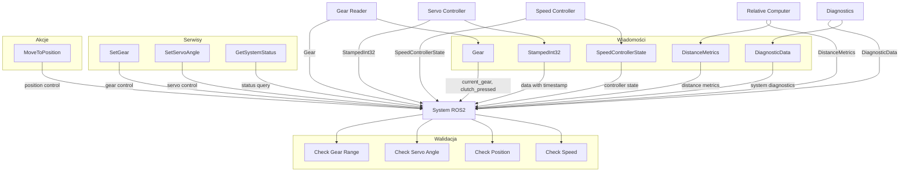

# My Robot Interfaces - Dokumentacja Pakietu

## Przegląd
Pakiet `my_robot_interfaces` zawiera niestandardowe wiadomości, serwisy i akcje ROS2 używane w systemie MSS. Definiuje struktury danych dla komunikacji między węzłami systemu synchronizacji prędkości ciągnika z sieczkarnią.

## Funkcjonalności
- **Niestandardowe wiadomości**: Definicje wiadomości dla systemu MSS
- **Serwisy**: Definicje serwisów do kontroli systemu
- **Akcje**: Definicje akcji dla złożonych operacji
- **Struktury danych**: Typy danych używane w systemie
- **Kompatybilność**: Zgodność z systemem ROS2

## Wiadomości

### `Gear.msg`
Wiadomość zawierająca stan biegów i sprzęgła ciągnika.

```yaml
# Nagłówek z timestampem
std_msgs/Header header

# Stan biegów
int32 current_gear          # Aktualny bieg (0-4)
int32 clutch_pressed        # Stan sprzęgła (0=zwolnione, 1=wciśnięte)
```

### `StampedInt32.msg`
Wiadomość zawierająca wartość całkowitą ze znacznikiem czasu.

```yaml
# Nagłówek z timestampem
std_msgs/Header header

# Wartość całkowita
int32 data                  # Wartość danych
```

### `SpeedControllerState.msg`
Wiadomość zawierająca stan kontrolera prędkości.

```yaml
# Nagłówek z timestampem
std_msgs/Header header

# Stan kontrolera
bool enabled                # Czy kontroler jest włączony
float64 target_speed        # Prędkość zadana [m/s]
float64 current_speed       # Aktualna prędkość [m/s]
float64 error               # Błąd prędkości [m/s]
float64 servo_angle         # Kąt serwa [°]
float64 kp                  # Wzmocnienie proporcjonalne
float64 ki                  # Wzmocnienie całkujące
float64 kd                  # Wzmocnienie różniczkujące
```

### `DistanceMetrics.msg`
Wiadomość zawierająca metryki odległości między pojazdami.

```yaml
# Nagłówek z timestampem
std_msgs/Header header

# Metryki odległości
float64 distance_straight      # Odległość w linii prostej [m]
float64 distance_longitudinal  # Odległość wzdłużna [m]
float64 distance_lateral       # Odległość poprzeczna [m]
```

### `DiagnosticData.msg`
Wiadomość zawierająca skonsolidowane dane diagnostyczne systemu.

```yaml
# Nagłówek z timestampem
std_msgs/Header header

# Dane diagnostyczne
GpsRtk tractor_gps_filtered    # Dane GPS ciągnika (filtrowane)
GpsRtk chopper_gps            # Dane GPS sieczkarni
StampedInt32 servo_position   # Pozycja serwa
bool bt_status                # Status połączenia Bluetooth
Gear tractor_gear             # Stan biegów i sprzęgła
Float64 target_speed          # Prędkość zadana
DistanceMetrics relative_position  # Pozycja względna
```

## Serwisy

### `SetGear.srv`
Serwis do ustawiania biegu ciągnika.

```yaml
# Request
int32 gear                    # Bieg do ustawienia (0-4)

# Response
bool success                  # Czy operacja się powiodła
string message                # Komunikat o wyniku
```

### `SetServoAngle.srv`
Serwis do ustawiania kąta serwa.

```yaml
# Request
int32 angle                   # Kąt serwa [°]

# Response
bool success                  # Czy operacja się powiodła
string message                # Komunikat o wyniku
```

### `GetSystemStatus.srv`
Serwis do pobierania statusu systemu.

```yaml
# Request
# Brak parametrów

# Response
bool system_healthy           # Czy system jest zdrowy
string status_message         # Komunikat o statusie
DiagnosticData diagnostics    # Dane diagnostyczne
```

## Akcje

### `MoveToPosition.action`
Akcja do przemieszczenia pojazdu do określonej pozycji.

```yaml
# Goal
float64 target_x              # Pozycja X [m]
float64 target_y              # Pozycja Y [m]
float64 target_heading        # Kurs docelowy [°]
float64 max_speed             # Maksymalna prędkość [m/s]

# Feedback
float64 current_x             # Aktualna pozycja X [m]
float64 current_y             # Aktualna pozycja Y [m]
float64 current_heading       # Aktualny kurs [°]
float64 distance_to_goal      # Odległość do celu [m]

# Result
bool success                  # Czy akcja się powiodła
string message                # Komunikat o wyniku
float64 final_x               # Końcowa pozycja X [m]
float64 final_y               # Końcowa pozycja Y [m]
float64 final_heading         # Końcowy kurs [°]
```

## Architektura

### Struktura wiadomości
```yaml
# Przykład wiadomości Gear
header:
  stamp:
    sec: 1701234567
    nanosec: 890123456
  frame_id: "gear_frame"
current_gear: 2
clutch_pressed: 0
```

### Użycie w systemie
```python
# Publikacja wiadomości
from my_robot_interfaces.msg import Gear

msg = Gear()
msg.header.stamp = self.get_clock().now().to_msg()
msg.header.frame_id = "gear_frame"
msg.current_gear = 2
msg.clutch_pressed = 0

self.publisher.publish(msg)
```

### Subskrypcja wiadomości
```python
# Subskrypcja wiadomości
from my_robot_interfaces.msg import Gear

def gear_callback(self, msg):
    current_gear = msg.current_gear
    clutch_pressed = msg.clutch_pressed
    
    if clutch_pressed:
        print("Sprzęgło wciśnięte")
    else:
        print(f"Aktualny bieg: {current_gear}")

self.subscription = self.create_subscription(
    Gear,
    '/gears',
    self.gear_callback,
    10
)
```

### Użycie serwisów
```python
# Klient serwisu
from my_robot_interfaces.srv import SetGear

def set_gear(self, gear):
    request = SetGear.Request()
    request.gear = gear
    
    future = self.set_gear_client.call_async(request)
    rclpy.spin_until_future_complete(self, future)
    
    if future.result() is not None:
        response = future.result()
        if response.success:
            print(f"Bieg ustawiony na {gear}")
        else:
            print(f"Błąd: {response.message}")
```

### Użycie akcji
```python
# Klient akcji
from my_robot_interfaces.action import MoveToPosition

def move_to_position(self, x, y, heading, max_speed):
    goal = MoveToPosition.Goal()
    goal.target_x = x
    goal.target_y = y
    goal.target_heading = heading
    goal.max_speed = max_speed
    
    self.move_client.send_goal_async(goal, feedback_callback=self.feedback_callback)
```

## Zależności

### ROS2
- `ament_cmake` - System budowania
- `geometry_msgs` - Wiadomości geometryczne
- `std_msgs` - Standardowe wiadomości
- `rosidl_default_generators` - Generatory wiadomości
- `rosidl_default_runtime` - Runtime wiadomości

### Pakiety
- `action_msgs` - Wiadomości akcji
- `service_msgs` - Wiadomości serwisów

## Instalacja i uruchomienie

### Budowanie
```bash
cd /home/pi/mss_ros
colcon build --packages-select my_robot_interfaces
source install/setup.bash
```

### Użycie w pakietach
```python
# W package.xml
<depend>my_robot_interfaces</depend>

# W setup.py
install_requires=['my_robot_interfaces']

# W kodzie Python
from my_robot_interfaces.msg import Gear
from my_robot_interfaces.srv import SetGear
from my_robot_interfaces.action import MoveToPosition
```

### Testowanie wiadomości
```bash
# Sprawdź dostępne wiadomości
ros2 interface list | grep my_robot_interfaces

# Sprawdź definicję wiadomości
ros2 interface show my_robot_interfaces/msg/Gear

# Test publikacji
ros2 topic pub /test_gear my_robot_interfaces/msg/Gear "
header:
  stamp:
    sec: 0
    nanosec: 0
  frame_id: 'test'
current_gear: 2
clutch_pressed: 0"
```

## Konfiguracja

### Parametry wiadomości
```python
# Konfiguracja w węzłach
self.declare_parameter('gear_frame_id', 'gear_frame')
self.declare_parameter('servo_frame_id', 'servo_frame')
self.declare_parameter('max_gear', 4)
```

### Walidacja danych
```python
def validate_gear_data(self, msg):
    # Sprawdź zakres biegu
    if not (0 <= msg.current_gear <= 4):
        return False
    
    # Sprawdź stan sprzęgła
    if msg.clutch_pressed not in [0, 1]:
        return False
    
    return True
```

## Diagnostyka

### Sprawdzanie statusu
```bash
# Sprawdź dostępne wiadomości
ros2 interface list | grep my_robot_interfaces

# Sprawdź definicję wiadomości
ros2 interface show my_robot_interfaces/msg/Gear
ros2 interface show my_robot_interfaces/srv/SetGear
ros2 interface show my_robot_interfaces/action/MoveToPosition

# Sprawdź topiki używające wiadomości
ros2 topic list | grep gear
```

### Monitoring
```bash
# Sprawdź dane biegów
ros2 topic echo /gears

# Sprawdź serwisy
ros2 service list | grep SetGear

# Sprawdź akcje
ros2 action list | grep MoveToPosition
```

### Testowanie
```bash
# Test publikacji
ros2 topic pub /test_gear my_robot_interfaces/msg/Gear "{header: {stamp: {sec: 0, nanosec: 0}, frame_id: 'test'}, current_gear: 2, clutch_pressed: 0}"

# Test serwisu
ros2 service call /set_gear my_robot_interfaces/srv/SetGear "{gear: 3}"

# Test akcji
ros2 action send_goal /move_to_position my_robot_interfaces/action/MoveToPosition "{target_x: 10.0, target_y: 5.0, target_heading: 45.0, max_speed: 2.0}"
```

### Typowe problemy
1. **Brak wiadomości**: Sprawdź czy pakiet jest zbudowany
2. **Błąd importu**: Sprawdź zależności w package.xml
3. **Błąd walidacji**: Sprawdź zakresy wartości
4. **Błąd kompilacji**: Sprawdź składnię wiadomości

## Bezpieczeństwo

### Walidacja danych
- **Zakres biegu**: 0-4
- **Stan sprzęgła**: 0 lub 1
- **Kąt serwa**: -180° do 180°
- **Pozycja**: Sprawdź zakresy współrzędnych

### Ograniczenia
- Rozmiar wiadomości: ~100-500 bytes
- Częstotliwość: Do 50 Hz
- Liczba serwisów: Bez ograniczeń

## Wydajność

### Metryki
- Rozmiar wiadomości: ~100-500 bytes
- Czas serializacji: < 1ms
- Czas deserializacji: < 1ms
- Wykorzystanie pamięci: Minimalne

### Optymalizacja
- Użyj odpowiedniego QoS
- Dostosuj częstotliwość publikacji
- Monitoruj wykorzystanie zasobów

## Testowanie

### Testy jednostkowe
```bash
# Uruchom testy
cd /home/pi/mss_ros
colcon test --packages-select my_robot_interfaces
colcon test-result --all
```

### Testy integracyjne
```bash
# Test z węzłami systemu
ros2 run gear_reader gear_reader_node
ros2 topic echo /gears
```

### Testy wydajności
```bash
# Test częstotliwości
ros2 topic hz /gears

# Test opóźnienia
ros2 topic delay /gears
```

## Graf przepływu informacji



## Autorzy
- **Główny deweloper**: Adam Wróblewski
- **Email**: adam01wroblewski@gmail.com
