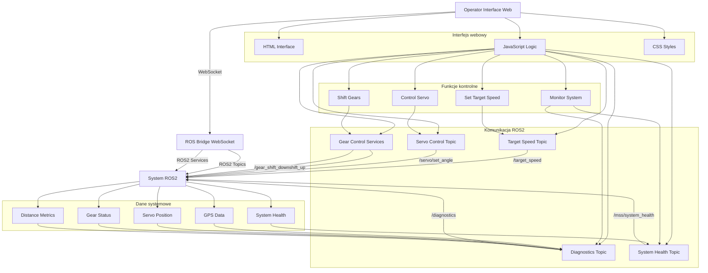

# Operator Interface - Dokumentacja Pakietu

## Przegląd
Pakiet `operator_interface` zawiera interfejs webowy dla operatora systemu MSS. Składa się z aplikacji webowej (HTML, CSS, JavaScript) która komunikuje się z systemem ROS2 przez ROS Bridge WebSocket, umożliwiając operatorowi monitorowanie i kontrolowanie systemu synchronizacji prędkości.

## Funkcjonalności
- **Interfejs webowy**: Nowoczesny interfejs użytkownika w przeglądarce
- **Komunikacja ROS2**: Połączenie przez ROS Bridge WebSocket
- **Monitorowanie systemu**: Wyświetlanie statusu wszystkich komponentów
- **Kontrola prędkości**: Ustawianie prędkości zadanej
- **Kontrola serwa**: Manualne sterowanie serwem
- **Kontrola biegów**: Zmiana biegów w górę/dół
- **Diagnostyka**: Wyświetlanie metryk systemu
- **Responsywny design**: Dostosowanie do różnych rozdzielczości

## Struktura pakietu

### Pliki webowe
- **`web/index.html`** - Główna strona interfejsu
- **`web/main.js`** - Logika JavaScript i komunikacja ROS2
- **`web/style.css`** - Style CSS
- **`web/favicon.ico`** - Ikona strony

### Węzły ROS2
- **Brak węzłów backendowych** - Interfejs komunikuje się bezpośrednio przez ROS Bridge

## Architektura

### Komunikacja ROS2
```javascript
// Inicjalizacja ROS Bridge
const ros = new ROSLIB.Ros({
    url: 'ws://localhost:9090'
});

// Połączenie z topikami
const targetSpeedTopic = new ROSLIB.Topic({
    ros: ros,
    name: '/target_speed',
    messageType: 'std_msgs/Float64'
});

const diagnosticsTopic = new ROSLIB.Topic({
    ros: ros,
    name: '/diagnostics',
    messageType: 'my_robot_interfaces/DiagnosticData'
});
```

### Funkcje kontrolne
```javascript
// Ustawianie prędkości zadanej
function setTargetSpeed(speed) {
    const msg = new ROSLIB.Message({
        data: parseFloat(speed)
    });
    targetSpeedTopic.publish(msg);
}

// Kontrola serwa
function setServoAngle(angle) {
    const servoMsg = new ROSLIB.Message({
        header: { stamp: { sec: 0, nanosec: 0 } },
        data: parseInt(angle)
    });
    servoAngleTopic.publish(servoMsg);
}

// Zmiana biegów
function shiftGearUp() {
    const gearUpService = new ROSLIB.Service({
        ros: ros,
        name: '/gear_shift_up',
        serviceType: 'std_srvs/srv/SetBool'
    });
    
    const request = new ROSLIB.ServiceRequest({
        data: true
    });
    gearUpService.callService(request);
}
```

### Monitorowanie danych
```javascript
// Subskrypcja danych diagnostycznych
diagnosticsTopic.subscribe(function(message) {
    updateSystemStatus(message);
    updateGPSData(message);
    updateServoStatus(message);
    updateGearStatus(message);
    updateDistanceMetrics(message);
});

// Aktualizacja statusu systemu
function updateSystemStatus(diagnostics) {
    document.getElementById('system-status').textContent = 
        diagnostics.bt_status ? 'Połączony' : 'Rozłączony';
    
    document.getElementById('rtk-status').textContent = 
        getRTKStatusText(diagnostics.tractor_gps_filtered.rtk_status);
}
```

## Zależności

### Frontend
- **ROS Bridge WebSocket** - Komunikacja z ROS2
- **HTML5** - Struktura interfejsu
- **CSS3** - Style i responsywność
- **JavaScript ES6** - Logika aplikacji

### Backend
- **rosbridge_suite** - ROS Bridge WebSocket server
- **ROS2** - System operacyjny robota

## Instalacja i uruchomienie

### Budowanie
```bash
cd /home/pi/mss_ros
colcon build --packages-select operator_interface
source install/setup.bash
```

### Uruchomienie ROS Bridge
```bash
# Uruchom ROS Bridge WebSocket server
ros2 run rosbridge_server rosbridge_websocket

# Uruchom w tle
ros2 run rosbridge_server rosbridge_websocket &
```

### Uruchomienie interfejsu
```bash
# Uruchom serwer HTTP (opcjonalnie)
cd /home/pi/mss_ros/src/operator_interface/web
python3 -m http.server 8080

# Lub otwórz bezpośrednio w przeglądarce
firefox /home/pi/mss_ros/src/operator_interface/web/index.html
```

### Uruchomienie z systemem MSS
```bash
# Uruchom pełny system MSS
ros2 launch mss_bringup mss_system.launch.py

# W osobnym terminalu uruchom ROS Bridge
ros2 run rosbridge_server rosbridge_websocket

# Otwórz interfejs w przeglądarce
firefox http://localhost:8080
```

## Konfiguracja

### Parametry ROS Bridge
```bash
# Uruchom z niestandardowym portem
ros2 run rosbridge_server rosbridge_websocket --ros-args \
  -p port:=9091

# Uruchom z niestandardowym adresem
ros2 run rosbridge_server rosbridge_websocket --ros-args \
  -p address:=0.0.0.0
```

### Konfiguracja interfejsu
```javascript
// Zmiana adresu ROS Bridge w main.js
const ros = new ROSLIB.Ros({
    url: 'ws://192.168.1.100:9090'  // Adres IP Raspberry Pi
});
```

## Diagnostyka

### Sprawdzanie statusu
```bash
# Sprawdź czy ROS Bridge działa
ros2 node list | grep rosbridge

# Sprawdź topiki
ros2 topic list

# Sprawdź serwisy
ros2 service list
```

### Monitoring
```bash
# Sprawdź połączenia WebSocket
netstat -tlnp | grep 9090

# Sprawdź logi ROS Bridge
ros2 node info /rosbridge_websocket
```

### Testowanie
```bash
# Test połączenia
curl -I http://localhost:9090

# Test topików
ros2 topic echo /target_speed
ros2 topic echo /diagnostics
```

### Typowe problemy
1. **Brak połączenia**: Sprawdź czy ROS Bridge jest uruchomiony
2. **Błąd WebSocket**: Sprawdź port i adres IP
3. **Brak danych**: Sprawdź czy węzły MSS publikują dane
4. **Błąd CORS**: Sprawdź konfigurację przeglądarki

## Bezpieczeństwo

### Uwagi bezpieczeństwa
- **ROS Bridge**: Umożliwia dostęp do całego systemu ROS2
- **WebSocket**: Komunikacja w czasie rzeczywistym
- **Uprawnienia**: Ogranicz dostęp do interfejsu

### Rekomendacje
- Użyj HTTPS w środowisku produkcyjnym
- Ogranicz dostęp do sieci lokalnej
- Regularnie aktualizuj ROS Bridge

## Wydajność

### Metryki
- Częstotliwość aktualizacji: 10 Hz
- Opóźnienie: < 100ms
- Wykorzystanie CPU: < 2%
- Wykorzystanie pamięci: < 50MB

### Optymalizacja
- Dostosuj częstotliwość aktualizacji
- Użyj odpowiedniego QoS
- Monitoruj wykorzystanie zasobów

## Testowanie

### Testy funkcjonalne
```bash
# Test interfejsu
firefox /home/pi/mss_ros/src/operator_interface/web/index.html

# Test komunikacji
ros2 topic echo /target_speed
ros2 service call /gear_shift_up std_srvs/srv/SetBool "{data: true}"
```

### Testy integracyjne
```bash
# Test z pełnym systemem
ros2 launch mss_bringup mss_system.launch.py
ros2 run rosbridge_server rosbridge_websocket
firefox http://localhost:8080
```

### Testy wydajności
```bash
# Test częstotliwości
ros2 topic hz /target_speed

# Test opóźnienia
ros2 topic delay /diagnostics
```

## Graf przepływu informacji



## Autorzy
- **Główny deweloper**: Adam Wróblewski
- **Email**: adam01wroblewski@gmail.com
