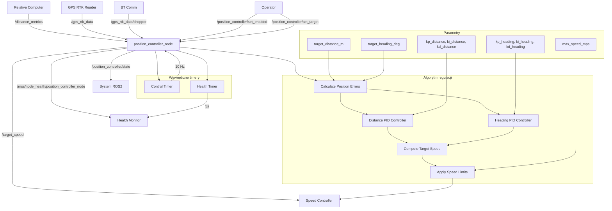

# Position Controller - Dokumentacja Pakietu

## Przegląd
Pakiet `position_controller` odpowiada za regulację pozycji względnej ciągnika względem sieczkarni. Węzeł implementuje regulator pozycji, który utrzymuje określoną odległość i pozycję względną między pojazdami podczas synchronizacji.

## Funkcjonalności
- **Regulacja pozycji**: Kontrola pozycji względnej ciągnika
- **Regulator PID**: Implementacja regulatora PID dla pozycji
- **Kontrola odległości**: Utrzymanie określonej odległości między pojazdami
- **Kontrola kursu**: Utrzymanie określonego kursu względnego
- **Health monitoring**: Raportowanie statusu węzła
- **Konfiguracja**: Parametry regulatora i celów

## Węzeł: `position_controller_node`

### Parametry
| Parametr | Typ | Domyślna wartość | Opis |
|----------|-----|------------------|------|
| `target_distance_m` | double | `5.0` | Docelowa odległość [m] |
| `target_heading_deg` | double | `0.0` | Docelowy kurs względny [°] |
| `kp_distance` | double | `1.0` | Wzmocnienie proporcjonalne odległości |
| `ki_distance` | double | `0.1` | Wzmocnienie całkujące odległości |
| `kd_distance` | double | `0.05` | Wzmocnienie różniczkujące odległości |
| `kp_heading` | double | `0.5` | Wzmocnienie proporcjonalne kursu |
| `ki_heading` | double | `0.05` | Wzmocnienie całkujące kursu |
| `kd_heading` | double | `0.02` | Wzmocnienie różniczkujące kursu |
| `max_speed_mps` | double | `3.0` | Maksymalna prędkość [m/s] |
| `position_tolerance_m` | double | `0.5` | Tolerancja pozycji [m] |
| `heading_tolerance_deg` | double | `5.0` | Tolerancja kursu [°] |

### Topiki

#### Subskrypcje
- **`/distance_metrics`** (`my_robot_interfaces/DistanceMetrics`)
  - Metryki odległości z relative_position_computer
  - Zawiera: odległości wzdłużną, poprzeczną, w linii prostej

- **`/gps_rtk_data`** (`my_robot_interfaces/GpsRtk`)
  - Dane GPS ciągnika z gps_rtk_reader
  - Zawiera: pozycję, prędkość, kurs, status RTK

- **`/gps_rtk_data/chopper`** (`my_robot_interfaces/GpsRtk`)
  - Dane GPS sieczkarni z bt_comm
  - Zawiera: pozycję, prędkość, kurs, status RTK

#### Publikowane
- **`/target_speed`** (`std_msgs/Float64`)
  - Prędkość zadana dla speed_controller
  - Zawiera: prędkość w m/s
  - Częstotliwość: 10 Hz

- **`/position_controller/state`** (`my_robot_interfaces/SpeedControllerState`)
  - Stan regulatora pozycji
  - Zawiera: błędy, wyjścia regulatora, parametry
  - Częstotliwość: 10 Hz

- **`/mss/node_health/position_controller_node`** (`std_msgs/String`)
  - Status zdrowia węzła w formacie JSON
  - Zawiera: status regulatora, błędy, metryki systemu
  - Częstotliwość: 0.2 Hz (co 5s)

### Serwisy

#### `/position_controller/set_enabled` (SetBool)
- **Funkcja**: Włączanie/wyłączanie regulatora pozycji
- **Parametr**: `data` (bool) - true=włączony, false=wyłączony
- **Odpowiedź**: `success` (bool), `message` (string)

#### `/position_controller/set_target` (SetTarget)
- **Funkcja**: Ustawianie celu pozycji
- **Parametr**: `target_distance` (double), `target_heading` (double)
- **Odpowiedź**: `success` (bool), `message` (string)

## Architektura

### Algorytm regulacji pozycji
```python
def position_control_loop(self):
    if not self.is_enabled:
        return
    
    # Oblicz błędy pozycji
    distance_error = self.target_distance - self.current_distance
    heading_error = self.target_heading - self.current_heading
    
    # Normalizuj błąd kursu
    while heading_error > 180:
        heading_error -= 360
    while heading_error < -180:
        heading_error += 360
    
    # Regulator PID dla odległości
    distance_output = self.distance_pid.compute(distance_error)
    
    # Regulator PID dla kursu
    heading_output = self.heading_pid.compute(heading_error)
    
    # Oblicz prędkość zadaną
    target_speed = self.compute_target_speed(distance_output, heading_output)
    
    # Ogranicz prędkość
    target_speed = max(-self.max_speed, min(self.max_speed, target_speed))
    
    # Publikuj prędkość zadaną
    self.publish_target_speed(target_speed)
```

### Regulator PID
```python
class PIDController:
    def __init__(self, kp, ki, kd):
        self.kp = kp
        self.ki = ki
        self.kd = kd
        self.integral = 0.0
        self.previous_error = 0.0
        self.last_time = time.time()
    
    def compute(self, error):
        current_time = time.time()
        dt = current_time - self.last_time
        
        if dt <= 0:
            return 0.0
        
        # Proporcjonalny
        proportional = self.kp * error
        
        # Całkujący
        self.integral += error * dt
        integral = self.ki * self.integral
        
        # Różniczkujący
        derivative = self.kd * (error - self.previous_error) / dt
        
        # Wyjście regulatora
        output = proportional + integral + derivative
        
        # Aktualizuj poprzednie wartości
        self.previous_error = error
        self.last_time = current_time
        
        return output
```

### Obliczanie prędkości zadanej
```python
def compute_target_speed(self, distance_output, heading_output):
    # Kombinacja wyjść regulatorów
    base_speed = distance_output
    
    # Korekta kursu
    heading_correction = heading_output * 0.1  # Współczynnik korekty
    
    # Prędkość zadana
    target_speed = base_speed + heading_correction
    
    return target_speed
```

### Sprawdzanie tolerancji
```python
def check_position_tolerance(self):
    distance_error = abs(self.target_distance - self.current_distance)
    heading_error = abs(self.target_heading - self.current_heading)
    
    # Normalizuj błąd kursu
    while heading_error > 180:
        heading_error -= 360
    heading_error = abs(heading_error)
    
    # Sprawdź tolerancje
    distance_ok = distance_error <= self.position_tolerance
    heading_ok = heading_error <= self.heading_tolerance
    
    return distance_ok and heading_ok
```

## Zależności

### ROS2
- `rclpy` - Python API dla ROS2
- `std_msgs` - Standardowe wiadomości
- `std_srvs` - Standardowe serwisy
- `my_robot_interfaces` - Niestandardowe wiadomości

### Python
- `json` - Formatowanie danych health
- `math` - Obliczenia matematyczne
- `time` - Obsługa czasu

## Instalacja i uruchomienie

### Budowanie
```bash
cd /home/pi/mss_ros
colcon build --packages-select position_controller
source install/setup.bash
```

### Uruchomienie
```bash
ros2 run position_controller position_controller_node
```

### Uruchomienie z parametrami
```bash
ros2 run position_controller position_controller_node --ros-args \
  -p target_distance_m:=3.0 \
  -p target_heading_deg:=0.0 \
  -p kp_distance:=1.5 \
  -p ki_distance:=0.2 \
  -p kd_distance:=0.1 \
  -p max_speed_mps:=2.0
```

## Konfiguracja

### Parametry regulatora
```bash
# Ustawienie celu pozycji
ros2 param set /position_controller_node target_distance_m 3.0
ros2 param set /position_controller_node target_heading_deg 0.0

# Ustawienie parametrów PID odległości
ros2 param set /position_controller_node kp_distance 1.5
ros2 param set /position_controller_node ki_distance 0.2
ros2 param set /position_controller_node kd_distance 0.1

# Ustawienie parametrów PID kursu
ros2 param set /position_controller_node kp_heading 0.5
ros2 param set /position_controller_node ki_heading 0.05
ros2 param set /position_controller_node kd_heading 0.02

# Ustawienie ograniczeń
ros2 param set /position_controller_node max_speed_mps 2.0
ros2 param set /position_controller_node position_tolerance_m 0.5
ros2 param set /position_controller_node heading_tolerance_deg 5.0
```

### Włączanie/wyłączanie
```bash
# Włącz regulator pozycji
ros2 service call /position_controller/set_enabled std_srvs/srv/SetBool "{data: true}"

# Wyłącz regulator pozycji
ros2 service call /position_controller/set_enabled std_srvs/srv/SetBool "{data: false}"
```

### Ustawianie celu
```bash
# Ustaw nowy cel pozycji
ros2 service call /position_controller/set_target my_robot_interfaces/srv/SetTarget \
  "{target_distance: 4.0, target_heading: 10.0}"
```

## Diagnostyka

### Sprawdzanie statusu
```bash
# Sprawdź węzły
ros2 node list | grep position_controller

# Sprawdź topiki
ros2 topic list | grep position

# Sprawdź stan regulatora
ros2 topic echo /position_controller/state

# Sprawdź health status
ros2 topic echo /mss/node_health/position_controller_node
```

### Monitoring
```bash
# Sprawdź parametry
ros2 param list /position_controller_node
ros2 param get /position_controller_node target_distance_m
ros2 param get /position_controller_node kp_distance

# Sprawdź logi
ros2 node info /position_controller_node
```

### Testowanie
```bash
# Test z pełnym systemem
ros2 run gps_rtk_reader gps_rtk_node
ros2 run bt_comm bt_receiver_node
ros2 run relative_position_computer relative_computer_node
ros2 run position_controller position_controller_node

# Test z mockup
ros2 run system_mockup gps_mockup_node
ros2 run position_controller position_controller_node
```

### Typowe problemy
1. **Brak regulacji**: Sprawdź czy regulator jest włączony
2. **Oscylacje**: Dostosuj parametry PID
3. **Brak reakcji**: Sprawdź dane pozycji
4. **Błąd tolerancji**: Dostosuj tolerancje pozycji

## Bezpieczeństwo

### Warunki bezpieczeństwa
- **Regulator włączony**: `is_enabled = true`
- **Dane pozycji**: Sprawdzenie aktualności danych
- **Ograniczenia prędkości**: Maksymalna prędkość
- **Tolerancje**: Sprawdzenie tolerancji pozycji

### Ograniczenia
- Maksymalna prędkość: 3.0 m/s (konfigurowalna)
- Tolerancja pozycji: 0.5m (konfigurowalna)
- Tolerancja kursu: 5° (konfigurowalna)
- Częstotliwość regulacji: 10 Hz

## Wydajność

### Metryki
- Częstotliwość regulacji: 10 Hz
- Opóźnienie reakcji: < 100ms
- Wykorzystanie CPU: < 3%
- Wykorzystanie pamięci: < 40MB

### Optymalizacja
- Dostosuj parametry PID do charakterystyki systemu
- Użyj odpowiedniego QoS
- Monitoruj wykorzystanie zasobów

## Testowanie

### Testy jednostkowe
```bash
# Uruchom testy
cd /home/pi/mss_ros
colcon test --packages-select position_controller
colcon test-result --all
```

### Testy integracyjne
```bash
# Test z pełnym systemem
ros2 run system_mockup gps_mockup_node
ros2 run position_controller position_controller_node

# Sprawdź regulację
ros2 topic echo /position_controller/state
```

### Testy wydajności
```bash
# Test częstotliwości
ros2 topic hz /position_controller/state

# Test opóźnienia
ros2 topic delay /position_controller/state
```

## Graf przepływu informacji



## Autorzy
- **Główny deweloper**: Adam Wróblewski
- **Email**: adam01wroblewski@gmail.com
