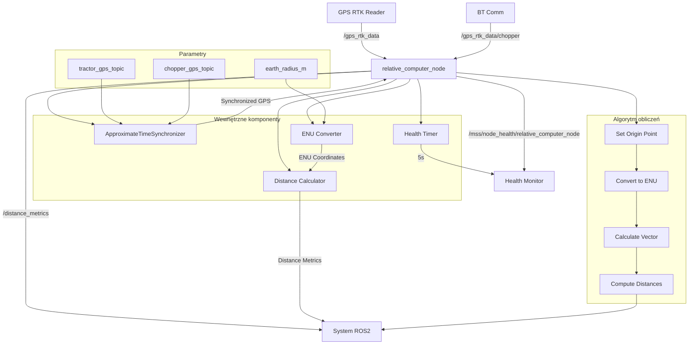

# Relative Position Computer - Dokumentacja Pakietu

## Przegląd
Pakiet `relative_position_computer` odpowiada za obliczanie względnej pozycji i odległości między ciągnikiem a sieczkarnią. Węzeł synchronizuje dane GPS z obu pojazdów i oblicza odległości wzdłużną, poprzeczną oraz w linii prostej.

## Funkcjonalności
- **Synchronizacja GPS**: Synchronizacja czasowa danych z obu pojazdów
- **Konwersja współrzędnych**: Transformacja z geograficznych na ENU
- **Obliczanie odległości**: Odległość w linii prostej, wzdłużna i poprzeczna
- **Punkt odniesienia**: Automatyczne ustawienie punktu bazowego
- **Health monitoring**: Raportowanie statusu węzła
- **Synchronizator czasowy**: ApproximateTimeSynchronizer dla danych GPS

## Węzeł: `relative_computer_node`

### Parametry
| Parametr | Typ | Domyślna wartość | Opis |
|----------|-----|------------------|------|
| `tractor_gps_topic` | string | `/gps_rtk_data` | Topik GPS ciągnika |
| `chopper_gps_topic` | string | `/gps_rtk_data/chopper` | Topik GPS sieczkarni |
| `distance_metrics_topic` | string | `/distance_metrics` | Topik publikacji metryk |
| `earth_radius_m` | double | `6371000.0` | Promień Ziemi [m] |

### Topiki

#### Subskrypcje
- **`/gps_rtk_data`** (`my_robot_interfaces/GpsRtk`)
  - Dane GPS ciągnika z gps_rtk_reader
  - Zawiera: pozycję, prędkość, kurs, status RTK

- **`/gps_rtk_data/chopper`** (`my_robot_interfaces/GpsRtk`)
  - Dane GPS sieczkarni z bt_comm
  - Zawiera: pozycję, prędkość, kurs, status RTK

#### Publikowane
- **`/distance_metrics`** (`my_robot_interfaces/DistanceMetrics`)
  - Metryki odległości między pojazdami
  - Zawiera: odległość w linii prostej, wzdłużna, poprzeczna
  - Częstotliwość: zależna od synchronizacji GPS

- **`/mss/node_health/relative_computer_node`** (`std_msgs/String`)
  - Status zdrowia węzła w formacie JSON
  - Zawiera: status synchronizatora, punktu odniesienia, metryki systemu
  - Częstotliwość: 0.2 Hz (co 5s)

### Wiadomości

#### `DistanceMetrics.msg`
```yaml
std_msgs/Header header
float64 distance_straight      # Odległość w linii prostej [m]
float64 distance_longitudinal  # Odległość wzdłużna [m]
float64 distance_lateral       # Odległość poprzeczna [m]
```

## Architektura

### Synchronizacja czasowa
```python
# ApproximateTimeSynchronizer
self.time_synchronizer = message_filters.ApproximateTimeSynchronizer(
    [self.tractor_sub, self.chopper_sub],
    queue_size=10,
    slop=0.1  # 100ms tolerancja
)
```

### Algorytm obliczeń
```python
def synchronized_callback(self, tractor_msg, chopper_msg):
    # Ustaw punkt odniesienia (pierwsza wiadomość)
    if not self.is_origin_set:
        self.origin_lat_rad = np.deg2rad(chopper_msg.latitude_deg)
        self.origin_lon_rad = np.deg2rad(chopper_msg.longitude_deg)
        self.is_origin_set = True
        return
    
    # Konwersja na ENU
    tractor_pos_enu = self.latlon_to_enu(tractor_msg.latitude_deg, tractor_msg.longitude_deg)
    chopper_pos_enu = self.latlon_to_enu(chopper_msg.latitude_deg, chopper_msg.longitude_deg)
    
    # Oblicz wektor od sieczkarni do ciągnika
    vector_chopper_to_tractor = tractor_pos_enu - chopper_pos_enu
    
    # Odległość w linii prostej
    dist_straight = np.linalg.norm(vector_chopper_to_tractor)
    
    # Oblicz odległości wzdłużną i poprzeczną
    heading_rad = np.deg2rad(chopper_msg.heading_deg)
    chopper_heading_vector = np.array([np.sin(heading_rad), np.cos(heading_rad)])
    
    dist_longitudinal = np.dot(vector_chopper_to_tractor, chopper_heading_vector)
    dist_lateral = np.cross(chopper_heading_vector, vector_chopper_to_tractor)
```

### Konwersja współrzędnych
```python
def latlon_to_enu(self, lat_deg, lon_deg):
    lat_rad = np.deg2rad(lat_deg)
    lon_rad = np.deg2rad(lon_deg)
    x = self.R_EARTH * (lon_rad - self.origin_lon_rad) * np.cos(self.origin_lat_rad)
    y = self.R_EARTH * (lat_rad - self.origin_lat_rad)
    return np.array([x, y])
```

## Zależności

### ROS2
- `rclpy` - Python API dla ROS2
- `my_robot_interfaces` - Niestandardowe wiadomości
- `message_filters` - Synchronizacja czasowa

### Python
- `numpy` - Obliczenia numeryczne
- `json` - Formatowanie danych health
- `psutil` - Metryki systemu
- `time` - Obsługa czasu

## Instalacja i uruchomienie

### Budowanie
```bash
cd /home/pi/mss_ros
colcon build --packages-select relative_position_computer
source install/setup.bash
```

### Uruchomienie
```bash
ros2 run relative_position_computer relative_computer_node
```

### Uruchomienie z parametrami
```bash
ros2 run relative_position_computer relative_computer_node --ros-args \
  -p tractor_gps_topic:=/gps_rtk_data_filtered \
  -p chopper_gps_topic:=/gps_rtk_data/chopper \
  -p distance_metrics_topic:=/relative_position
```

## Konfiguracja

### Parametry synchronizacji
```bash
# Zmiana topików GPS
ros2 param set /relative_computer_node tractor_gps_topic /gps_rtk_data_filtered
ros2 param set /relative_computer_node chopper_gps_topic /gps_rtk_data/chopper

# Zmiana promienia Ziemi
ros2 param set /relative_computer_node earth_radius_m 6378137.0
```

### Tolerancja czasowa
- **Slop**: 0.1s (100ms) - tolerancja synchronizacji
- **Queue size**: 10 - rozmiar bufora synchronizatora

## Diagnostyka

### Sprawdzanie statusu
```bash
# Sprawdź węzły
ros2 node list | grep relative_computer

# Sprawdź topiki
ros2 topic list | grep distance

# Sprawdź dane odległości
ros2 topic echo /distance_metrics

# Sprawdź health status
ros2 topic echo /mss/node_health/relative_computer_node
```

### Monitoring
```bash
# Sprawdź parametry
ros2 param list /relative_computer_node
ros2 param get /relative_computer_node earth_radius_m

# Sprawdź logi
ros2 node info /relative_computer_node
```

### Testowanie
```bash
# Test z mockup GPS
ros2 run system_mockup gps_mockup_node

# Test synchronizacji
ros2 topic hz /distance_metrics

# Test opóźnienia
ros2 topic delay /distance_metrics
```

### Typowe problemy
1. **Brak danych**: Sprawdź czy oba węzły GPS publikują dane
2. **Brak synchronizacji**: Sprawdź tolerancję czasową (slop)
3. **Nieprawidłowe odległości**: Sprawdź punkt odniesienia i kurs
4. **Błąd obliczeń**: Sprawdź dane GPS i status RTK

## Bezpieczeństwo

### Walidacja danych
- **Status RTK**: Sprawdzenie jakości danych GPS
- **Zakres współrzędnych**: Walidacja szerokości/długości geograficznej
- **Punkt odniesienia**: Automatyczne ustawienie przy pierwszej wiadomości

### Ograniczenia
- Tolerancja synchronizacji: 100ms
- Promień Ziemi: 6371000m (domyślnie)
- Zakres odległości: ±1000m (typowy)

## Wydajność

### Metryki
- Częstotliwość publikacji: zależna od GPS (1-20 Hz)
- Opóźnienie: < 200ms
- Wykorzystanie CPU: < 3%
- Wykorzystanie pamięci: < 40MB

### Optymalizacja
- Dostosuj tolerancję synchronizacji do potrzeb
- Użyj odpowiedniego QoS dla topików
- Monitoruj wykorzystanie zasobów

## Testowanie

### Testy jednostkowe
```bash
# Uruchom testy
cd /home/pi/mss_ros
colcon test --packages-select relative_position_computer
colcon test-result --all
```

### Testy integracyjne
```bash
# Test z pełnym systemem GPS
ros2 run gps_rtk_reader gps_rtk_node
ros2 run bt_comm bt_receiver_node
ros2 run relative_position_computer relative_computer_node

# Test z mockup
ros2 run system_mockup gps_mockup_node
```

### Testy wydajności
```bash
# Test częstotliwości
ros2 topic hz /distance_metrics

# Test opóźnienia
ros2 topic delay /distance_metrics
```

## Graf przepływu informacji



## Autorzy
- **Główny deweloper**: Adam Wróblewski
- **Email**: adam01wroblewski@gmail.com
