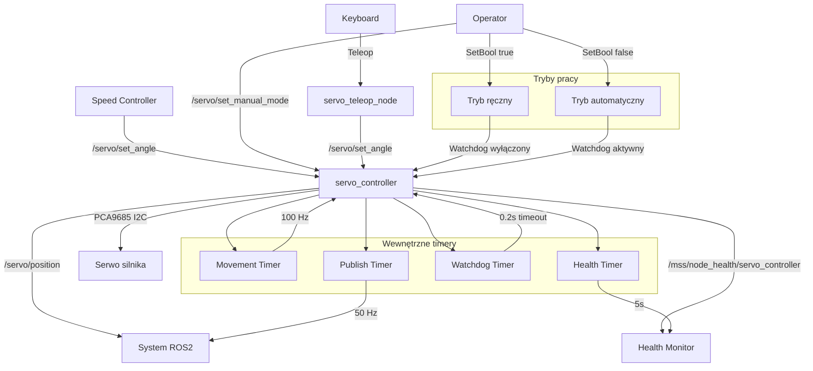

# Servo Controller - Dokumentacja Pakietu

## Przegląd
Pakiet `servo_controller` odpowiada za sterowanie serwem silnika ciągnika rolniczego. Węzeł odbiera komendy kąta serwa z regulatora prędkości i wykonuje płynny ruch serwa z kontrolą prędkości i bezpieczeństwa.

## Funkcjonalności
- **Sterowanie serwem**: Kontrola kąta serwa przez PCA9685
- **Płynny ruch**: Symulacja ruchu z kontrolą prędkości (750°/s)
- **Watchdog**: Automatyczne wyłączenie przy braku komend (0.2s)
- **Tryb ręczny/automatyczny**: Przełączanie trybów pracy
- **Health monitoring**: Raportowanie statusu węzła i sprzętu
- **Graceful shutdown**: Bezpieczne zamykanie z ustawieniem serwa na 0°

## Węzły

### 1. `servo_controller` (główny węzeł)
Sterowanie serwem silnika z kontrolą bezpieczeństwa.

#### Parametry
| Parametr | Typ | Domyślna wartość | Opis |
|----------|-----|------------------|------|
| `watchdog_timeout_sec` | double | `0.2` | Timeout watchdoga [s] |

#### Topiki
- **Subskrypcje**: `/servo/set_angle` (StampedInt32)
- **Publikacje**: 
  - `/servo/position` (StampedInt32) - aktualna pozycja serwa
  - `/mss/node_health/servo_controller` (String) - health status

#### Serwisy
- **`/servo/set_manual_mode`** (SetBool) - przełączanie trybu ręcznego/automatycznego

### 2. `servo_teleop_node`
Węzeł do ręcznego sterowania serwem przez klawiaturę.

#### Funkcjonalności
- Sterowanie strzałkami: ↑/↓ (zmiana kąta)
- Automatyczne publikowanie komend kąta
- Interfejs tekstowy z aktualnym stanem

### 3. `servo_profiler_node`
Węzeł do profilowania wydajności serwa.

#### Funkcjonalności
- Pomiar czasu reakcji serwa
- Analiza dokładności pozycjonowania
- Generowanie raportów wydajności

## Architektura

### Sprzęt
- **PCA9685**: 16-kanałowy sterownik PWM
- **Kanał serwa**: 0 (konfigurowalny)
- **Zakres PWM**: 500-2500μs
- **Zakres kąta**: 0-180°

### Algorytm sterowania
```python
# Oblicz błąd pozycji
error = target_angle - current_angle

# Oblicz maksymalny ruch w tym kroku
max_step = SERVO_SPEED_DEGPS * tick_duration

# Wykonaj ruch
if abs(error) < abs(max_step):
    step = error  # Ruch do celu
else:
    step = max_step if error > 0 else -max_step

current_angle += step
servo.angle = int(round(current_angle))
```

### Watchdog
```python
if time_since_last_msg > watchdog_timeout:
    if target_angle != 0.0:
        target_angle = 0.0  # Bezpieczna pozycja
```

## Wiadomości

### `StampedInt32.msg`
```yaml
std_msgs/Header header
int32 data  # Kąt serwa w stopniach (0-180)
```

## Zależności

### ROS2
- `rclpy` - Python API dla ROS2
- `std_msgs` - Standardowe wiadomości
- `my_robot_interfaces` - Niestandardowe wiadomości

### Python
- `adafruit_servokit` - Sterowanie PCA9685
- `json` - Formatowanie danych health
- `psutil` - Metryki systemu
- `time` - Obsługa czasu

## Instalacja i uruchomienie

### Budowanie
```bash
cd /home/pi/mss_ros
colcon build --packages-select servo_controller
source install/setup.bash
```

### Uruchomienie
```bash
# Główny węzeł serwa
ros2 run servo_controller servo_node

# Teleop (opcjonalnie)
ros2 run servo_controller servo_teleop

# Profiler (opcjonalnie)
ros2 run servo_controller servo_profiler
```

### Uruchomienie z parametrami
```bash
ros2 run servo_controller servo_node --ros-args \
  -p watchdog_timeout_sec:=0.5
```

## Konfiguracja sprzętowa

### Wymagania
- PCA9685 sterownik PWM
- Serwo silnika z zakresem 0-180°
- Połączenie I2C z Raspberry Pi

### Schemat połączeń
```
Raspberry Pi I2C:
SDA (Pin 3)  → PCA9685 SDA
SCL (Pin 5)  → PCA9685 SCL
VCC (3.3V)   → PCA9685 VCC
GND          → PCA9685 GND

PCA9685:
PWM0         → Serwo Signal
V+           → Zasilanie serwa (5-6V)
GND          → Masa serwa
```

### Konfiguracja I2C
```bash
# Włącz I2C
sudo raspi-config
# Interfacing Options → I2C → Enable

# Sprawdź urządzenia I2C
sudo i2cdetect -y 1

# Sprawdź uprawnienia
ls -l /dev/i2c-*
```

## Diagnostyka

### Sprawdzanie statusu
```bash
# Sprawdź węzły
ros2 node list | grep servo

# Sprawdź topiki
ros2 topic list | grep servo

# Sprawdź pozycję serwa
ros2 topic echo /servo/position

# Sprawdź health status
ros2 topic echo /mss/node_health/servo_controller
```

### Testowanie
```bash
# Test ręcznego sterowania
ros2 topic pub /servo/set_angle my_robot_interfaces/msg/StampedInt32 \
  "{header: {stamp: {sec: 0, nanosec: 0}, frame_id: ''}, data: 90}"

# Test trybu ręcznego
ros2 service call /servo/set_manual_mode std_srvs/srv/SetBool "{data: true}"

# Test teleop
ros2 run servo_controller servo_teleop
```

### Logi
```bash
# Sprawdź logi węzła
ros2 node info /servo_controller

# Sprawdź parametry
ros2 param list /servo_controller
ros2 param get /servo_controller watchdog_timeout_sec
```

### Typowe problemy
1. **Błąd PCA9685**: Sprawdź połączenie I2C i zasilanie
2. **Serwo nie reaguje**: Sprawdź sygnał PWM i zasilanie serwa
3. **Watchdog timeout**: Sprawdź częstotliwość komend
4. **Błąd uprawnień**: Sprawdź dostęp do urządzeń I2C

## Bezpieczeństwo

### Warunki bezpieczeństwa
- **Watchdog timeout**: Automatyczne ustawienie na 0° przy braku komend
- **Tryb ręczny**: Wyłączenie watchdoga dla testów
- **Graceful shutdown**: Ustawienie serwa na 0° przy zamykaniu
- **Ograniczenia kąta**: Walidacja zakresu 0-180°

### Ograniczenia
- Kąt serwa: 0-180°
- Prędkość ruchu: 750°/s
- Timeout watchdoga: 0.2s
- Częstotliwość aktualizacji: 100 Hz

## Wydajność

### Metryki
- Częstotliwość ruchu: 100 Hz
- Częstotliwość publikacji pozycji: 50 Hz
- Opóźnienie: < 10ms
- Wykorzystanie CPU: < 2%
- Wykorzystanie pamięci: < 30MB

### Optymalizacja
- Dostosuj częstotliwość timerów do potrzeb
- Użyj odpowiedniego QoS dla topików
- Monitoruj wykorzystanie zasobów

## Testowanie

### Testy jednostkowe
```bash
# Uruchom testy
cd /home/pi/mss_ros
colcon test --packages-select servo_controller
colcon test-result --all
```

### Testy integracyjne
```bash
# Test z speed controller
ros2 run speed_controller speed_controller_node
ros2 service call /speed_controller/set_enabled std_srvs/srv/SetBool "{data: true}"

# Test pozycjonowania
ros2 topic pub /servo/set_angle my_robot_interfaces/msg/StampedInt32 \
  "{header: {stamp: {sec: 0, nanosec: 0}, frame_id: ''}, data: 45}"
```

### Testy wydajności
```bash
# Test częstotliwości
ros2 topic hz /servo/position

# Test opóźnienia
ros2 topic delay /servo/position
```

## Graf przepływu informacji



## Autorzy
- **Główny deweloper**: Adam Wróblewski
- **Email**: adam01wroblewski@gmail.com
