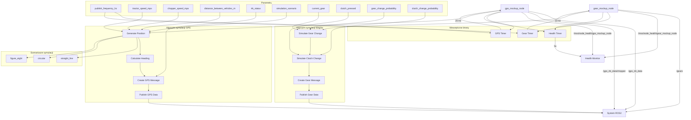

# System Mockup - Dokumentacja Pakietu

## Przegląd
Pakiet `system_mockup` zawiera węzły symulacyjne do testowania systemu MSS bez rzeczywistego sprzętu. Węzły mockup generują realistyczne dane GPS i biegów, umożliwiając testowanie i debugowanie systemu w środowisku laboratoryjnym.

## Funkcjonalności
- **GPS Mockup**: Symulacja danych GPS ciągnika i sieczkarni
- **Gear Mockup**: Symulacja danych biegów i sprzęgła
- **Realistyczne dane**: Generowanie realistycznych danych testowych
- **Konfiguracja**: Parametry symulacji i scenariuszy
- **Health monitoring**: Raportowanie statusu węzłów
- **Scenariusze testowe**: Różne scenariusze testowe

## Węzły

### `gps_mockup_node`
Węzeł symulujący dane GPS dla ciągnika i sieczkarni.

#### Parametry
| Parametr | Typ | Domyślna wartość | Opis |
|----------|-----|------------------|------|
| `publish_frequency_hz` | double | `20.0` | Częstotliwość publikacji [Hz] |
| `tractor_speed_mps` | double | `5.0` | Prędkość ciągnika [m/s] |
| `chopper_speed_mps` | double | `5.0` | Prędkość sieczkarni [m/s] |
| `distance_between_vehicles_m` | double | `5.0` | Odległość między pojazdami [m] |
| `rtk_status` | int | `2` | Status RTK (0=No RTK, 1=Float, 2=Fixed) |
| `simulation_scenario` | string | `"straight_line"` | Scenariusz symulacji |

#### Topiki

##### Publikowane
- **`/gps_rtk_data`** (`my_robot_interfaces/GpsRtk`)
  - Symulowane dane GPS ciągnika
  - Zawiera: pozycję, prędkość, kurs, status RTK
  - Częstotliwość: 20 Hz (konfigurowalna)

- **`/gps_rtk_data/chopper`** (`my_robot_interfaces/GpsRtk`)
  - Symulowane dane GPS sieczkarni
  - Zawiera: pozycję, prędkość, kurs, status RTK
  - Częstotliwość: 20 Hz (konfigurowalna)

- **`/mss/node_health/gps_mockup_node`** (`std_msgs/String`)
  - Status zdrowia węzła w formacie JSON
  - Zawiera: status symulacji, liczba wiadomości, metryki systemu
  - Częstotliwość: 0.2 Hz (co 5s)

### `gear_mockup_node`
Węzeł symulujący dane biegów i sprzęgła ciągnika.

#### Parametry
| Parametr | Typ | Domyślna wartość | Opis |
|----------|-----|------------------|------|
| `publish_frequency_hz` | double | `10.0` | Częstotliwość publikacji [Hz] |
| `current_gear` | int | `2` | Aktualny bieg (0-4) |
| `clutch_pressed` | bool | `false` | Stan sprzęgła |
| `gear_change_probability` | double | `0.1` | Prawdopodobieństwo zmiany biegu |
| `clutch_change_probability` | double | `0.05` | Prawdopodobieństwo zmiany sprzęgła |

#### Topiki

##### Publikowane
- **`/gears`** (`my_robot_interfaces/Gear`)
  - Symulowane dane biegów i sprzęgła
  - Zawiera: aktualny bieg (0-4), stan sprzęgła (0-1)
  - Częstotliwość: 10 Hz (konfigurowalna)

- **`/mss/node_health/gear_mockup_node`** (`std_msgs/String`)
  - Status zdrowia węzła w formacie JSON
  - Zawiera: status symulacji, liczba wiadomości, metryki systemu
  - Częstotliwość: 0.2 Hz (co 5s)

## Architektura

### Symulacja GPS
```python
def generate_gps_data(self, vehicle_type, current_time):
    if vehicle_type == "tractor":
        # Pozycja ciągnika
        base_lat = 52.2297
        base_lon = 21.0122
        speed = self.tractor_speed_mps
    else:  # chopper
        # Pozycja sieczkarni (za ciągnikiem)
        base_lat = 52.2297
        base_lon = 21.0122
        speed = self.chopper_speed_mps
    
    # Generuj pozycję na podstawie scenariusza
    if self.simulation_scenario == "straight_line":
        lat, lon = self.generate_straight_line_position(base_lat, base_lon, speed, current_time)
    elif self.simulation_scenario == "circular":
        lat, lon = self.generate_circular_position(base_lat, base_lon, speed, current_time)
    elif self.simulation_scenario == "figure_eight":
        lat, lon = self.generate_figure_eight_position(base_lat, base_lon, speed, current_time)
    
    # Generuj dane GPS
    gps_data = GpsRtk()
    gps_data.header.stamp = self.get_clock().now().to_msg()
    gps_data.header.frame_id = f"{vehicle_type}_gps"
    gps_data.latitude_deg = lat
    gps_data.longitude_deg = lon
    gps_data.altitude_m = 100.0
    gps_data.speed_mps = speed
    gps_data.heading_deg = self.calculate_heading(lat, lon)
    gps_data.rtk_status = self.rtk_status
    gps_data.satellites_used = 12
    gps_data.hdop = 1.2
    gps_data.vdop = 1.8
    gps_data.signal_quality = 95.0
    
    return gps_data
```

### Scenariusze symulacji
```python
def generate_straight_line_position(self, base_lat, base_lon, speed, current_time):
    # Ruch w linii prostej
    distance = speed * current_time
    lat_offset = distance / 111000.0  # 1 stopień ≈ 111km
    lon_offset = 0.0
    
    return base_lat + lat_offset, base_lon + lon_offset

def generate_circular_position(self, base_lat, base_lon, speed, current_time):
    # Ruch po okręgu
    radius = 50.0  # metry
    angular_speed = speed / radius
    angle = angular_speed * current_time
    
    lat_offset = (radius * math.cos(angle)) / 111000.0
    lon_offset = (radius * math.sin(angle)) / (111000.0 * math.cos(math.radians(base_lat)))
    
    return base_lat + lat_offset, base_lon + lon_offset

def generate_figure_eight_position(self, base_lat, base_lon, speed, current_time):
    # Ruch po ósemce
    radius = 25.0  # metry
    angular_speed = speed / radius
    angle = angular_speed * current_time
    
    # Parametryczne równanie ósemki
    x = radius * math.sin(angle)
    y = radius * math.sin(2 * angle) / 2
    
    lat_offset = x / 111000.0
    lon_offset = y / (111000.0 * math.cos(math.radians(base_lat)))
    
    return base_lat + lat_offset, base_lon + lon_offset
```

### Symulacja biegów
```python
def generate_gear_data(self):
    # Generuj dane biegów
    gear_data = Gear()
    gear_data.header.stamp = self.get_clock().now().to_msg()
    gear_data.header.frame_id = "gear_frame"
    
    # Symuluj zmianę biegu
    if random.random() < self.gear_change_probability:
        if self.current_gear < 4:
            self.current_gear += 1
        else:
            self.current_gear = 1
    
    # Symuluj zmianę sprzęgła
    if random.random() < self.clutch_change_probability:
        self.clutch_pressed = not self.clutch_pressed
    
    gear_data.current_gear = self.current_gear
    gear_data.clutch_pressed = 1 if self.clutch_pressed else 0
    
    return gear_data
```

### Obliczanie kursu
```python
def calculate_heading(self, lat, lon):
    if not hasattr(self, 'previous_lat'):
        self.previous_lat = lat
        self.previous_lon = lon
        return 0.0
    
    # Oblicz kurs na podstawie poprzedniej pozycji
    lat_diff = lat - self.previous_lat
    lon_diff = lon - self.previous_lon
    
    heading = math.degrees(math.atan2(lon_diff, lat_diff))
    
    # Aktualizuj poprzednią pozycję
    self.previous_lat = lat
    self.previous_lon = lon
    
    return heading
```

## Zależności

### ROS2
- `rclpy` - Python API dla ROS2
- `std_msgs` - Standardowe wiadomości
- `std_srvs` - Standardowe serwisy
- `my_robot_interfaces` - Niestandardowe wiadomości

### Python
- `json` - Formatowanie danych health
- `math` - Obliczenia matematyczne
- `random` - Generowanie liczb losowych
- `time` - Obsługa czasu

## Instalacja i uruchomienie

### Budowanie
```bash
cd /home/pi/mss_ros
colcon build --packages-select system_mockup
source install/setup.bash
```

### Uruchomienie GPS mockup
```bash
ros2 run system_mockup gps_mockup_node
```

### Uruchomienie gear mockup
```bash
ros2 run system_mockup gear_mockup_node
```

### Uruchomienie z parametrami
```bash
# GPS mockup z parametrami
ros2 run system_mockup gps_mockup_node --ros-args \
  -p publish_frequency_hz:=50.0 \
  -p tractor_speed_mps:=3.0 \
  -p chopper_speed_mps:=3.0 \
  -p distance_between_vehicles_m:=4.0 \
  -p rtk_status:=2 \
  -p simulation_scenario:=circular

# Gear mockup z parametrami
ros2 run system_mockup gear_mockup_node --ros-args \
  -p publish_frequency_hz:=20.0 \
  -p current_gear:=2 \
  -p clutch_pressed:=false \
  -p gear_change_probability:=0.2 \
  -p clutch_change_probability:=0.1
```

## Konfiguracja

### Parametry GPS mockup
```bash
# Ustawienie częstotliwości publikacji
ros2 param set /gps_mockup_node publish_frequency_hz 50.0

# Ustawienie prędkości pojazdów
ros2 param set /gps_mockup_node tractor_speed_mps 3.0
ros2 param set /gps_mockup_node chopper_speed_mps 3.0

# Ustawienie odległości między pojazdami
ros2 param set /gps_mockup_node distance_between_vehicles_m 4.0

# Ustawienie statusu RTK
ros2 param set /gps_mockup_node rtk_status 2

# Ustawienie scenariusza symulacji
ros2 param set /gps_mockup_node simulation_scenario circular
```

### Parametry gear mockup
```bash
# Ustawienie częstotliwości publikacji
ros2 param set /gear_mockup_node publish_frequency_hz 20.0

# Ustawienie aktualnego biegu
ros2 param set /gear_mockup_node current_gear 2

# Ustawienie stanu sprzęgła
ros2 param set /gear_mockup_node clutch_pressed false

# Ustawienie prawdopodobieństw zmian
ros2 param set /gear_mockup_node gear_change_probability 0.2
ros2 param set /gear_mockup_node clutch_change_probability 0.1
```

### Scenariusze symulacji
- **`straight_line`**: Ruch w linii prostej
- **`circular`**: Ruch po okręgu
- **`figure_eight`**: Ruch po ósemce

## Diagnostyka

### Sprawdzanie statusu
```bash
# Sprawdź węzły
ros2 node list | grep mockup

# Sprawdź topiki
ros2 topic list | grep gps
ros2 topic list | grep gear

# Sprawdź dane GPS
ros2 topic echo /gps_rtk_data
ros2 topic echo /gps_rtk_data/chopper

# Sprawdź dane biegów
ros2 topic echo /gears

# Sprawdź health status
ros2 topic echo /mss/node_health/gps_mockup_node
ros2 topic echo /mss/node_health/gear_mockup_node
```

### Monitoring
```bash
# Sprawdź parametry
ros2 param list /gps_mockup_node
ros2 param list /gear_mockup_node

# Sprawdź logi
ros2 node info /gps_mockup_node
ros2 node info /gear_mockup_node
```

### Testowanie
```bash
# Test z pełnym systemem
ros2 run system_mockup gps_mockup_node
ros2 run system_mockup gear_mockup_node
ros2 run speed_controller speed_controller_node
ros2 run relative_position_computer relative_computer_node

# Test z launch file
ros2 launch mss_bringup all_nodes_mockup.launch.py
```

### Typowe problemy
1. **Brak danych**: Sprawdź czy węzły mockup są uruchomione
2. **Błąd parametrów**: Sprawdź wartości parametrów
3. **Błąd scenariusza**: Sprawdź nazwę scenariusza
4. **Błąd symulacji**: Sprawdź logi węzłów

## Bezpieczeństwo

### Uwagi bezpieczeństwa
- **Dane testowe**: Tylko do celów testowych
- **Parametry**: Sprawdź wartości parametrów
- **Scenariusze**: Sprawdź poprawność scenariuszy

### Ograniczenia
- Częstotliwość publikacji: 20 Hz (konfigurowalna)
- Rozmiar wiadomości: ~100 bytes
- Liczba scenariuszy: 3 (straight_line, circular, figure_eight)

## Wydajność

### Metryki
- Częstotliwość publikacji: 20 Hz
- Opóźnienie: < 10ms
- Wykorzystanie CPU: < 2%
- Wykorzystanie pamięci: < 20MB

### Optymalizacja
- Dostosuj częstotliwość publikacji
- Użyj odpowiedniego QoS
- Monitoruj wykorzystanie zasobów

## Testowanie

### Testy jednostkowe
```bash
# Uruchom testy
cd /home/pi/mss_ros
colcon test --packages-select system_mockup
colcon test-result --all
```

### Testy integracyjne
```bash
# Test z pełnym systemem
ros2 run system_mockup gps_mockup_node
ros2 run system_mockup gear_mockup_node
ros2 run speed_controller speed_controller_node

# Sprawdź dane
ros2 topic echo /gps_rtk_data
ros2 topic echo /gears
```

### Testy wydajności
```bash
# Test częstotliwości
ros2 topic hz /gps_rtk_data
ros2 topic hz /gears

# Test opóźnienia
ros2 topic delay /gps_rtk_data
ros2 topic delay /gears
```

## Graf przepływu informacji



## Autorzy
- **Główny deweloper**: Adam Wróblewski
- **Email**: adam01wroblewski@gmail.com
